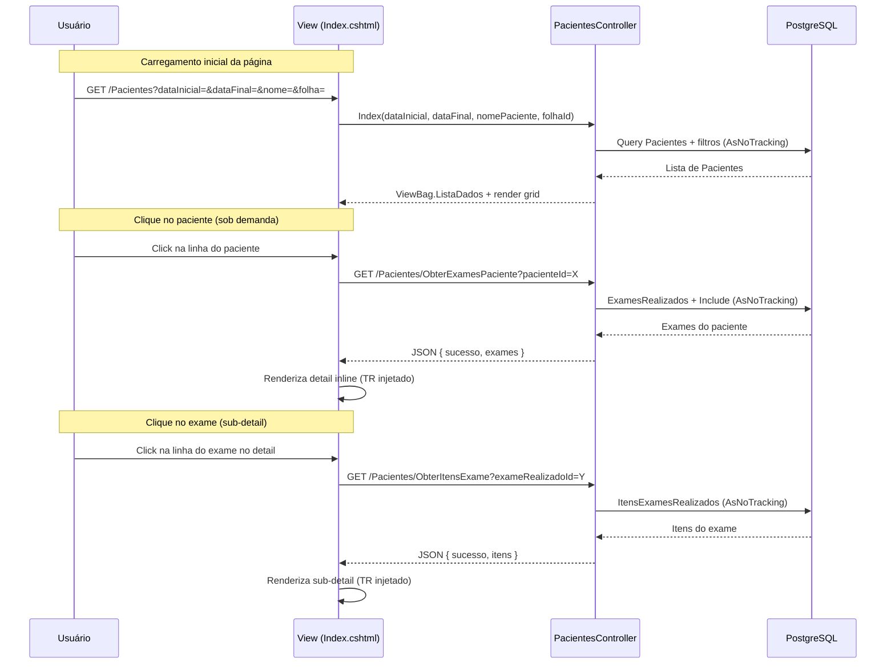

# Design Document — Consultar Exames do Paciente (Master/Detail)

## Overview

Evolução incremental da tela de **Cadastro de Pacientes** (`/Pacientes`)
para adicionar consulta de exames em formato Master/Detail inline. A
implementação adiciona:

1. **Filtros backend** acima do grid existente (período, nome, folha)
2. **Três endpoints AJAX** no `PacientesController` para carregamento
   sob demanda (exames, itens, folhas)
3. **Detail inline** expandido abaixo da linha do paciente clicado,
   exibindo exames realizados e seus itens

A funcionalidade é exclusivamente de **visualização** — sem ações de
edição ou exclusão no detail.

### Decisões de Design

| Decisão                          | Justificativa                                    |
|----------------------------------|--------------------------------------------------|
| Endpoints no PacientesController | Requisito explícito; mantém coesão com a tela    |
| Detail via TR injetado no DOM    | Padrão já usado em ConsultarExamesController     |
| Filtros via form GET             | Padrão existente no projeto (ConsultarExames)    |
| DataTables NÃO usado no detail  | Detail é simples, TR injetado é mais leve        |
| AsNoTracking() em todas queries  | Requisito de performance; somente leitura        |

## Architecture

### Integração com o Existente

```
┌─────────────────────────────────────────────────────────────┐
│ Views/Pacientes/Index.cshtml (EXISTENTE — preservado)        │
│  ┌─────────────────────────────────────────────────────────┐│
│  │ _PartialMenuPacientes (EXISTENTE — preservado)          ││
│  └─────────────────────────────────────────────────────────┘│
│  ┌─────────────────────────────────────────────────────────┐│
│  │ NOVO: Filtros Backend (Data Ini, Data Fim, Nome, Folha) ││
│  └─────────────────────────────────────────────────────────┘│
│  ┌─────────────────────────────────────────────────────────┐│
│  │ Grid DataTables #modeloTable (EXISTENTE — preservado)   ││
│  │  ├── Linha Paciente (click → expande detail)            ││
│  │  │   └── Detail inline (TR injetado via JS)             ││
│  │  │       ├── Header: Exames Realizados                  ││
│  │  │       └── Sub-detail: Itens do Exame                 ││
│  │  └── ...                                                ││
│  └─────────────────────────────────────────────────────────┘│
└─────────────────────────────────────────────────────────────┘
```

### Fluxo de Dados



## Components and Interfaces

### Backend — PacientesController (Novos Endpoints)

#### 1. Endpoint Index (ALTERAÇÃO)

O método `Index` existente será **estendido** para aceitar novos
parâmetros de filtro. A assinatura atual:

```csharp
// ATUAL (preservado):
public async Task<IActionResult> Index(string? Conteudo, int registros = 50)

// NOVO (estendido):
public async Task<IActionResult> Index(
    string? Conteudo,
    int registros = 50,
    string? dataInicial = null,
    string? dataFinal = null,
    string? nomePaciente = null,
    int? folhaId = null)
```

**Lógica de filtro adicionada:**
- Se `dataInicial` e/ou `dataFinal` informados: filtrar pacientes que
  possuam `ExamesRealizados.DataIni` dentro do range UTC
- Se `nomePaciente` informado: filtrar `Pacientes.NomePaciente`
  case-insensitive (Contains)
- Se `folhaId` informado: filtrar pacientes que possuam exame com
  `ExamesRealizados.ClasseExamesId == folhaId`
- Valores padrão: `dataInicial` = hoje - 3 dias, `dataFinal` = hoje
  (aplicados no frontend via value dos inputs)

**Importante:** Os filtros novos são **adicionais** ao filtro
`Conteudo` existente. Se `Conteudo` estiver preenchido, o
comportamento atual é preservado integralmente. Os novos filtros
só se aplicam quando `Conteudo` está vazio.

#### 2. ObterExamesPaciente

```
GET /Pacientes/ObterExamesPaciente?pacienteId={int}
```

**Arquivo:** `Areas/Controllers/PacientesController.cs`
**Atributos:** `[TypeFilter(typeof(SessionFilter))]`, `[HttpGet]`,
`[Route("Pacientes/ObterExamesPaciente")]`

**Query:**
```csharp
_db.ExamesRealizados
    .AsNoTracking()
    .Where(e => e.PacienteId == pacienteId)
    .Include(e => e.Instituicao)
    .Include(e => e.Postos)
    .Include(e => e.ClasseExames)
    .OrderByDescending(e => e.DataIni)
    .Select(e => new {
        e.Id,
        DataIni = e.DataIni.ToLocalString("dd/MM/yyyy"),
        DataFim = e.DataFim.HasValue
            ? e.DataFim.Value.ToLocalString("dd/MM/yyyy") : "-",
        SiglaInstituicao = e.Instituicao.Sigla,
        NomePosto = e.Postos.NomePosto.Length > 12
            ? e.Postos.NomePosto.Substring(0, 9) + "..."
            : e.Postos.NomePosto,
        Folha = e.ClasseExames.RefExame ?? "-"
    })
```

**Resposta:** `Json(new { sucesso = true, exames })`

#### 3. ObterItensExame

```
GET /Pacientes/ObterItensExame?exameRealizadoId={int}
```

**Atributos:** `[TypeFilter(typeof(SessionFilter))]`, `[HttpGet]`,
`[Route("Pacientes/ObterItensExame")]`

**Query:**
```csharp
_db.ItensExamesRealizados
    .AsNoTracking()
    .Where(i => i.ExameRealizadoId == exameRealizadoId)
    .OrderBy(i => i.OrdemItem)
    .Select(i => new {
        i.RefExame,
        i.RefItem,
        ContaExame = i.ContaExame.FormatarContaExameSem11(),
        i.Descricao
    })
```

**Resposta:** `Json(new { sucesso = true, itens })`

#### 4. ObterFolhasExame

```
GET /Pacientes/ObterFolhasExame
```

**Atributos:** `[TypeFilter(typeof(SessionFilter))]`, `[HttpGet]`,
`[Route("Pacientes/ObterFolhasExame")]`

**Query:**
```csharp
_db.ClasseExames
    .AsNoTracking()
    .OrderBy(c => c.RefExame)
    .Select(c => new { c.Id, c.RefExame })
```

**Resposta:** `Json(new { sucesso = true, folhas })`

### Frontend — Index.cshtml (Alterações)

#### Filtros Backend (HTML adicionado antes do grid)

```html
<div id="filtrosPacientesExames"
     style="margin-bottom: 10px; padding: 8px 12px;
            border: 1px solid #ddd; border-radius: 6px;
            background-color: #f9f9f9;">
    <form method="get" asp-action="Index"
          asp-controller="Pacientes"
          style="display: flex; flex-wrap: wrap;
                 align-items: center; gap: 8px;">
        <!-- Data Inicial (padrão: hoje - 3 dias) -->
        <!-- Data Final (padrão: hoje) -->
        <!-- Nome do Paciente (text) -->
        <!-- Folha de Exame (select carregado via AJAX) -->
        <!-- Botão Pesquisar -->
    </form>
</div>
```

#### JavaScript — Detail Inline

O script será adicionado no bloco `<script>` existente da view,
seguindo o padrão já implementado em `ConsultarExames/Index.cshtml`:

- Handler delegado com namespace: `$(document).off('click.detailExames')
  .on('click.detailExames', '#modeloTable tbody tr', handler)`
- Ignora cliques na coluna de opções (`.grid_fundo_opcoes`)
- Ignora cliques em linhas de detalhe (`.detail-row`,
  `.detail-header-row`)
- Remove detail anterior antes de abrir novo
- Chama `ObterExamesPaciente` via `$.ajax`
- Renderiza TRs de header e dados do exame
- Ao clicar em uma linha de exame no detail, chama
  `ObterItensExame` e renderiza sub-detail

#### CSS — Estilos do Detail (no próprio cshtml)

```css
<style>
    tr.detail-row { ... }
    tr.detail-header-row { ... }
    tr.detail-parent-highlight { ... }
    tr.detail-exame-row { ... }
    tr.detail-item-row { ... }
</style>
```

Estilos seguem o padrão já existente em
`Views/ConsultarExames/Index.cshtml`.

## Data Models

### Relacionamentos Reais (Investigados no Código)

```
Pacientes (1) ──── (N) ExamesRealizados
    │                       │
    │                       ├── FK: PacienteId → Pacientes.Id
    │                       ├── FK: InstituicaoId → Instituicao.Id
    │                       ├── FK: PostoId → Postos.Id
    │                       ├── FK: ClasseExamesId → ClasseExames.Id
    │                       ├── FK: MedicoId → Medicos.Id
    │                       ├── FK: TabelaExamesId → TabelaExames.Id
    │                       │
    │                       └── (1) ──── (N) ItensExamesRealizados
    │                                           │
    │                                           ├── FK: ExameRealizadoId
    │                                           ├── FK: PacienteId
    │                                           ├── FK: ClasseExamesId
    │                                           ├── FK: InstituicaoId
    │                                           └── FK: TabelaExamesId
    │
ClasseExames (Folha de Exame)
    ├── Id (PK)
    ├── RefExame (nome/identificador da Folha)
    └── (1) ──── (N) ExamesRealizados
```

### JSON Responses

#### ObterExamesPaciente Response

```json
{
    "sucesso": true,
    "exames": [
        {
            "id": 1234,
            "dataIni": "15/05/2026",
            "dataFim": "16/05/2026",
            "siglaInstituicao": "LAB",
            "nomePosto": "Posto Cent...",
            "folha": "HEMOGRAMA"
        }
    ]
}
```

#### ObterItensExame Response

```json
{
    "sucesso": true,
    "itens": [
        {
            "refExame": "HEMOGRAMA",
            "refItem": "HEM001",
            "contaExame": "01.02.03",
            "descricao": "Hemoglobina"
        }
    ]
}
```

#### ObterFolhasExame Response

```json
{
    "sucesso": true,
    "folhas": [
        { "id": 1, "refExame": "BIOQUIMICA" },
        { "id": 2, "refExame": "HEMOGRAMA" }
    ]
}
```

## Correctness Properties

*A property is a characteristic or behavior that should hold true
across all valid executions of a system — essentially, a formal
statement about what the system should do. Properties serve as the
bridge between human-readable specifications and machine-verifiable
correctness guarantees.*

### Property 1: Filtro de período retorna apenas pacientes com exames no range

*For any* par de datas (dataInicial, dataFinal) válido, todos os
pacientes retornados pelo endpoint Index devem possuir pelo menos um
`ExamesRealizados` cuja `DataIni` esteja dentro do range UTC
correspondente ao período informado.

**Validates: Requirements 4.3**

### Property 2: Filtro de nome é case-insensitive

*For any* string de busca `s`, todos os pacientes retornados pelo
filtro de nome devem ter `NomePaciente` contendo `s` independentemente
de maiúsculas/minúsculas (ou seja,
`NomePaciente.ToLower().Contains(s.ToLower())` deve ser verdadeiro).

**Validates: Requirements 4.4**

### Property 3: Filtro de folha retorna apenas pacientes vinculados

*For any* `folhaId` válido, todos os pacientes retornados devem
possuir pelo menos um `ExamesRealizados` com
`ClasseExamesId == folhaId`.

**Validates: Requirements 4.6**

### Property 4: Abreviação de NomePosto respeita limite de 12 caracteres

*For any* string `nomePosto`, se `nomePosto.Length > 12` então o
resultado da abreviação deve ter exatamente 12 caracteres e terminar
com `"..."`; se `nomePosto.Length <= 12` então o resultado deve ser
igual à string original.

**Validates: Requirements 5.1, 5.4**

### Property 5: Exames são ordenados por DataIni decrescente

*For any* paciente com múltiplos exames, a lista retornada por
`ObterExamesPaciente` deve estar ordenada de forma que cada
`DataIni[i] >= DataIni[i+1]` (ordem não-crescente).

**Validates: Requirements 7.4**

### Property 6: Itens de exame são ordenados por OrdemItem

*For any* exame com múltiplos itens, a lista retornada por
`ObterItensExame` deve estar ordenada de forma que cada
`OrdemItem[i] <= OrdemItem[i+1]` (ordem não-decrescente).

**Validates: Requirements 6.3, 8.4**

### Property 7: Folhas são ordenadas alfabeticamente por RefExame

*For any* conjunto de folhas retornado por `ObterFolhasExame`, a
sequência de `RefExame` deve estar em ordem alfabética não-decrescente.

**Validates: Requirements 9.3**

## Error Handling

### Backend

| Cenário                              | Tratamento                              |
|--------------------------------------|-----------------------------------------|
| `pacienteId` inválido (não existe)   | Retorna `{ sucesso: true, exames: [] }` |
| `exameRealizadoId` inválido          | Retorna `{ sucesso: true, itens: [] }`  |
| Exceção no banco                     | Log via `_eventLogHelper`, retorna      |
|                                      | `{ sucesso: false, mensagem: "..." }`   |
| Sessão expirada (SessionFilter)      | Redirect para login (padrão existente)  |
| Parâmetros de data inválidos         | Ignora filtro, retorna sem filtrar data |

### Frontend

| Cenário                              | Tratamento                              |
|--------------------------------------|-----------------------------------------|
| AJAX retorna `sucesso: false`        | Não renderiza detail, exibe mensagem    |
| AJAX retorna `exames: []`            | Exibe mensagem "Nenhum exame" no detail |
| Erro de rede (AJAX fail)             | Exibe mensagem via `clickAviso`         |
| Clique rápido duplo                  | Ignora se detail já está carregando     |

## Testing Strategy

### Abordagem

Esta feature envolve lógica de filtro backend (queries EF Core) e
apresentação frontend (detail inline via DOM). A estratégia combina:

1. **Testes de integração** — Verificar endpoints com banco real
2. **Testes manuais** — Verificar comportamento visual do detail
3. **Code review** — Verificar padrões (AsNoTracking, SessionFilter,
   namespace handlers, encoding)

### PBT — Avaliação de Aplicabilidade

As propriedades identificadas (filtros, ordenação, truncamento)
envolvem queries ao banco de dados e lógica de apresentação. A
maioria depende de estado do banco, tornando PBT com mocks complexo
e de baixo valor agregado para este caso. A exceção é a **Property 4
(abreviação de NomePosto)** que é uma função pura testável.

**Decisão:** PBT aplicável apenas para a lógica de truncamento de
string (Property 4). As demais propriedades serão validadas por
testes de integração com exemplos representativos.

### Testes Recomendados

| Tipo        | Escopo                                          |
|-------------|-------------------------------------------------|
| Integração  | Endpoints retornam dados corretos com filtros   |
| Integração  | Ordenação de exames e itens                     |
| Unitário    | Abreviação de NomePosto (função pura)           |
| Manual      | Detail inline abre/fecha corretamente           |
| Manual      | Apenas um detail aberto por vez                 |
| Manual      | Filtros preenchem valores padrão                |
| Manual      | ComboBox de folhas carrega corretamente         |
| Smoke       | Build compila com 0 erros e 0 avisos            |
| Smoke       | Rotas existentes continuam respondendo          |
| Regressão   | Grid existente mantém busca, paginação, ações   |

### Configuração de Testes

- Framework: xUnit (já existente no projeto, se disponível) ou
  testes manuais documentados
- Para Property 4: teste unitário com múltiplas strings de tamanhos
  variados (0, 1, 11, 12, 13, 50, 100 caracteres)
- Para integração: usar banco de desenvolvimento local com dados
  de teste
