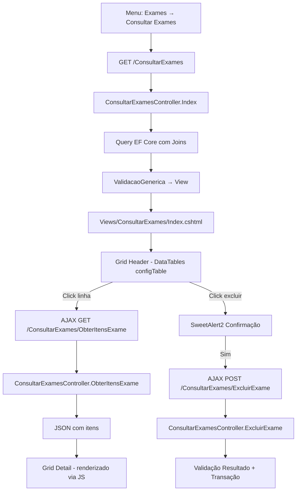
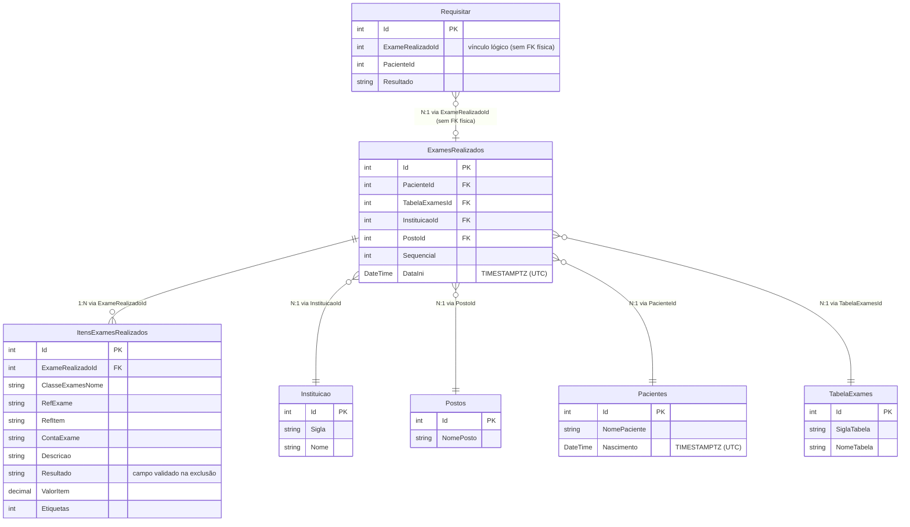

# Design Document — Consultar Exames

## Visão Geral

Tela de consulta e exclusão de exames realizados, acessível via menu
**Exames → Consultar Exames**. Implementa um padrão Master/Detail inline
onde o grid principal (header) exibe registros de `ExamesRealizados` e,
ao clicar em uma linha, um grid secundário (detail) exibe os respectivos
`ItensExamesRealizados` via AJAX.

A tela é somente leitura (sem inclusão/edição), com exceção da operação
de exclusão que valida a inexistência de resultados antes de remover
registros em transação.

### Decisões de Design

| Decisão                          | Justificativa                                    |
|----------------------------------|--------------------------------------------------|
| Herdar de `BaseController`       | Padrão existente — injeta serviços via construtor |
| `ValidacaoGenerica<dynamic>`     | Padrão de `PacientesController.Index`            |
| Joins via navigation properties  | EF Core já mapeia as relações no model           |
| Transação nativa EF Core         | Padrão de `RequisitarController.ExcluirRequisicao`|
| Detail via AJAX (não modal)      | Requisito de master/detail inline                |
| `configTable()` para header      | Padrão global de `mydatatables.js`               |
| SweetAlert2 para confirmação     | Padrão existente em `site.js` (`clickConfirm`)   |
| `ToLocalString()` para datas     | Extension method existente em `BLL/UtilBLL.cs`   |

---

## Arquitetura



### Estrutura de Arquivos

```
LabWebMvc.MVC/
├── Areas/Controllers/
│   └── ConsultarExamesController.cs    ← Controller principal
├── Views/ConsultarExames/
│   ├── Index.cshtml                    ← View principal (header + detail)
│   └── Partials/
│       └── _PartialMenuConsultarExames.cshtml  ← Menu da tela
```

---

## Componentes e Interfaces

### ConsultarExamesController

**Arquivo:** `Areas/Controllers/ConsultarExamesController.cs`
**Namespace:** `LabWebMvc.MVC.Areas.Controllers`
**Herança:** `BaseController`

#### Construtor

```csharp
public ConsultarExamesController(
    IDbFactory dbFactory,
    IValidadorDeSessao validador,
    GeralController geralController,
    IEventLogHelper eventLogHelper,
    Imagem imagem,
    ExclusaoService exclusaoService,
    IConnectionService connectionService)
    : base(dbFactory, validador, geralController,
           eventLogHelper, imagem, exclusaoService, connectionService)
{ }
```

#### Actions

| Action           | Verbo | Rota                                    | Retorno          |
|------------------|-------|-----------------------------------------|------------------|
| `Index`          | GET   | `/ConsultarExames`                      | `View()`         |
| `ObterItensExame`| GET   | `/ConsultarExames/ObterItensExame`      | `Json()`         |
| `ExcluirExame`   | GET   | `/ConsultarExames/ExcluirExame`         | `Json()`         |

---

### Action Index — Assinatura e Fluxo

```csharp
[TypeFilter(typeof(SessionFilter))]
[HttpGet]
[Route("ConsultarExames")]
public async Task<IActionResult> Index(
    string? dataExame,
    string? nomePaciente,
    int? codigoExame,
    string? siglaInstituicao,
    string? nomeInstituicao,
    string? nomePosto)
```

**Fluxo de execução:**

1. Verificar se algum filtro foi informado
2. Se nenhum filtro → `Take(100).OrderByDescending(x => x.Id)`
3. Se filtro informado → aplicar filtros sem limite de registros
4. Executar query com joins (Instituicao, Postos, Pacientes, TabelaExames)
5. Projetar resultado em lista `dynamic` com campos formatados
6. Montar `vmListaValidacao<dynamic>` e retornar via `ValidacaoGenerica`

**Query base com joins:**

```csharp
var query = _db.ExamesRealizados
    .AsNoTracking()
    .Include(e => e.Instituicao)
    .Include(e => e.Postos)
    .Include(e => e.Pacientes)
    .Include(e => e.TabelaExames)
    .AsQueryable();
```

**Aplicação de filtros (quando informados):**

```csharp
// Filtro por data — converte para range UTC
if (!string.IsNullOrEmpty(dataExame))
{
    DateTime dataParsed = dataExame.Trim().FormataData("dd/MM/yyyy", true);
    var (inicioUtc, fimUtc) = _geralController
        .ConverterDataLocalParaRangeUtc(dataParsed);
    query = query.Where(e => e.DataIni >= inicioUtc && e.DataIni <= fimUtc);
}

// Filtro por nome do paciente — case-insensitive
if (!string.IsNullOrEmpty(nomePaciente))
    query = query.Where(e => e.Pacientes.NomePaciente
        .ToLower().Contains(nomePaciente.Trim().ToLower()));

// Filtro por código do exame — correspondência exata
if (codigoExame.HasValue)
    query = query.Where(e => e.Id == codigoExame.Value);

// Filtro por sigla da instituição — case-insensitive
if (!string.IsNullOrEmpty(siglaInstituicao))
    query = query.Where(e => e.Instituicao.Sigla
        .ToLower().Contains(siglaInstituicao.Trim().ToLower()));

// Filtro por nome da instituição — case-insensitive
if (!string.IsNullOrEmpty(nomeInstituicao))
    query = query.Where(e => e.Instituicao.Nome
        .ToLower().Contains(nomeInstituicao.Trim().ToLower()));

// Filtro por nome do posto — case-insensitive
if (!string.IsNullOrEmpty(nomePosto))
    query = query.Where(e => e.Postos.NomePosto
        .ToLower().Contains(nomePosto.Trim().ToLower()));
```

**Projeção para o grid:**

```csharp
foreach (var item in dados)
{
    listaGrid.Add(new
    {
        Id = item.Id,
        TabelaExamesId = item.TabelaExamesId,
        SiglaInstituicao = item.Instituicao.Sigla,
        NomeInstituicao = item.Instituicao.Nome,
        NomePosto = item.Postos.NomePosto,
        NomePaciente = item.Pacientes.NomePaciente,
        Nascimento = item.Pacientes.Nascimento,
        Sequencial = item.Sequencial,
        DataIni = item.DataIni  // UTC — formatação na view
    });
}
```

---

### Action ObterItensExame — Assinatura e Fluxo

```csharp
[TypeFilter(typeof(SessionFilter))]
[HttpGet]
[Route("ConsultarExames/ObterItensExame")]
public async Task<IActionResult> ObterItensExame(int exameRealizadoId)
```

**Fluxo:**

1. Buscar `ItensExamesRealizados` onde `ExameRealizadoId == exameRealizadoId`
2. Usar `AsNoTracking()`
3. Projetar campos necessários para JSON
4. Retornar `Json(new { sucesso = true, itens = [...] })`

```csharp
var itens = await _db.ItensExamesRealizados
    .AsNoTracking()
    .Where(i => i.ExameRealizadoId == exameRealizadoId)
    .OrderBy(i => i.OrdemItem)
    .Select(i => new
    {
        i.ClasseExamesNome,
        i.RefExame,
        i.RefItem,
        i.ContaExame,
        i.Descricao,
        ValorItem = i.ValorItem.HasValue
            ? i.ValorItem.Value.ToString("N2")
            : "-",
        i.Etiquetas
    })
    .ToListAsync();

return Json(new { sucesso = true, itens });
```

---

### Action ExcluirExame — Assinatura e Fluxo

```csharp
[TypeFilter(typeof(SessionFilter))]
[HttpGet]
[Route("ConsultarExames/ExcluirExame")]
public async Task<IActionResult> ExcluirExame(int id)
```

**Fluxo de execução:**

1. Buscar `ExamesRealizados` pelo `id`
2. Buscar `ItensExamesRealizados` onde `ExameRealizadoId == id`
3. **Validar:** verificar se TODOS os campos `Resultado` estão vazios/nulos
4. Se algum `Resultado` preenchido → retornar erro (bloquear exclusão)
5. Buscar `Requisitar` onde `ExameRealizadoId == id`
6. Iniciar transação com `_db.Database.BeginTransactionAsync()`
7. Remover `ItensExamesRealizados` → `RemoveRange`
8. Remover `Requisitar` vinculados → `RemoveRange`
9. Remover `ExamesRealizados` → `Remove`
10. `SaveChangesAsync()` + `CommitAsync()`
11. Em caso de erro → `RollbackAsync()` + log via `_eventLogHelper`

```csharp
// Validação de resultados
var itensExame = await _db.ItensExamesRealizados
    .Where(i => i.ExameRealizadoId == id)
    .ToListAsync();

bool temResultado = itensExame
    .Any(i => !string.IsNullOrWhiteSpace(i.Resultado));

if (temResultado)
    return Json(new
    {
        titulo = "Erro",
        mensagem = "Este exame não pode ser excluído pois um ou mais "
                 + "itens já possuem resultado lançado.",
        sucesso = false
    });

// Transação de exclusão
using var transaction = await _db.Database.BeginTransactionAsync();
try
{
    _db.ItensExamesRealizados.RemoveRange(itensExame);

    var requisicoes = await _db.Requisitar
        .Where(r => r.ExameRealizadoId == id)
        .ToListAsync();
    _db.Requisitar.RemoveRange(requisicoes);

    _db.ExamesRealizados.Remove(exame);

    await _db.SaveChangesAsync();
    await transaction.CommitAsync();

    return Json(new
    {
        titulo = "Sucesso",
        mensagem = "Exame excluído com sucesso!",
        sucesso = true
    });
}
catch (Exception ex)
{
    await transaction.RollbackAsync();
    _eventLogHelper.LogEventViewer(
        $"Erro ao excluir exame {id}: {ex.Message}", "wError");
    return Json(new
    {
        titulo = "Erro",
        mensagem = "Erro ao excluir o exame: " + ex.Message,
        sucesso = false
    });
}
```

---

## Modelo de Dados

### Entidades Envolvidas e Relacionamentos



### Campos Exibidos no Grid Header

| Coluna na View       | Origem                          | Tipo       |
|----------------------|---------------------------------|------------|
| Id (Código)          | `ExamesRealizados.Id`           | int        |
| Tabela               | `ExamesRealizados.TabelaExamesId`| int       |
| Sigla Instituição    | `Instituicao.Sigla`             | string     |
| Nome Instituição     | `Instituicao.Nome`              | string     |
| Nome Posto           | `Postos.NomePosto`              | string     |
| Nome Paciente        | `Pacientes.NomePaciente`        | string     |
| Data Nascimento      | `Pacientes.Nascimento`          | DateTime   |
| Sequencial           | `ExamesRealizados.Sequencial`   | int        |
| Data do Exame        | `ExamesRealizados.DataIni`      | DateTime   |

### Campos Exibidos no Grid Detail

| Coluna na View    | Origem                              | Tipo    |
|-------------------|-------------------------------------|---------|
| Classe            | `ItensExamesRealizados.ClasseExamesNome` | string |
| Ref. Exame        | `ItensExamesRealizados.RefExame`    | string  |
| Ref. Item         | `ItensExamesRealizados.RefItem`     | string  |
| Conta Exame       | `ItensExamesRealizados.ContaExame`  | string  |
| Descrição         | `ItensExamesRealizados.Descricao`   | string  |
| Valor Item        | `ItensExamesRealizados.ValorItem`   | decimal |
| Etiquetas (Qtd)   | `ItensExamesRealizados.Etiquetas`   | int     |

---

## Estrutura da View

### Index.cshtml

**Arquivo:** `Views/ConsultarExames/Index.cshtml`

```html
@addTagHelper *, Microsoft.AspNetCore.Mvc.TagHelpers
@using BLL
@using static BLL.UtilBLL

<!-- Partial de menu -->
<partial name='Partials/_PartialMenuConsultarExames' />

<!-- Área de filtros backend -->
<div id="filtrosConsultarExames">
    <form method="get" asp-action="Index" asp-controller="ConsultarExames">
        <!-- Inputs: dataExame, nomePaciente, codigoExame,
             siglaInstituicao, nomeInstituicao, nomePosto -->
        <button type="submit">Pesquisar</button>
    </form>
</div>

<!-- Grid Header (ExamesRealizados) -->
<div class="table-responsive">
    <table id="modeloTable" name="datatable"
           data-order='[[ 0, "desc" ]]'
           class="display compact order-column stripe table-hover nowrap">
        <thead>...</thead>
        <tbody>
            @foreach (var item in ViewBag.ListaDados) { ... }
        </tbody>
        <tfoot>...</tfoot>
    </table>
</div>

<!-- Grid Detail (ItensExamesRealizados) — inicia oculto -->
<div id="detailContainer" style="display: none;">
    <table id="detailTable"
           class="display compact order-column stripe table-hover nowrap">
        <thead>...</thead>
        <tbody id="detailBody"></tbody>
    </table>
</div>

@section Scripts {
    <div class="toolbar">
        <partial name='_PartialDatatables' />
    </div>
    <!-- Scripts específicos da tela -->
}
```

### Formatação de Datas na View

Datas UTC são convertidas para exibição local usando `ToLocalString()`:

```csharp
// Data do Exame (DataIni) — somente data
item.DataIni.ToLocalString("dd/MM/yyyy")

// Data de Nascimento — somente data
item.Nascimento.ToLocalString("dd/MM/yyyy")
```

### Coluna de Opções (Exclusão)

```html
<td class='grid_fundo_opcoes'>
    <a id="@item.Id" class='grid_itens'
       onclick="clickDeleteExame(this)"
       title='Excluir'>
        <i class='fa-sharp fa-solid fa-trash-can'></i>
    </a>
</td>
```

---

## JavaScript — Comportamento da Tela

### Exclusão via SweetAlert2

Utiliza o padrão `clickConfirm` existente em `site.js`:

```javascript
function clickDeleteExame(x) {
    return clickConfirm(x, null, "Excluir este exame?", null,
                        "ConsultarExames/ExcluirExame");
}
```

O `clickConfirm` já implementa:
- Confirmação com SweetAlert2 (botões "Sim" / "Não")
- Loading spinner durante a requisição
- Exibição de mensagem de sucesso/erro
- `location.reload()` em caso de sucesso

### Master/Detail — Click na Linha do Header

```javascript
// Ao clicar em uma linha do grid header (exceto coluna de opções)
$('#modeloTable tbody').on('click', 'tr', function (e) {
    // Ignora cliques na coluna de opções
    if ($(e.target).closest('.grid_fundo_opcoes').length) return;

    var id = $(this).find('td:first').text();
    carregarDetail(id);
});

function carregarDetail(exameRealizadoId) {
    $.ajax({
        url: 'ConsultarExames/ObterItensExame',
        data: { exameRealizadoId: exameRealizadoId },
        type: 'GET',
        dataType: 'json',
        success: function (data) {
            if (data.sucesso) {
                renderizarDetail(data.itens);
                $('#detailContainer').show();
            }
        }
    });
}

function renderizarDetail(itens) {
    var tbody = $('#detailBody');
    tbody.empty();
    itens.forEach(function (item) {
        tbody.append(
            '<tr>' +
            '<td>' + item.classeExamesNome + '</td>' +
            '<td>' + item.refExame + '</td>' +
            '<td>' + item.refItem + '</td>' +
            '<td>' + item.contaExame + '</td>' +
            '<td>' + item.descricao + '</td>' +
            '<td>' + item.valorItem + '</td>' +
            '<td>' + item.etiquetas + '</td>' +
            '</tr>'
        );
    });
}
```

### Comportamento: Somente Um Detail Aberto

Ao clicar em outra linha, o detail anterior é substituído pelo novo
(a função `carregarDetail` limpa o tbody antes de popular).

---

## Tratamento de Erros

| Cenário                              | Tratamento                                    |
|--------------------------------------|-----------------------------------------------|
| Exame não encontrado (id inválido)   | Retorna JSON `{ sucesso: false, mensagem }`   |
| Itens com resultado preenchido       | Bloqueia exclusão, retorna mensagem específica |
| Exceção durante transação            | Rollback + log via `_eventLogHelper`          |
| Falha na requisição AJAX (detail)    | Não exibe detail, mantém estado anterior      |
| Sessão expirada                      | `SessionFilter` redireciona para login        |

### Mensagens de Erro

- **Resultado preenchido:** "Este exame não pode ser excluído pois um ou
  mais itens já possuem resultado lançado."
- **Exame não encontrado:** "Exame não encontrado."
- **Erro genérico:** "Erro ao excluir o exame: {mensagem da exceção}"

### Log de Erros

Erros de exclusão são registrados via `_eventLogHelper.LogEventViewer()`
com nível `"wError"`, seguindo o padrão de `RequisitarController`.

---

## Estratégia de Testes

### Por que PBT não se aplica

Esta funcionalidade é composta por:
- Operações CRUD simples (listagem com joins, exclusão com validação)
- Renderização de UI (grids DataTables)
- Wiring de controller (rotas, injeção de dependência)

Não há transformações de dados complexas, parsers, serializers ou
algoritmos com espaço de entrada amplo. Testes baseados em exemplos
e integração são mais adequados.

### Testes Unitários (Exemplos)

| Cenário                                          | Tipo        |
|--------------------------------------------------|-------------|
| Index sem filtros retorna máximo 100 registros   | Exemplo     |
| Index com filtro de data aplica range UTC        | Exemplo     |
| Index com filtro de nome filtra case-insensitive | Exemplo     |
| ObterItensExame retorna itens do exame correto   | Exemplo     |
| ExcluirExame bloqueia quando há resultado        | Exemplo     |
| ExcluirExame remove itens + requisitar + header  | Exemplo     |
| ExcluirExame faz rollback em caso de exceção     | Exemplo     |

### Testes de Integração

| Cenário                                          | Tipo        |
|--------------------------------------------------|-------------|
| Fluxo completo: listar → detalhar → excluir     | Integração  |
| Transação de exclusão mantém consistência        | Integração  |
| Filtros combinados retornam dados corretos       | Integração  |

### Validação de Build

- Compilar com `dotnet build "LabWebMvc.MVC/LabWebMvc.MVC.csproj"`
- Resultado obrigatório: 0 erros, 0 avisos
