# Authentication & Authorization

<cite>
**Referenced Files in This Document**
- [Startup.cs](file://LabWebMvc.MVC/Startup.cs)
- [HomeController.cs](file://LabWebMvc.MVC/Areas/Controllers/HomeController.cs)
- [BaseController.cs](file://LabWebMvc.MVC/Areas/Controllers/BaseController.cs)
- [ValidacoesDeSessao.cs](file://ExtensionsMethods/ValidadorDeSessao/ValidacoesDeSessao.cs)
- [IValidadorDeSessao.cs](file://ExtensionsMethods/ValidadorDeSessao/IValidadorDeSessao.cs)
- [ValidadorDeSessao.cs](file://ExtensionsMethods/ValidadorDeSessao/ValidadorDeSessao.cs)
- [GenericValidations.cs](file://ExtensionsMethods/Genericos/GenericValidations.cs)
- [ValidacoesDeSenhas.cs](file://LabWebMvc.MVC/Areas/Validations/ValidacoesDeSenhas.cs)
- [IValidacoesDeSenhas.cs](file://LabWebMvc.MVC/Areas/Validations/IValidacoesDeSenhas.cs)
- [Menu.cs](file://LabWebMvc.MVC/Interfaces/Menu.cs)
- [SessionCookieDiagnosticMiddleware.cs](file://LabWebMvc.MVC/Areas/Middleware/SessionCookieDiagnosticMiddleware.cs)
- [ResponseCookieLoggerMiddleware.cs](file://LabWebMvc.MVC/Areas/Middleware/ResponseCookieLoggerMiddleware.cs)
- [SessionDebugMiddleware.cs](file://LabWebMvc.MVC/Areas/Middleware/SessionDebugMiddleware.cs)
- [IdentityHostingStartup.cs](file://LabWebMvc.MVC/Areas/Identity/IdentityHostingStartup.cs)
- [UsuariosWeb.cs](file://LabWebMvc.MVC/Models/UsuariosWeb.cs)
</cite>

## Table of Contents
1. [Introduction](#introduction)
2. [Project Structure](#project-structure)
3. [Core Components](#core-components)
4. [Architecture Overview](#architecture-overview)
5. [Detailed Component Analysis](#detailed-component-analysis)
6. [Dependency Analysis](#dependency-analysis)
7. [Performance Considerations](#performance-considerations)
8. [Troubleshooting Guide](#troubleshooting-guide)
9. [Conclusion](#conclusion)
10. [Appendices](#appendices)

## Introduction
This document explains the authentication and authorization system implemented in the project. It covers cookie-based authentication, session management, ReCaptcha integration for spam protection, password validation and migration, and security configuration. It also documents the menu-based authorization concept, concurrent access controls, and session validation services. Guidance is included for securing controllers, implementing custom authorization attributes, handling authentication failures, preventing session hijacking, configuring secure cookies, and enabling audit logging for security events.

## Project Structure
The authentication and authorization logic spans several layers:
- Startup configuration registers authentication, session, and middleware.
- Controllers handle login, logout, and session validation.
- Validation services manage password verification, migration, and dynamic database connections.
- Middleware supports diagnostics and logging around cookies and sessions.
- Models and interfaces define user and menu structures used by the system.

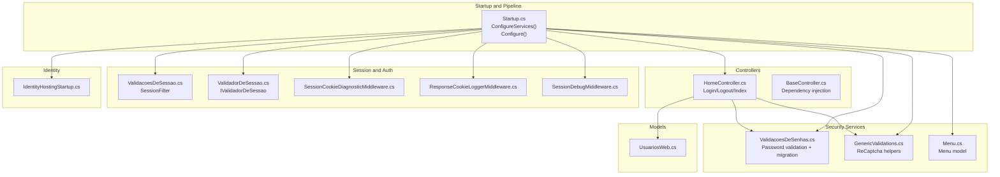

**Diagram sources**
- [Startup.cs:127-165](file://LabWebMvc.MVC/Startup.cs#L127-L165)
- [HomeController.cs:27-56](file://LabWebMvc.MVC/Areas/Controllers/HomeController.cs#L27-L56)
- [BaseController.cs:12-39](file://LabWebMvc.MVC/Areas/Controllers/BaseController.cs#L12-L39)
- [ValidacoesDeSessao.cs:39-72](file://ExtensionsMethods/ValidadorDeSessao/ValidacoesDeSessao.cs#L39-L72)
- [ValidadorDeSessao.cs:6-36](file://ExtensionsMethods/ValidadorDeSessao/ValidadorDeSessao.cs#L6-L36)
- [SessionCookieDiagnosticMiddleware.cs:1-34](file://LabWebMvc.MVC/Areas/Middleware/SessionCookieDiagnosticMiddleware.cs#L1-L34)
- [ResponseCookieLoggerMiddleware.cs:1-42](file://LabWebMvc.MVC/Areas/Middleware/ResponseCookieLoggerMiddleware.cs#L1-L42)
- [SessionDebugMiddleware.cs:1-41](file://LabWebMvc.MVC/Areas/Middleware/SessionDebugMiddleware.cs#L1-L41)
- [ValidacoesDeSenhas.cs:15-37](file://LabWebMvc.MVC/Areas/Validations/ValidacoesDeSenhas.cs#L15-L37)
- [GenericValidations.cs:8-178](file://ExtensionsMethods/Genericos/GenericValidations.cs#L8-L178)
- [Menu.cs:3-49](file://LabWebMvc.MVC/Interfaces/Menu.cs#L3-L49)
- [IdentityHostingStartup.cs:6-39](file://LabWebMvc.MVC/Areas/Identity/IdentityHostingStartup.cs#L6-L39)
- [UsuariosWeb.cs:5-24](file://LabWebMvc.MVC/Models/UsuariosWeb.cs#L5-L24)

**Section sources**
- [Startup.cs:127-165](file://LabWebMvc.MVC/Startup.cs#L127-L165)
- [HomeController.cs:27-56](file://LabWebMvc.MVC/Areas/Controllers/HomeController.cs#L27-L56)
- [BaseController.cs:12-39](file://LabWebMvc.MVC/Areas/Controllers/BaseController.cs#L12-L39)
- [ValidacoesDeSessao.cs:39-72](file://ExtensionsMethods/ValidadorDeSessao/ValidacoesDeSessao.cs#L39-L72)
- [ValidadorDeSessao.cs:6-36](file://ExtensionsMethods/ValidadorDeSessao/ValidadorDeSessao.cs#L6-L36)
- [SessionCookieDiagnosticMiddleware.cs:1-34](file://LabWebMvc.MVC/Areas/Middleware/SessionCookieDiagnosticMiddleware.cs#L1-L34)
- [ResponseCookieLoggerMiddleware.cs:1-42](file://LabWebMvc.MVC/Areas/Middleware/ResponseCookieLoggerMiddleware.cs#L1-L42)
- [SessionDebugMiddleware.cs:1-41](file://LabWebMvc.MVC/Areas/Middleware/SessionDebugMiddleware.cs#L1-L41)
- [ValidacoesDeSenhas.cs:15-37](file://LabWebMvc.MVC/Areas/Validations/ValidacoesDeSenhas.cs#L15-L37)
- [GenericValidations.cs:8-178](file://ExtensionsMethods/Genericos/GenericValidations.cs#L8-L178)
- [Menu.cs:3-49](file://LabWebMvc.MVC/Interfaces/Menu.cs#L3-L49)
- [IdentityHostingStartup.cs:6-39](file://LabWebMvc.MVC/Areas/Identity/IdentityHostingStartup.cs#L6-L39)
- [UsuariosWeb.cs:5-24](file://LabWebMvc.MVC/Models/UsuariosWeb.cs#L5-L24)

## Core Components
- Cookie-based authentication with ASP.NET Core CookieAuthentication:
  - Authentication scheme configured with login/logout/access-denied paths and sliding expiration.
  - Secure cookie policy and SameSite mode configured.
- Session management:
  - Distributed in-memory cache with HttpOnly session cookies.
  - Idle timeout and explicit session cleanup on logout.
- Password validation and migration:
  - BCrypt verification with automatic migration from legacy AES hashes.
  - Dynamic database connection selection based on user email and company.
- ReCaptcha integration:
  - Frontend rendering keys and backend assessment via Google ReCaptcha Enterprise.
  - Risk scoring evaluation and response validation.
- Session validation and middleware:
  - SessionFilter checks session validity before controller actions.
  - Diagnostic middlewares log cookie presence and Set-Cookie headers.
- Identity hosting startup:
  - Configuration loading for migrations and connection strings.

**Section sources**
- [Startup.cs:141-152](file://LabWebMvc.MVC/Startup.cs#L141-L152)
- [Startup.cs:129-138](file://LabWebMvc.MVC/Startup.cs#L129-L138)
- [ValidacoesDeSenhas.cs:437-482](file://LabWebMvc.MVC/Areas/Validations/ValidacoesDeSenhas.cs#L437-L482)
- [GenericValidations.cs:10-18](file://ExtensionsMethods/Genericos/GenericValidations.cs#L10-L18)
- [ValidacoesDeSessao.cs:39-72](file://ExtensionsMethods/ValidadorDeSessao/ValidacoesDeSessao.cs#L39-L72)
- [SessionCookieDiagnosticMiddleware.cs:8-29](file://LabWebMvc.MVC/Areas/Middleware/SessionCookieDiagnosticMiddleware.cs#L8-L29)
- [ResponseCookieLoggerMiddleware.cs:14-37](file://LabWebMvc.MVC/Areas/Middleware/ResponseCookieLoggerMiddleware.cs#L14-L37)
- [IdentityHostingStartup.cs:9-35](file://LabWebMvc.MVC/Areas/Identity/IdentityHostingStartup.cs#L9-L35)

## Architecture Overview
The authentication pipeline integrates cookie authentication and session management, with validation services and middleware supporting security and diagnostics.

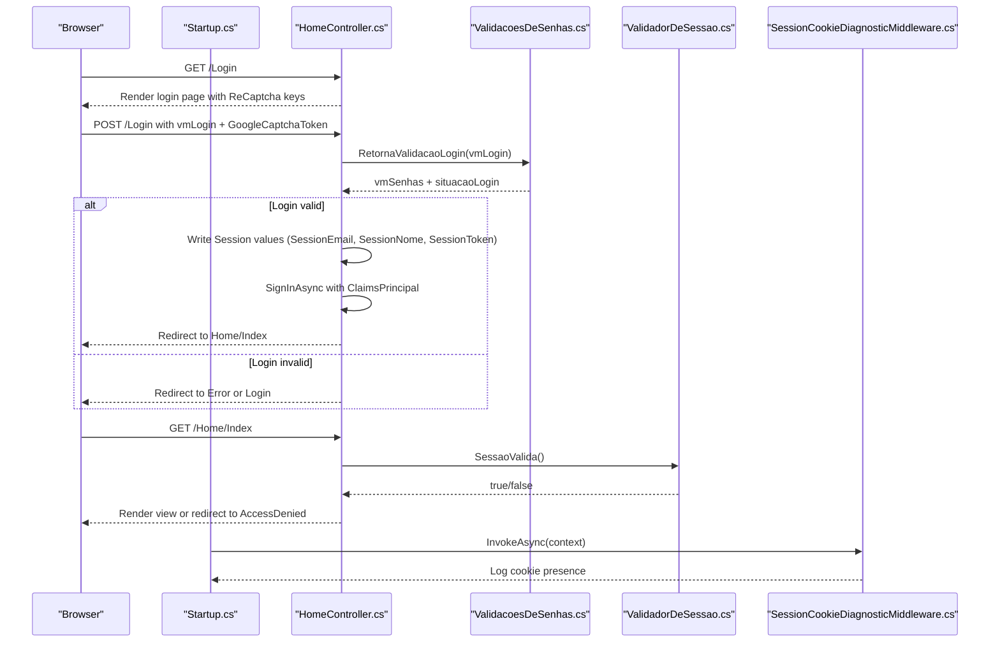

**Diagram sources**
- [Startup.cs:141-152](file://LabWebMvc.MVC/Startup.cs#L141-L152)
- [HomeController.cs:102-154](file://LabWebMvc.MVC/Areas/Controllers/HomeController.cs#L102-L154)
- [HomeController.cs:260-345](file://LabWebMvc.MVC/Areas/Controllers/HomeController.cs#L260-L345)
- [ValidacoesDeSenhas.cs:224-482](file://LabWebMvc.MVC/Areas/Validations/ValidacoesDeSenhas.cs#L224-L482)
- [ValidadorDeSessao.cs:15-34](file://ExtensionsMethods/ValidadorDeSessao/ValidadorDeSessao.cs#L15-L34)
- [SessionCookieDiagnosticMiddleware.cs:16-32](file://LabWebMvc.MVC/Areas/Middleware/SessionCookieDiagnosticMiddleware.cs#L16-L32)

## Detailed Component Analysis

### Cookie-Based Authentication
- Authentication scheme:
  - Cookie name, HttpOnly, SameSite, SecurePolicy configured.
  - LoginPath, LogoutPath, AccessDeniedPath defined.
  - ExpireTimeSpan and SlidingExpiration enabled.
- Claims-based identity:
  - Claims are created and signed in during successful login.
- Logout:
  - SignOutAsync removes authentication cookie.
  - Session values cleared and associated session cookie deleted.

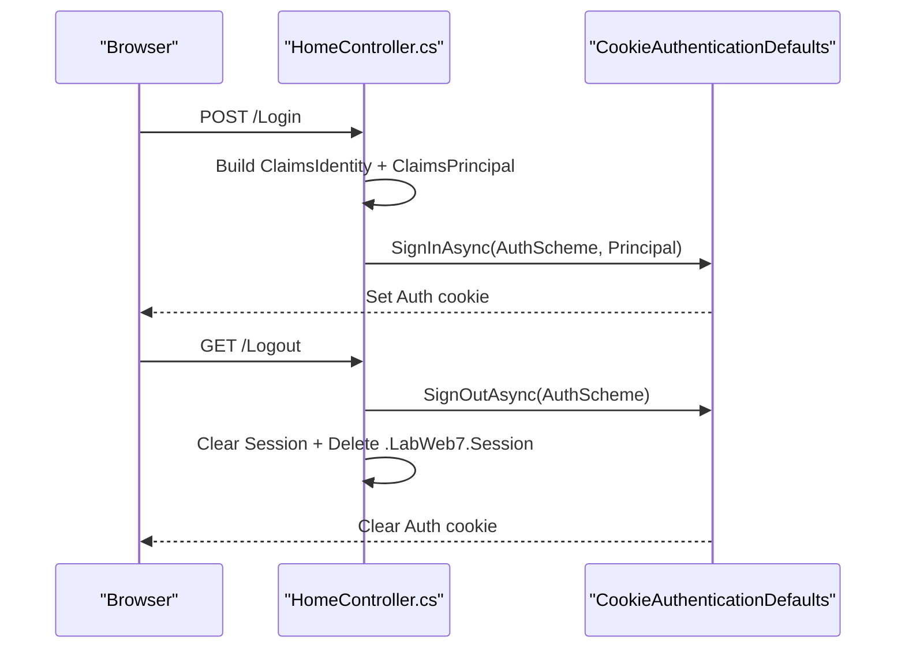

**Diagram sources**
- [Startup.cs:141-152](file://LabWebMvc.MVC/Startup.cs#L141-L152)
- [HomeController.cs:299-316](file://LabWebMvc.MVC/Areas/Controllers/HomeController.cs#L299-L316)
- [HomeController.cs:380-405](file://LabWebMvc.MVC/Areas/Controllers/HomeController.cs#L380-L405)

**Section sources**
- [Startup.cs:141-152](file://LabWebMvc.MVC/Startup.cs#L141-L152)
- [HomeController.cs:299-316](file://LabWebMvc.MVC/Areas/Controllers/HomeController.cs#L299-L316)
- [HomeController.cs:380-405](file://LabWebMvc.MVC/Areas/Controllers/HomeController.cs#L380-L405)

### Session Management
- Session configuration:
  - Name, HttpOnly, SameSite, SecurePolicy, IdleTimeout set.
  - UseSession invoked before authentication and authorization.
- Session storage:
  - Keys include SessionEmail, SessionNome, SessionToken, SessionCNPJEmpresa, SessionUF, etc.
- Session validation:
  - IValidadorDeSessao and SessionFilter enforce session presence and validity.
- Logout cleanup:
  - Clears session values and deletes session cookie.

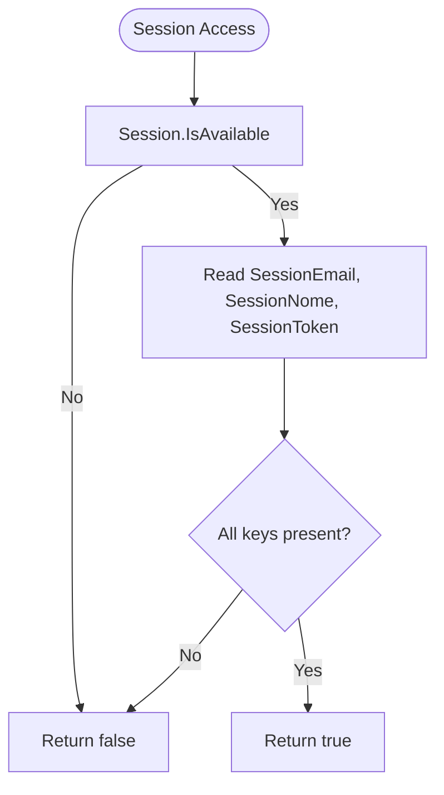

**Diagram sources**
- [ValidadorDeSessao.cs:15-34](file://ExtensionsMethods/ValidadorDeSessao/ValidadorDeSessao.cs#L15-L34)
- [ValidacoesDeSessao.cs:16-26](file://ExtensionsMethods/ValidadorDeSessao/ValidacoesDeSessao.cs#L16-L26)

**Section sources**
- [Startup.cs:129-138](file://LabWebMvc.MVC/Startup.cs#L129-L138)
- [HomeController.cs:278-293](file://LabWebMvc.MVC/Areas/Controllers/HomeController.cs#L278-L293)
- [ValidadorDeSessao.cs:15-34](file://ExtensionsMethods/ValidadorDeSessao/ValidadorDeSessao.cs#L15-L34)
- [ValidacoesDeSessao.cs:39-72](file://ExtensionsMethods/ValidadorDeSessao/ValidacoesDeSessao.cs#L39-L72)
- [HomeController.cs:394-405](file://LabWebMvc.MVC/Areas/Controllers/HomeController.cs#L394-L405)

### Password Validation and Migration
- Validation flow:
  - Retrieves user record by login/email.
  - Verifies password using BCrypt with automatic migration from legacy AES.
  - Updates stored hash if migration occurs.
- Dynamic connection:
  - Determines company and sets connection string before validating credentials.
- Recovery and creation:
  - Supports password recovery and user creation with hashed defaults.

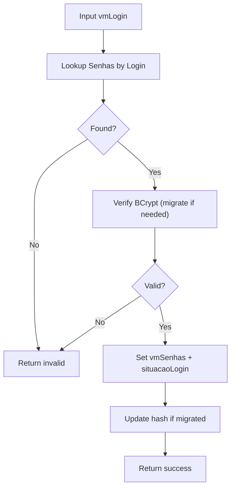

**Diagram sources**
- [ValidacoesDeSenhas.cs:437-482](file://LabWebMvc.MVC/Areas/Validations/ValidacoesDeSenhas.cs#L437-L482)
- [ValidacoesDeSenhas.cs:99-221](file://LabWebMvc.MVC/Areas/Validations/ValidacoesDeSenhas.cs#L99-L221)

**Section sources**
- [ValidacoesDeSenhas.cs:437-482](file://LabWebMvc.MVC/Areas/Validations/ValidacoesDeSenhas.cs#L437-L482)
- [ValidacoesDeSenhas.cs:99-221](file://LabWebMvc.MVC/Areas/Validations/ValidacoesDeSenhas.cs#L99-L221)

### ReCaptcha Integration
- Frontend:
  - Public key and API URL passed to view for rendering.
- Backend:
  - Validates ReCaptcha token via service and Google APIs.
  - Evaluates risk score and error codes.
  - Stores raw response for later validation checks.
- Limits and confirmation:
  - Handles free tier limits and prompts confirmation before proceeding.

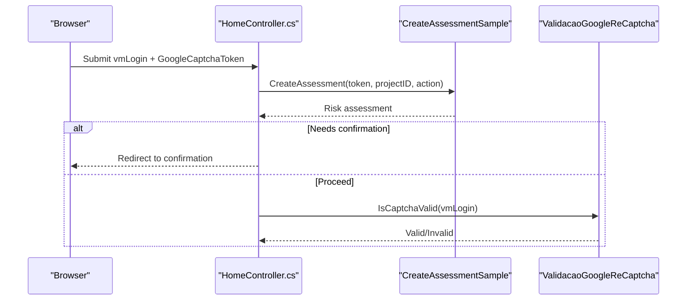

**Diagram sources**
- [HomeController.cs:156-184](file://LabWebMvc.MVC/Areas/Controllers/HomeController.cs#L156-L184)
- [HomeController.cs:186-258](file://LabWebMvc.MVC/Areas/Controllers/HomeController.cs#L186-L258)
- [GenericValidations.cs:10-11](file://ExtensionsMethods/Genericos/GenericValidations.cs#L10-L11)

**Section sources**
- [HomeController.cs:102-154](file://LabWebMvc.MVC/Areas/Controllers/HomeController.cs#L102-L154)
- [HomeController.cs:156-184](file://LabWebMvc.MVC/Areas/Controllers/HomeController.cs#L156-L184)
- [HomeController.cs:186-258](file://LabWebMvc.MVC/Areas/Controllers/HomeController.cs#L186-L258)
- [GenericValidations.cs:10-18](file://ExtensionsMethods/Genericos/GenericValidations.cs#L10-L18)

### Menu-Based Authorization Concept
- Menu model defines hierarchical navigation items (Principal, Item, Subitem, Controle, Acao, Parametros).
- Menu assembly helper builds a composite string for menu rendering and potential authorization checks.
- Authorization enforcement can be applied at controller/action level using filters or policies.

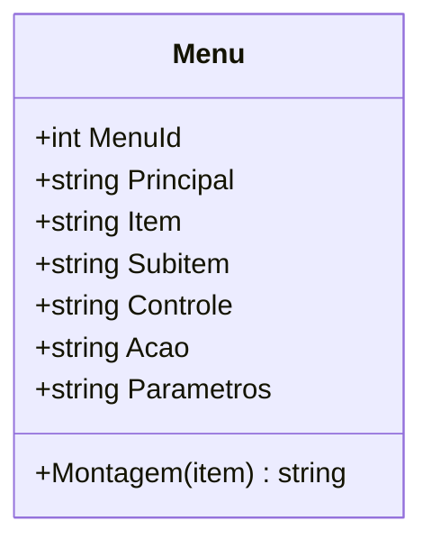

**Diagram sources**
- [Menu.cs:3-49](file://LabWebMvc.MVC/Interfaces/Menu.cs#L3-L49)

**Section sources**
- [Menu.cs:3-49](file://LabWebMvc.MVC/Interfaces/Menu.cs#L3-L49)

### Concurrent Access Control
- Concurrency services are registered in Startup and injected into controllers.
- Concurrency logic is implemented in dedicated services to prevent simultaneous conflicting operations.
- Integration points exist in controllers and services to coordinate exclusive access.

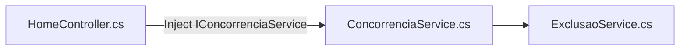

**Diagram sources**
- [Startup.cs:86-86](file://LabWebMvc.MVC/Startup.cs#L86-L86)
- [BaseController.cs:14-39](file://LabWebMvc.MVC/Areas/Controllers/BaseController.cs#L14-L39)

**Section sources**
- [Startup.cs:86-86](file://LabWebMvc.MVC/Startup.cs#L86-L86)
- [BaseController.cs:14-39](file://LabWebMvc.MVC/Areas/Controllers/BaseController.cs#L14-L39)

### Session Validation Services
- IValidadorDeSessao and ValidadorDeSessao provide centralized session validation logic.
- SessionFilter enforces session validity across controller actions, excluding public routes.

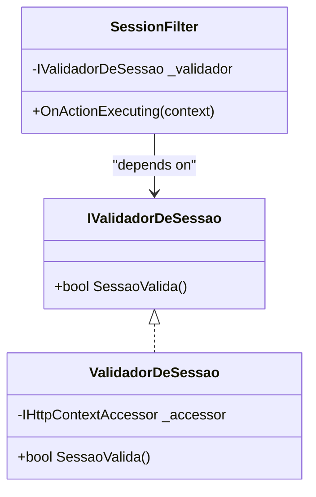

**Diagram sources**
- [IValidadorDeSessao.cs:3-6](file://ExtensionsMethods/ValidadorDeSessao/IValidadorDeSessao.cs#L3-L6)
- [ValidadorDeSessao.cs:6-36](file://ExtensionsMethods/ValidadorDeSessao/ValidadorDeSessao.cs#L6-L36)
- [ValidacoesDeSessao.cs:39-72](file://ExtensionsMethods/ValidadorDeSessao/ValidacoesDeSessao.cs#L39-L72)

**Section sources**
- [IValidadorDeSessao.cs:3-6](file://ExtensionsMethods/ValidadorDeSessao/IValidadorDeSessao.cs#L3-L6)
- [ValidadorDeSessao.cs:6-36](file://ExtensionsMethods/ValidadorDeSessao/ValidadorDeSessao.cs#L6-L36)
- [ValidacoesDeSessao.cs:39-72](file://ExtensionsMethods/ValidadorDeSessao/ValidacoesDeSessao.cs#L39-L72)

### Security Configuration and Middleware
- Cookie policy and routing order:
  - UseCookiePolicy, UseRouting, UseSession, UseAuthentication, UseAuthorization.
- Secure cookie settings:
  - HttpOnly, SameSite, SecurePolicy configured in both authentication and session options.
- Diagnostics:
  - SessionCookieDiagnosticMiddleware logs presence of session cookie.
  - ResponseCookieLoggerMiddleware logs Set-Cookie headers.
  - SessionDebugMiddleware logs session values for debugging.

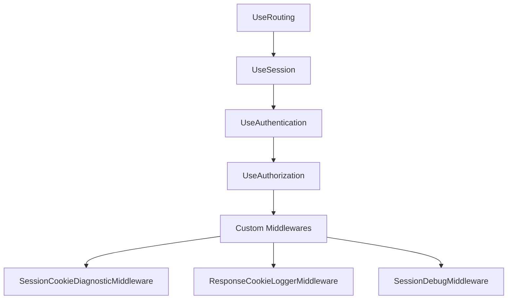

**Diagram sources**
- [Startup.cs:189-214](file://LabWebMvc.MVC/Startup.cs#L189-L214)
- [SessionCookieDiagnosticMiddleware.cs:16-32](file://LabWebMvc.MVC/Areas/Middleware/SessionCookieDiagnosticMiddleware.cs#L16-L32)
- [ResponseCookieLoggerMiddleware.cs:14-37](file://LabWebMvc.MVC/Areas/Middleware/ResponseCookieLoggerMiddleware.cs#L14-L37)
- [SessionDebugMiddleware.cs:14-39](file://LabWebMvc.MVC/Areas/Middleware/SessionDebugMiddleware.cs#L14-L39)

**Section sources**
- [Startup.cs:189-214](file://LabWebMvc.MVC/Startup.cs#L189-L214)
- [SessionCookieDiagnosticMiddleware.cs:16-32](file://LabWebMvc.MVC/Areas/Middleware/SessionCookieDiagnosticMiddleware.cs#L16-L32)
- [ResponseCookieLoggerMiddleware.cs:14-37](file://LabWebMvc.MVC/Areas/Middleware/ResponseCookieLoggerMiddleware.cs#L14-L37)
- [SessionDebugMiddleware.cs:14-39](file://LabWebMvc.MVC/Areas/Middleware/SessionDebugMiddleware.cs#L14-L39)

### Identity Framework Integration
- IdentityHostingStartup loads configuration based on environment to support migrations and connection strings.
- Razor Pages are enabled for direct routing (e.g., Login page).

**Section sources**
- [IdentityHostingStartup.cs:9-35](file://LabWebMvc.MVC/Areas/Identity/IdentityHostingStartup.cs#L9-L35)
- [Startup.cs:162-164](file://LabWebMvc.MVC/Startup.cs#L162-L164)

## Dependency Analysis
- Controllers depend on:
  - IValidacoesDeSenhas for credential validation.
  - IValidadorDeSessao for session checks.
  - IConnectionService for dynamic database switching.
  - ReCaptcha services for spam protection.
- Startup registers:
  - Authentication, Session, Cookie Policy, and middleware in the correct order.
  - ReCaptcha settings and services.
- Models:
  - UsuariosWeb links to Senhas for user credentials.

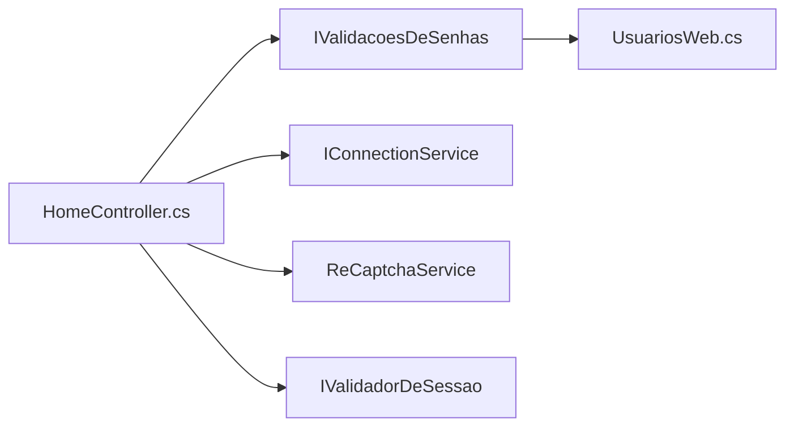

**Diagram sources**
- [HomeController.cs:36-56](file://LabWebMvc.MVC/Areas/Controllers/HomeController.cs#L36-L56)
- [ValidacoesDeSenhas.cs:15-37](file://LabWebMvc.MVC/Areas/Validations/ValidacoesDeSenhas.cs#L15-L37)
- [UsuariosWeb.cs:5-24](file://LabWebMvc.MVC/Models/UsuariosWeb.cs#L5-L24)

**Section sources**
- [HomeController.cs:36-56](file://LabWebMvc.MVC/Areas/Controllers/HomeController.cs#L36-L56)
- [ValidacoesDeSenhas.cs:15-37](file://LabWebMvc.MVC/Areas/Validations/ValidacoesDeSenhas.cs#L15-L37)
- [UsuariosWeb.cs:5-24](file://LabWebMvc.MVC/Models/UsuariosWeb.cs#L5-L24)

## Performance Considerations
- Sliding expiration reduces idle-time logout frequency while maintaining security.
- Use of distributed in-memory cache for sessions scales horizontally when deployed behind load balancers.
- Minimize synchronous database calls in hot paths; the code uses async methods for ReCaptcha and database operations.
- Avoid storing sensitive data in cookies; use session storage for tokens and claims are kept minimal.

## Troubleshooting Guide
- Authentication failures:
  - Verify LoginPath, LogoutPath, AccessDeniedPath in authentication options.
  - Check that UseSession precedes UseAuthentication and UseAuthorization.
- Session issues:
  - Confirm session cookie name and SameSite settings match browser expectations.
  - Use diagnostic middleware to verify cookie presence and Set-Cookie headers.
- ReCaptcha problems:
  - Ensure SiteKey and SecretKey are configured and accessible to views.
  - Review risk assessment results and error codes returned by Google.
- Audit logging:
  - Use IEventLogHelper to capture login attempts, validation outcomes, and security events.

**Section sources**
- [Startup.cs:141-152](file://LabWebMvc.MVC/Startup.cs#L141-L152)
- [Startup.cs:189-214](file://LabWebMvc.MVC/Startup.cs#L189-L214)
- [SessionCookieDiagnosticMiddleware.cs:16-32](file://LabWebMvc.MVC/Areas/Middleware/SessionCookieDiagnosticMiddleware.cs#L16-L32)
- [ResponseCookieLoggerMiddleware.cs:14-37](file://LabWebMvc.MVC/Areas/Middleware/ResponseCookieLoggerMiddleware.cs#L14-L37)
- [HomeController.cs:144-150](file://LabWebMvc.MVC/Areas/Controllers/HomeController.cs#L144-L150)

## Conclusion
The system combines cookie-based authentication with robust session management, ReCaptcha spam protection, and secure password handling with automatic migration. Middleware and filters provide diagnostics and enforcement, while Startup wiring ensures proper pipeline ordering. The menu model and concurrency services support scalable authorization and access control.

## Appendices

### Security Best Practices
- Secure cookie configuration:
  - HttpOnly, SameSite, SecurePolicy aligned with environment.
  - Use sliding expiration judiciously.
- Prevent session hijacking:
  - Store tokens in session, not cookies.
  - Clear session on logout and delete session cookie.
- Logging and monitoring:
  - Capture authentication outcomes and ReCaptcha assessments.
  - Monitor access denied and expired session events.

### Examples and Patterns
- Securing controllers:
  - Apply SessionFilter to enforce session validity across actions.
- Custom authorization attributes:
  - Implement IAuthorizationRequirement and AuthorizationHandler for RBAC.
- Handling authentication failures:
  - Redirect to AccessDenied or Error pages with contextual messages.

[No sources needed since this section provides general guidance]