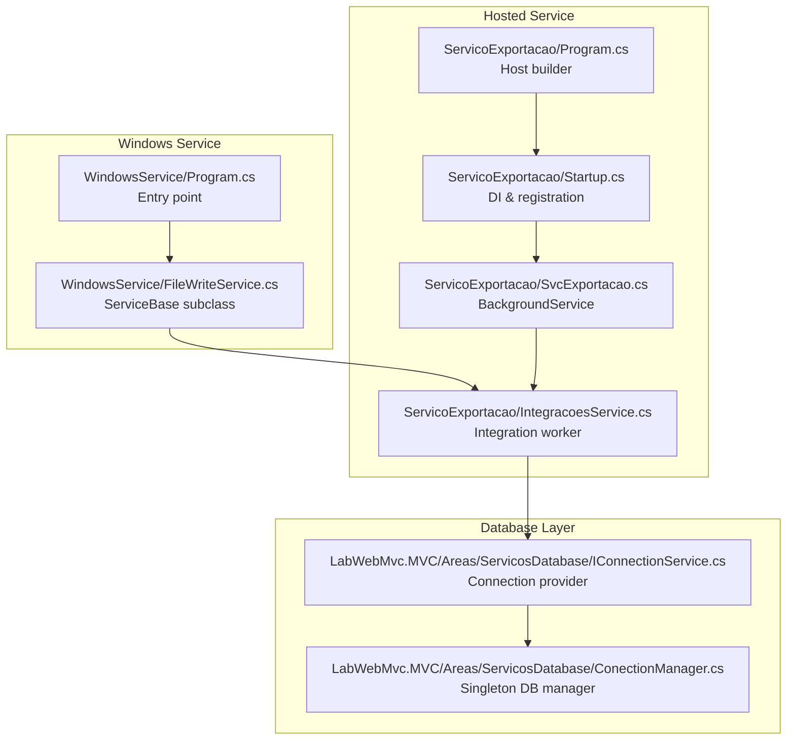
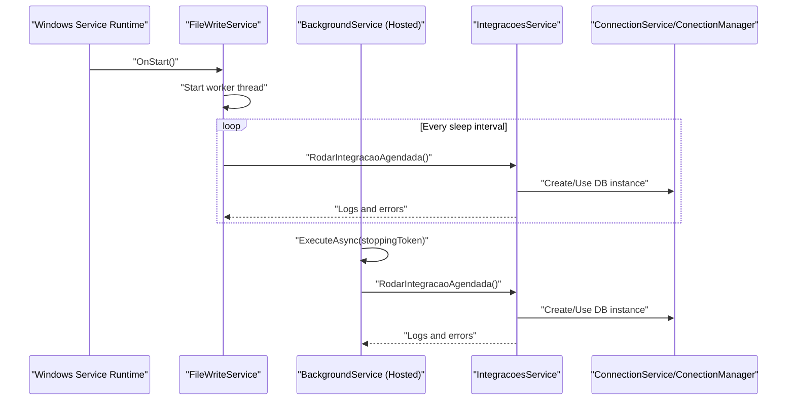
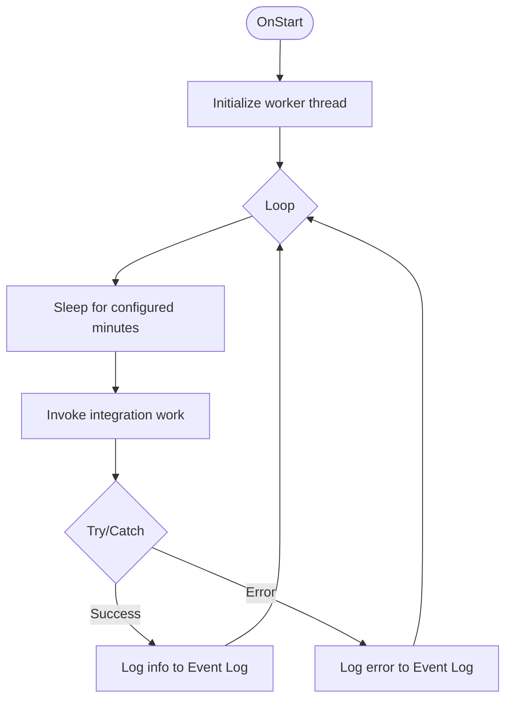
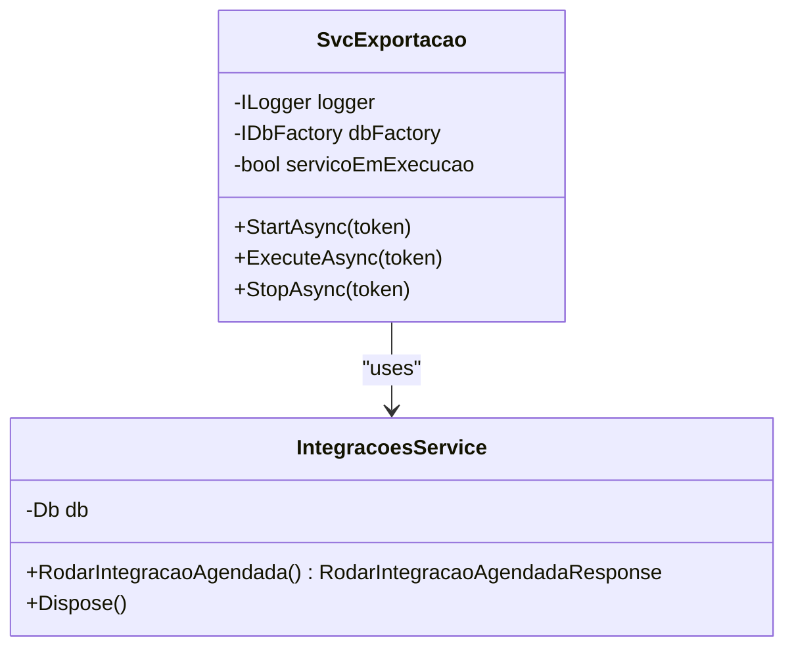
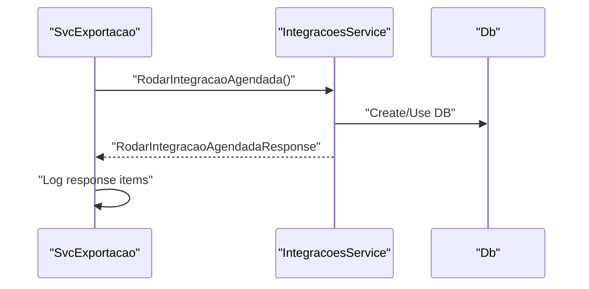
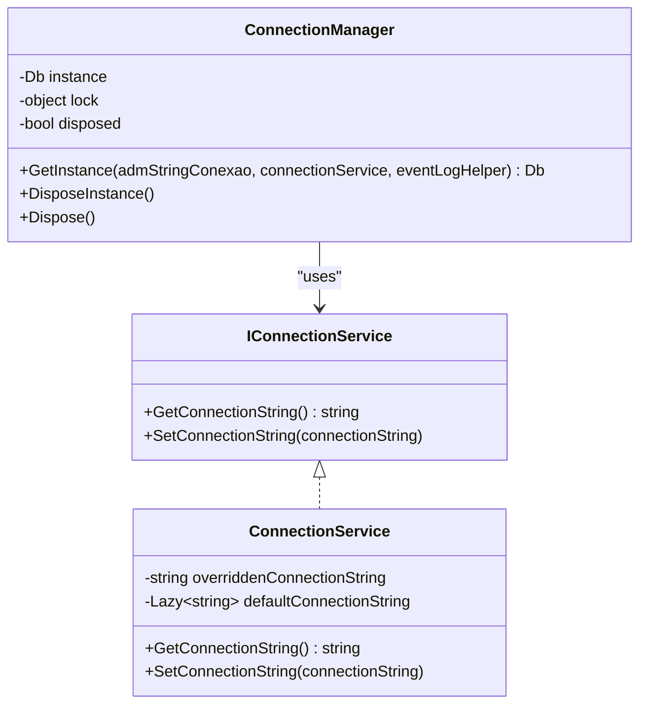
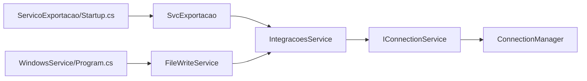

# Background Services

<cite>
**Referenced Files in This Document**
- [Program.cs](file://WindowsService/Program.cs)
- [FileWriteService.cs](file://WindowsService/FileWriteService.cs)
- [Program.cs](file://ServicoExportacao/Program.cs)
- [Startup.cs](file://ServicoExportacao/Startup.cs)
- [SvcExportacao.cs](file://ServicoExportacao/SvcExportacao.cs)
- [IntegracoesService.cs](file://ServicoExportacao/IntegracoesService.cs)
- [BaseServico.cs](file://ServicoExportacao/BaseServico.cs)
- [IConnectionService.cs](file://LabWebMvc.MVC/Areas/ServicosDatabase/IConnectionService.cs)
- [ConectionManager.cs](file://LabWebMvc.MVC/Areas/ServicosDatabase/ConectionManager.cs)
- [appsettings.json](file://Extensions/appsettings.json)
- [appsettings.Development.json](file://Extensions/appsettings.Development.json)
</cite>

## Table of Contents
1. [Introduction](#introduction)
2. [Project Structure](#project-structure)
3. [Core Components](#core-components)
4. [Architecture Overview](#architecture-overview)
5. [Detailed Component Analysis](#detailed-component-analysis)
6. [Dependency Analysis](#dependency-analysis)
7. [Performance Considerations](#performance-considerations)
8. [Troubleshooting Guide](#troubleshooting-guide)
9. [Conclusion](#conclusion)
10. [Appendices](#appendices)

## Introduction
This document explains the background services and Windows service implementation used for scheduled data integration tasks. It covers the hosted service architecture, background job processing, and scheduled task execution. It also documents the integration service workers, data export operations, and service monitoring capabilities. Cross-platform deployment considerations are included, along with service lifecycle management, error handling strategies, health checks, configuration via appsettings, dependency injection setup, and logging integration. Practical examples are provided for creating custom background services, implementing retry mechanisms, and handling service dependencies, alongside startup procedures, graceful shutdown, and performance monitoring guidance.

## Project Structure
The solution includes two primary service implementations:
- A Windows Service wrapper that runs a continuous loop to trigger scheduled integration work.
- An ASP.NET Core hosted service that performs the same integration work using the BackgroundService pattern.

**Diagram sources**
- [Program.cs:1-81](file://WindowsService/Program.cs#L1-L81)
- [FileWriteService.cs:1-125](file://WindowsService/FileWriteService.cs#L1-L125)
- [Program.cs:1-27](file://ServicoExportacao/Program.cs#L1-L27)
- [Startup.cs:1-95](file://ServicoExportacao/Startup.cs#L1-L95)
- [SvcExportacao.cs:1-89](file://ServicoExportacao/SvcExportacao.cs#L1-L89)
- [IntegracoesService.cs:1-42](file://ServicoExportacao/IntegracoesService.cs#L1-L42)
- [IConnectionService.cs:1-43](file://LabWebMvc.MVC/Areas/ServicosDatabase/IConnectionService.cs#L1-L43)
- [ConectionManager.cs:1-51](file://LabWebMvc.MVC/Areas/ServicosDatabase/ConectionManager.cs#L1-L51)

**Section sources**
- [Program.cs:1-81](file://WindowsService/Program.cs#L1-L81)
- [Program.cs:1-27](file://ServicoExportacao/Program.cs#L1-L27)
- [Startup.cs:1-95](file://ServicoExportacao/Startup.cs#L1-L95)

## Core Components
- Windows Service entry point and lifecycle:
  - Initializes dependencies and runs as a Windows Service or debug mode depending on environment.
  - Starts a dedicated thread that periodically triggers integration work.
  - Writes informational and error events to the Windows Event Log.
- Hosted service implementation:
  - Uses BackgroundService to run integration work on a schedule.
  - Registers the hosted service in DI during startup.
  - Logs progress and errors to a file-based logger.
- Integration service worker:
  - Orchestrates scheduled integration tasks and aggregates logs and errors.
  - Disposes underlying database resources properly.
- Database connectivity:
  - Provides a lazily initialized connection string from configuration.
  - Offers a singleton DB instance via a managed connection manager.

Key responsibilities:
- Scheduled execution: Windows Service loop and BackgroundService ExecuteAsync.
- Logging: Event Log entries and file-based logging.
- Configuration: Reads appsettings and environment-specific overrides.
- Dependency injection: Registers hosted service and database factory.

**Section sources**
- [FileWriteService.cs:1-125](file://WindowsService/FileWriteService.cs#L1-L125)
- [SvcExportacao.cs:1-89](file://ServicoExportacao/SvcExportacao.cs#L1-L89)
- [IntegracoesService.cs:1-42](file://ServicoExportacao/IntegracoesService.cs#L1-L42)
- [IConnectionService.cs:1-43](file://LabWebMvc.MVC/Areas/ServicosDatabase/IConnectionService.cs#L1-L43)
- [ConectionManager.cs:1-51](file://LabWebMvc.MVC/Areas/ServicosDatabase/ConectionManager.cs#L1-L51)

## Architecture Overview
The system supports two execution modes:
- Windows Service mode: Runs continuously, sleeping between cycles, invoking integration work.
- Hosted service mode: Runs inside an ASP.NET Core host, using BackgroundService for scheduling.

**Diagram sources**
- [FileWriteService.cs:33-118](file://WindowsService/FileWriteService.cs#L33-L118)
- [SvcExportacao.cs:22-75](file://ServicoExportacao/SvcExportacao.cs#L22-L75)
- [IntegracoesService.cs:21-40](file://ServicoExportacao/IntegracoesService.cs#L21-L40)
- [IConnectionService.cs:12-42](file://LabWebMvc.MVC/Areas/ServicosDatabase/IConnectionService.cs#L12-L42)
- [ConectionManager.cs:15-31](file://LabWebMvc.MVC/Areas/ServicosDatabase/ConectionManager.cs#L15-L31)

## Detailed Component Analysis

### Windows Service Implementation
- Entry point:
  - Detects Windows OS and either runs as a ServiceBase or prints a message for non-Windows environments.
  - Builds dependencies manually for the Windows Service scenario.
- Service lifecycle:
  - OnStart initializes the worker thread.
  - OnStop writes a termination event.
  - Pause/Continue are logged but no-op logic is present.
- Worker loop:
  - Sleeps for configured minutes, then invokes integration work.
  - Wraps execution in try/catch and logs errors to the Event Log.
  - Uses a debug mode path that mirrors OnStart for interactive debugging.

**Diagram sources**
- [FileWriteService.cs:33-118](file://WindowsService/FileWriteService.cs#L33-L118)

**Section sources**
- [Program.cs:9-35](file://WindowsService/Program.cs#L9-L35)
- [FileWriteService.cs:12-125](file://WindowsService/FileWriteService.cs#L12-L125)

### Hosted Service Implementation
- Registration:
  - Adds the hosted service in Startup.ConfigureServices.
- Execution:
  - ExecuteAsync prevents concurrent runs, logs lifecycle events, and schedules work.
  - Uses a cancellation token to honor shutdown signals.
- Integration worker:
  - Calls the integration service and writes logs to a file-based logger.
  - Ensures proper disposal of DB resources.

**Diagram sources**
- [SvcExportacao.cs:10-89](file://ServicoExportacao/SvcExportacao.cs#L10-L89)
- [IntegracoesService.cs:9-42](file://ServicoExportacao/IntegracoesService.cs#L9-L42)

**Section sources**
- [Startup.cs:64-66](file://ServicoExportacao/Startup.cs#L64-L66)
- [SvcExportacao.cs:10-89](file://ServicoExportacao/SvcExportacao.cs#L10-L89)
- [IntegracoesService.cs:9-42](file://ServicoExportacao/IntegracoesService.cs#L9-L42)

### Integration Service Worker
- Purpose:
  - Coordinates scheduled integration tasks.
  - Aggregates logs and errors into a response object.
- Resource management:
  - Implements IDisposable to dispose the underlying DB context.

**Diagram sources**
- [SvcExportacao.cs:35-48](file://ServicoExportacao/SvcExportacao.cs#L35-L48)
- [IntegracoesService.cs:21-40](file://ServicoExportacao/IntegracoesService.cs#L21-L40)

**Section sources**
- [IntegracoesService.cs:9-42](file://ServicoExportacao/IntegracoesService.cs#L9-L42)
- [BaseServico.cs:4-14](file://ServicoExportacao/BaseServico.cs#L4-L14)

### Database Connectivity
- Connection provider:
  - Lazily resolves the connection string from configuration and environment variables.
  - Supports overriding the connection string at runtime.
- Singleton DB manager:
  - Ensures a single DB instance per process with thread-safe initialization and disposal.

**Diagram sources**
- [IConnectionService.cs:5-42](file://LabWebMvc.MVC/Areas/ServicosDatabase/IConnectionService.cs#L5-L42)
- [ConectionManager.cs:6-50](file://LabWebMvc.MVC/Areas/ServicosDatabase/ConectionManager.cs#L6-L50)

**Section sources**
- [IConnectionService.cs:12-42](file://LabWebMvc.MVC/Areas/ServicosDatabase/IConnectionService.cs#L12-L42)
- [ConectionManager.cs:15-31](file://LabWebMvc.MVC/Areas/ServicosDatabase/ConectionManager.cs#L15-L31)

## Dependency Analysis
- Service registration:
  - The hosted service is registered in Startup.ConfigureServices.
- Runtime dependencies:
  - Both Windows Service and hosted service rely on the integration service and database factory.
- Configuration:
  - Reads appsettings and environment-specific files to build configuration.
- Logging:
  - Windows Service uses Event Log; hosted service uses a file-based logger.

**Diagram sources**
- [Startup.cs:64-66](file://ServicoExportacao/Startup.cs#L64-L66)
- [SvcExportacao.cs:16-20](file://ServicoExportacao/SvcExportacao.cs#L16-L20)
- [IntegracoesService.cs:12-15](file://ServicoExportacao/IntegracoesService.cs#L12-L15)
- [IConnectionService.cs:12-15](file://LabWebMvc.MVC/Areas/ServicosDatabase/IConnectionService.cs#L12-L15)
- [ConectionManager.cs:15-26](file://LabWebMvc.MVC/Areas/ServicosDatabase/ConectionManager.cs#L15-L26)
- [Program.cs:18-28](file://WindowsService/Program.cs#L18-L28)
- [FileWriteService.cs:18-22](file://WindowsService/FileWriteService.cs#L18-L22)

**Section sources**
- [Startup.cs:22-72](file://ServicoExportacao/Startup.cs#L22-L72)
- [Program.cs:13-28](file://WindowsService/Program.cs#L13-L28)

## Performance Considerations
- Threading model:
  - Windows Service uses a dedicated worker thread; avoid blocking calls in the worker loop.
- Scheduling:
  - The Windows Service sleeps for a configurable number of minutes; adjust for workload intensity.
  - The hosted service completes one cycle and delays for a short period; consider implementing periodic scheduling with timers or external schedulers for precise intervals.
- Resource management:
  - Ensure DB instances are disposed promptly; the integration service implements IDisposable.
- Logging overhead:
  - Event Log and file-based logging should be tuned to reduce I/O contention under load.

[No sources needed since this section provides general guidance]

## Troubleshooting Guide
- Windows Service logs:
  - Review the Application Event Log for informational and error entries emitted by the service.
- Hosted service logs:
  - Inspect file-based logs written during service execution.
- Configuration issues:
  - Verify appsettings and environment-specific files; ensure the connection string section exists and is valid.
- Connection failures:
  - Confirm the connection string resolution and that the environment variables are set as expected.

**Section sources**
- [FileWriteService.cs:95-112](file://WindowsService/FileWriteService.cs#L95-L112)
- [SvcExportacao.cs:50-66](file://ServicoExportacao/SvcExportacao.cs#L50-L66)
- [IConnectionService.cs:17-35](file://LabWebMvc.MVC/Areas/ServicosDatabase/IConnectionService.cs#L17-L35)

## Conclusion
The solution provides robust background processing through both a Windows Service wrapper and an ASP.NET Core hosted service. The integration worker encapsulates scheduled tasks and ensures proper resource disposal. Configuration and logging are centralized, enabling straightforward deployment and monitoring. For production, consider enhancing scheduling precision, adding health checks, and implementing retry policies for transient failures.

[No sources needed since this section summarizes without analyzing specific files]

## Appendices

### Service Lifecycle Management
- Windows Service:
  - OnStart initializes and starts the worker thread.
  - OnStop writes termination events; consider signaling the worker thread to exit gracefully.
  - Pause/Continue are logged; implement cooperative pause/resume if needed.
- Hosted Service:
  - StartAsync and StopAsync write lifecycle logs; use cancellation tokens to abort long-running operations.

**Section sources**
- [FileWriteService.cs:33-66](file://WindowsService/FileWriteService.cs#L33-L66)
- [SvcExportacao.cs:77-87](file://ServicoExportacao/SvcExportacao.cs#L77-L87)

### Error Handling Strategies
- Windows Service:
  - Wraps integration execution in try/catch; logs errors to the Event Log.
- Hosted Service:
  - Catches exceptions, aggregates errors, and logs to file-based logger.
- Recommendations:
  - Add retry logic for transient errors.
  - Implement circuit breaker patterns for external dependencies.

**Section sources**
- [FileWriteService.cs:95-112](file://WindowsService/FileWriteService.cs#L95-L112)
- [SvcExportacao.cs:50-66](file://ServicoExportacao/SvcExportacao.cs#L50-L66)

### Health Checks and Monitoring
- Current state:
  - Event Log and file-based logging are used for monitoring.
- Recommendations:
  - Add ASP.NET Core health checks for database connectivity and integration status.
  - Expose metrics endpoints for monitoring service uptime and throughput.

[No sources needed since this section provides general guidance]

### Configuration Through appsettings
- Windows Service:
  - Reads configuration from the main application’s appsettings path.
- Hosted Service:
  - Loads appsettings and environment-specific files to resolve connection strings.
- Logging:
  - Configure logging levels in appsettings for both development and production.

**Section sources**
- [Startup.cs:32-57](file://ServicoExportacao/Startup.cs#L32-L57)
- [appsettings.json:1-10](file://Extensions/appsettings.json#L1-L10)
- [appsettings.Development.json:1-9](file://Extensions/appsettings.Development.json#L1-L9)

### Dependency Injection Setup
- Register the hosted service in Startup.ConfigureServices.
- Inject IDbFactory into the hosted service and integration service.
- Ensure the integration service disposes the DB context.

**Section sources**
- [Startup.cs:64-66](file://ServicoExportacao/Startup.cs#L64-L66)
- [SvcExportacao.cs:16-20](file://ServicoExportacao/SvcExportacao.cs#L16-L20)
- [IntegracoesService.cs:16-19](file://ServicoExportacao/IntegracoesService.cs#L16-L19)

### Logging Integration
- Windows Service:
  - Uses Event Log for operational messages and errors.
- Hosted Service:
  - Uses a file-based logger for audit trails.

**Section sources**
- [FileWriteService.cs:30-31](file://WindowsService/FileWriteService.cs#L30-L31)
- [SvcExportacao.cs:33-33](file://ServicoExportacao/SvcExportacao.cs#L33-L33)

### Examples and Best Practices
- Creating a custom background service:
  - Derive from BackgroundService and implement ExecuteAsync with cancellation support.
- Implementing retry mechanisms:
  - Wrap integration calls with retry policies for transient failures.
- Handling service dependencies:
  - Use constructor injection for IDbFactory and other dependencies.
- Service startup and graceful shutdown:
  - Use cancellation tokens to abort pending work during shutdown.
- Performance monitoring:
  - Track execution duration and error rates; expose metrics via health checks.

[No sources needed since this section provides general guidance]