# Business Logic Layer

<cite>
**Referenced Files in This Document**
- [BLL.csproj](file://BLL/BLL.csproj)
- [PartBLL.cs](file://BLL/PartBLL.cs)
- [UtilBLL.cs](file://BLL/UtilBLL.cs)
- [ConversoresPdf.cs](file://BLL/ConversoresPdf.cs)
- [WkConverterPdf.cs](file://BLL/WkConverterPdf.cs)
- [ITempoServidorService.cs](file://BLL/ITempoServidorService.cs)
- [TempoLocal.cs](file://BLL/TempoLocal.cs)
- [TempoServidorMSSQL.cs](file://BLL/TempoServidorMSSQL.cs)
- [PathHelper.cs](file://BLL/PathHelper.cs)
</cite>

## Table of Contents
1. [Introduction](#introduction)
2. [Project Structure](#project-structure)
3. [Core Components](#core-components)
4. [Architecture Overview](#architecture-overview)
5. [Detailed Component Analysis](#detailed-component-analysis)
6. [Dependency Analysis](#dependency-analysis)
7. [Performance Considerations](#performance-considerations)
8. [Troubleshooting Guide](#troubleshooting-guide)
9. [Conclusion](#conclusion)

## Introduction
This document describes the Business Logic Layer (BLL) components of the Web-Project. It focuses on core business rules, PDF generation services, time synchronization services, and utility functions. It explains the responsibilities of the PartBLL class, the helper methods in UtilBLL, and specialized services for document processing. It also covers the PDF conversion workflow using wkhtmltopdf integration, time synchronization with server and database, business rule enforcement, service interfaces, dependency injection configuration, error handling patterns, examples of common business operations, validation logic, data transformation processes, performance considerations, caching strategies, and thread safety.

## Project Structure
The BLL project is a .NET 8 library that exposes business services and utilities. It references several packages for PDF generation, cryptography, JSON, and database connectivity. The project contains:
- Core business model: PartBLL
- PDF conversion helpers: ConversoresPdf
- wkhtmltopdf integration: WkConverterPdf
- Time services: ITempoServidorService, TempoLocal, TempoServidorMSSQL
- Path helper: PathHelper
- Utility functions: UtilBLL

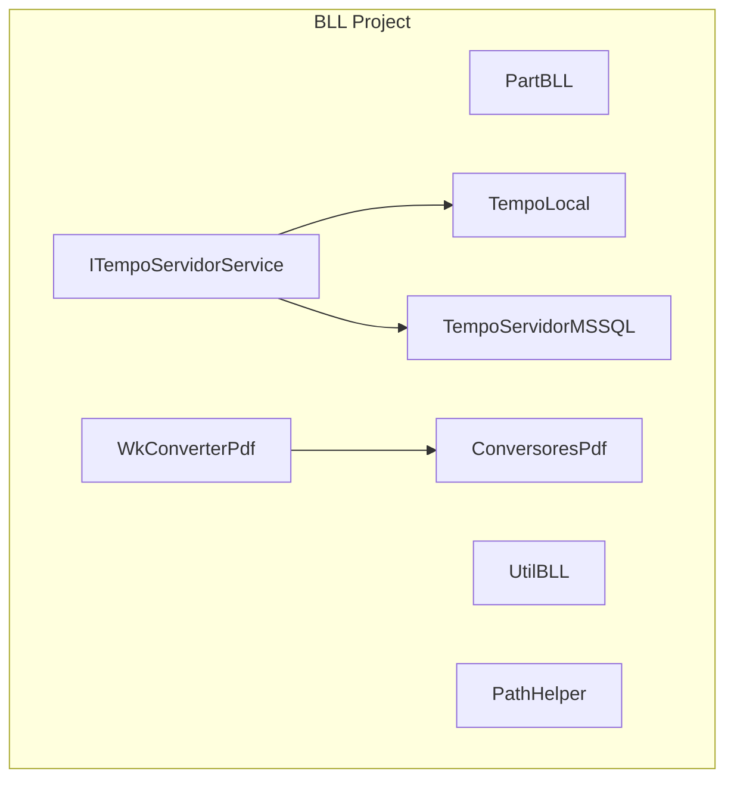

**Diagram sources**
- [PartBLL.cs:1-45](file://BLL/PartBLL.cs#L1-L45)
- [UtilBLL.cs:1-1738](file://BLL/UtilBLL.cs#L1-L1738)
- [ConversoresPdf.cs:1-112](file://BLL/ConversadoresPdf.cs#L1-L112)
- [WkConverterPdf.cs:1-386](file://BLL/WkConverterPdf.cs#L1-L386)
- [ITempoServidorService.cs:1-33](file://BLL/ITempoServidorService.cs#L1-L33)
- [TempoLocal.cs:1-30](file://BLL/TempoLocal.cs#L1-L30)
- [TempoServidorMSSQL.cs:1-90](file://BLL/TempoServidorMSSQL.cs#L1-L90)
- [PathHelper.cs:1-38](file://BLL/PathHelper.cs#L1-L38)

**Section sources**
- [BLL.csproj:1-33](file://BLL/BLL.csproj#L1-L33)

## Core Components
- PartBLL: A lightweight model representing a named part with equality semantics and a formatted string representation.
- UtilBLL: A comprehensive static utility class offering:
  - String manipulation and normalization (accent removal, trimming, casing)
  - Validation helpers (CPF/CNPJ/PIS/CNS/CEP/phone/email)
  - Formatting helpers (dates, numbers, masks)
  - Data transformation (Base64 encode/decode, streams, arrays)
  - Time utilities (working days, weekend detection, holiday checks)
  - File and path helpers (safe deletion, extension extraction)
  - Masking sensitive data
  - Async-safe LINQ helpers
  - Text wrapping and line breaking
- ConversoresPdf: Static helpers for converting images and files to Base64 and Data URIs, and for reading files into memory streams.
- WkConverterPdf: Static wrapper around wkhtmltopdf for converting HTML to PDF, including environment configuration, parameter building, process invocation, timeouts, and output handling.
- ITempoServidorService: Interface for time synchronization services.
- TempoLocal: Local time provider with synchronous and asynchronous methods.
- TempoServidorMSSQL: PostgreSQL time provider using Npgsql to query server time.
- PathHelper: Resolves real paths for files under web root or custom directories.

**Section sources**
- [PartBLL.cs:1-45](file://BLL/PartBLL.cs#L1-L45)
- [UtilBLL.cs:1-1738](file://BLL/UtilBLL.cs#L1-L1738)
- [ConversoresPdf.cs:1-112](file://BLL/ConversoresPdf.cs#L1-L112)
- [WkConverterPdf.cs:1-386](file://BLL/WkConverterPdf.cs#L1-L386)
- [ITempoServidorService.cs:1-33](file://BLL/ITempoServidorService.cs#L1-L33)
- [TempoLocal.cs:1-30](file://BLL/TempoLocal.cs#L1-L30)
- [TempoServidorMSSQL.cs:1-90](file://BLL/TempoServidorMSSQL.cs#L1-L90)
- [PathHelper.cs:1-38](file://BLL/PathHelper.cs#L1-L38)

## Architecture Overview
The BLL encapsulates business logic and cross-cutting concerns:
- Time services implement a common interface and can be injected where needed.
- PDF generation is handled by two complementary modules:
  - ConversoresPdf for image and file conversions.
  - WkConverterPdf for HTML-to-PDF conversion via wkhtmltopdf.
- UtilBLL centralizes validations, formatting, and transformations used across the application.
- PathHelper provides safe path resolution for file operations.

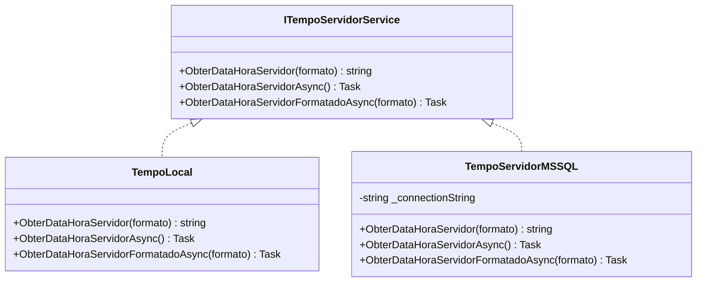

**Diagram sources**
- [ITempoServidorService.cs:1-33](file://BLL/ITempoServidorService.cs#L1-L33)
- [TempoLocal.cs:1-30](file://BLL/TempoLocal.cs#L1-L30)
- [TempoServidorMSSQL.cs:1-90](file://BLL/TempoServidorMSSQL.cs#L1-L90)

## Detailed Component Analysis

### PartBLL
Responsibilities:
- Encapsulates a part identifier and name.
- Implements equality based on PartId.
- Provides a formatted ToString for logging or display.

Key behaviors:
- Equality comparison uses PartId.
- Hash code derived from PartId.
- Supports optional comments indicating operator overrides.

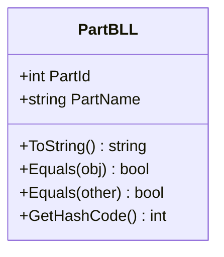

**Diagram sources**
- [PartBLL.cs:1-45](file://BLL/PartBLL.cs#L1-L45)

**Section sources**
- [PartBLL.cs:1-45](file://BLL/PartBLL.cs#L1-L45)

### UtilBLL
Responsibilities:
- Centralized business utilities for:
  - String normalization and sanitization
  - Validation of personal and corporate identifiers (CPF, CNPJ, PIS, CNS)
  - Phone, email, and postal code validation
  - Formatting helpers for dates, numbers, and masks
  - Data transformations (Base64, streams, arrays)
  - Time utilities (weekends, holidays, working days)
  - File and path helpers (safe deletion, extension extraction)
  - Masking sensitive data
  - Async-safe LINQ helpers
  - Text wrapping and line breaking

Highlights:
- Numeric and alpha checks, accent removal, and safe string trimming.
- Validation functions for Brazilian identifiers and international formats.
- Formatting functions for CPF, CNPJ, CEP, phone numbers, and decimal values.
- Safe async helpers to prevent exceptions in data access.
- Text wrapping and line breaking for reports.

```mermaid
classDiagram
class UtilBLL {
+static string Getbolinha
+static bool IsNumeric(text) bool
+static bool ContemStringAZ(text) bool
+static string ClearString(texto) string
+static string RemoveAcentuacao(value) string
+static string RetornaNumeros(str) string
+static string ConvertStringMaiuscula(value) string
+static bool IsFimDeSemana(data) bool
+static bool IsFeriado(data) bool
+static List<DateTime> GetProximasDatasUteis(qtdDias) List<DateTime>
+static bool ValidaSenhaSimples(texto) bool
+static void RemoverCaracteresEspeciais(obj) void
+static string[] ConstroiBotoesFormulario(Botoes, setas) string[]
+static DateTime FormataData(data, patternData, modoData) DateTime
+static dynamic FormataData(data, modoData, patternData) dynamic
+static dynamic RetornaSN(valor, compacto) dynamic
+static string? RetornaTextoQuandoNullVazio(valor, texto) string?
+static byte[] GetByteArray(input) byte[]
+static string LimitaString(value, length) string
+static string FillZero(value, length, left) string
+static List<string> GetFullErrorMessage(e) List<string>
+static bool ValidarTelefoneCelular(telefone) bool
+static bool ValidaEmail(email) bool
+static string RetornaEmailValidado(email) string
+static bool ValidaPisPasep(pisPasep) bool
+static bool ValidarCEI(value) bool
+static bool ValidarCNPJ(cnpj) bool
+static bool ValidarCNS(vlrCNS) bool
+static bool ValidarCPF(CPF) bool
+static bool ValidarDeclaracaoNascidoVivo(value) bool
+static bool ValidarCEP(cep) bool
+static string CPFSemFormatacao(CPF) string
+static string CNPJSemFormatacao(CNPJ) string
+static string DesformataCamposNumericosComMascara(value) string
+static string RetornaValorParcelaBrasileira(value) string
+static string RetornaDecimalComPonto(valor) string
+static string CortaNoTamanhoMaximo(valor, tam) string
+static bool ValidaData(data) bool
+static DateTime DateFromDataBase(date, hour) DateTime
+static string HourFromDataBase(date) string
+static DateTime RetornaDataMinimaDefault() DateTime
+static DateTime RetornaDataMaximaDefault() DateTime
+static string DataNula(data) string
+static void DeleteFile(filename, baseName) void
+static string Formatar(texto, mascara) string
+static string FormatarCEP(cep) string
+static string FormatarContaExame(conta) string
+static string FormatarContaExameSem11(conta) string
+static string? FormatarCPF(cpfFormatar) string?
+static string FormatarCNPJNotNull(cnpjFormatar) string
+static string? FormatarCNPJ(cnpjFormatar) string?
+static dynamic FormatarCNPJ(cnpjFormatar) dynamic
+static dynamic FormatarCPF(cnpjFormatar) dynamic
+static string? FormataTelefone(tel) string?
+static string FormataTelefoneNotNull(tel) string
+static string ApenasNumeros(valor) string
+static DateTime GetDateFromString(dateString, start) DateTime
+static string GetEscapedString(value) string
+static string Base64Decode(base64EncodedData) string
+static string Base64Encode(plainText) string
+static string CalcularIdade(DataDeNascimento) string
+static DateTime CalcularProximoDiaUtil(dataBase, feriados, diasUteisDesejados) DateTime
+static Task<string> RetornaTextoDeArquivoHtml(pathToHtmlFile) Task<string>
+static Task<string> RetornaTextoDeArquivoHtmlAsync(pathToHtmlFile) Task<string>
+static string RetornaValorDoFormulario(campo, fc) string
+static string RetornaValorDoFormulario(campo, dados) string
+static bool ConvertStringToBool(truefalse) bool
+static string NovaUrl(urlOriginal, novaRota) string
+static string TextoEspaco(texto, quant) string
+static int ToInt32(valor) int
+static ulong ToULong(valor) ulong
+static string[] EliminaItemVazioDoArray(array) string[]
+static string RemoveAcentos(text) string
+static string[] RetornaPartesNome(Nome) string[]
+static string LimpaCaracteresEspeciais(texto, retiraEspacoBranco, expressaoPermitida) string
+static dynamic RetornaValorFormulario(campo, fc) dynamic
+static string GetExtension(file) string
+static decimal ToDecimalInvariant(value) decimal
+static string GetCodigoDeErrosHttp(codigo) string
+static bool NaoExistePath(campo, texto) bool
+static Task<DateTime?> ObterDataHoraServidorAsync(conexao, tipoBanco) Task<DateTime?>
+static string MascararTexto(textoOriginal, visivelInicio, visivelFim, mascara) string
+static string MascararEmail(email) string
+static string Safe(value) string
+static string SafeUpper(value) string
+static string SafeLower(value) string
+static Task<List<T>> SafeToListAsync(query, fallback) Task<List<T>>
+static List<string> QuebrarTextoEmLinhas(texto, limite) List<string>
+static void AppendTextoQuebrado(sb, texto, limite) void
}
```

**Diagram sources**
- [UtilBLL.cs:1-1738](file://BLL/UtilBLL.cs#L1-L1738)

**Section sources**
- [UtilBLL.cs:1-1738](file://BLL/UtilBLL.cs#L1-L1738)

### ConversoresPdf
Responsibilities:
- Convert images to Base64 and Data URIs.
- Convert multiple images to Base64 lists.
- Load files into memory streams.
- Convert strings to Base64.

Error handling:
- Throws FileNotFoundException for missing image files.
- Throws InvalidOperationException for conversion errors.

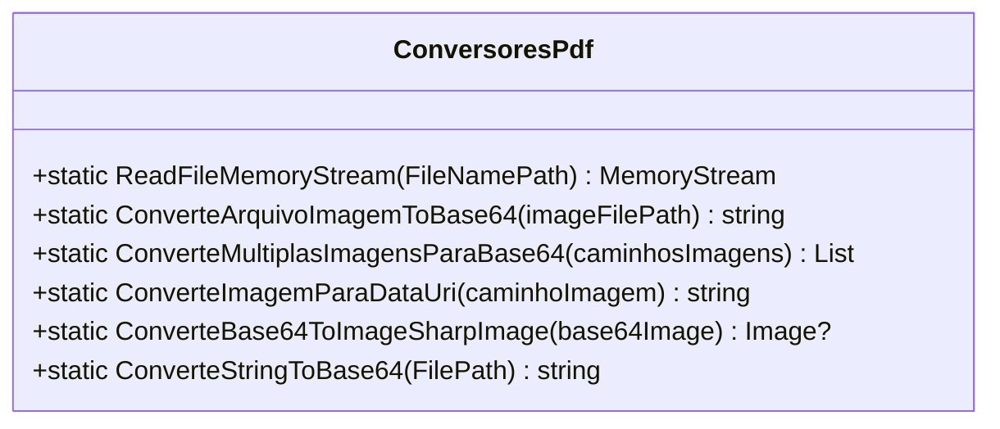

**Diagram sources**
- [ConversoresPdf.cs:1-112](file://BLL/ConversoresPdf.cs#L1-L112)

**Section sources**
- [ConversoresPdf.cs:1-112](file://BLL/ConversoresPdf.cs#L1-L112)

### WkConverterPdf
Responsibilities:
- Configure wkhtmltopdf environment (paths, timeout).
- Build command-line arguments for wkhtmltopdf.
- Execute conversion process with HTML or URL input.
- Manage temporary files and output streams.
- Handle timeouts and conversion failures.

Key classes:
- PaperTypes: Constants for paper sizes.
- PdfConvertException: Base exception for conversion errors.
- PdfConvertTimeoutException: Specific timeout exception.
- PdfOutput: Output configuration (file path, stream, callback).
- PdfDocument: Document configuration (paper type, header/footer, cookies, extra params).
- PdfConvertEnvironment: Environment configuration (temp folder, wkhtmltopdf path, timeout, debug).
- PdfConvert: Main conversion engine.

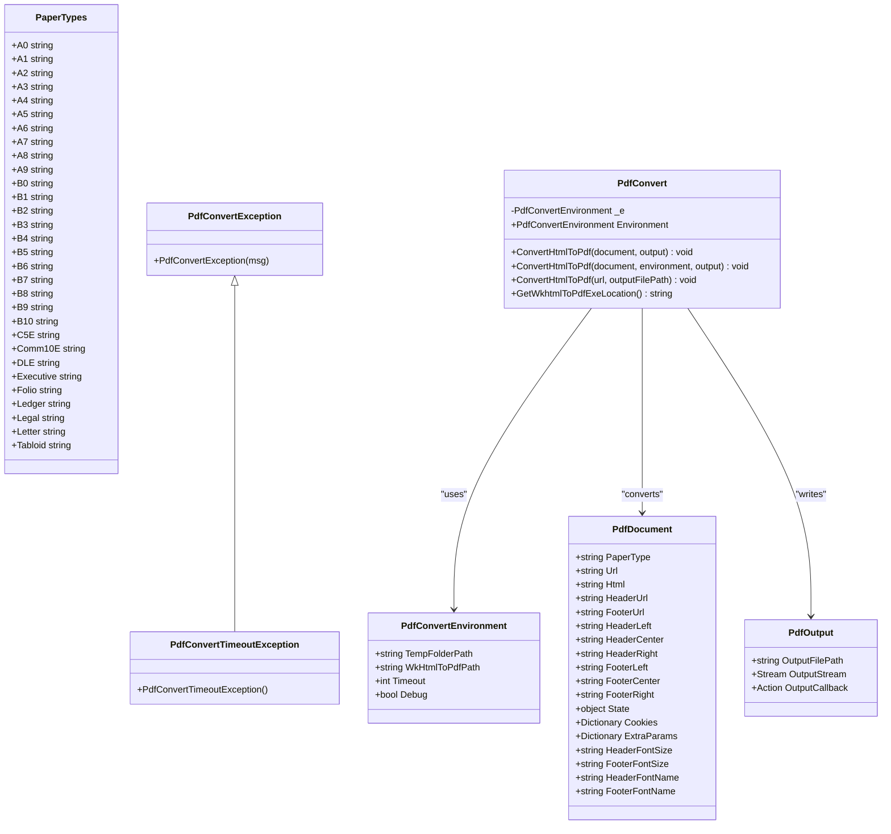

**Diagram sources**
- [WkConverterPdf.cs:1-386](file://BLL/WkConverterPdf.cs#L1-L386)

**Section sources**
- [WkConverterPdf.cs:1-386](file://BLL/WkConverterPdf.cs#L1-L386)

### Time Services
- ITempoServidorService defines the contract for time retrieval.
- TempoLocal provides local time with synchronous and asynchronous methods.
- TempoServidorMSSQL retrieves server time from PostgreSQL using Npgsql.

**Diagram sources**
- [ITempoServidorService.cs:1-33](file://BLL/ITempoServidorService.cs#L1-L33)
- [TempoLocal.cs:1-30](file://BLL/TempoLocal.cs#L1-L30)
- [TempoServidorMSSQL.cs:1-90](file://BLL/TempoServidorMSSQL.cs#L1-L90)

**Section sources**
- [ITempoServidorService.cs:1-33](file://BLL/ITempoServidorService.cs#L1-L33)
- [TempoLocal.cs:1-30](file://BLL/TempoLocal.cs#L1-L30)
- [TempoServidorMSSQL.cs:1-90](file://BLL/TempoServidorMSSQL.cs#L1-L90)

### PathHelper
Responsibilities:
- Resolve the true path for a given file by searching directories under a base path.
- Return the base path if no match is found.

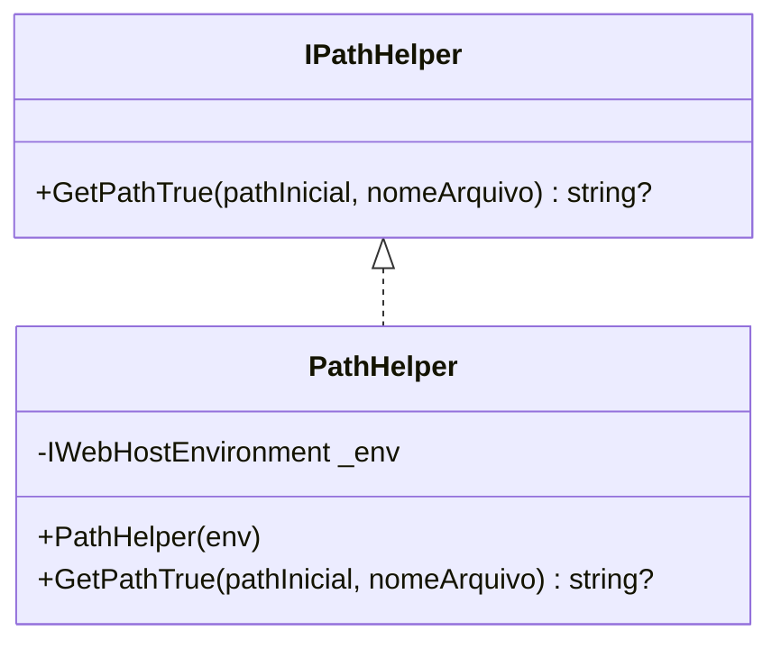

**Diagram sources**
- [PathHelper.cs:1-38](file://BLL/PathHelper.cs#L1-L38)

**Section sources**
- [PathHelper.cs:1-38](file://BLL/PathHelper.cs#L1-L38)

## Architecture Overview
The BLL integrates with external systems and provides:
- PDF generation via wkhtmltopdf and ImageSharp.
- Time synchronization with local and PostgreSQL servers.
- Robust validation and formatting utilities.
- Safe path resolution for file operations.

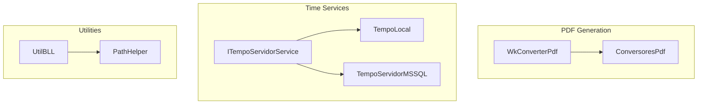

**Diagram sources**
- [ConversoresPdf.cs:1-112](file://BLL/ConversoresPdf.cs#L1-L112)
- [WkConverterPdf.cs:1-386](file://BLL/WkConverterPdf.cs#L1-L386)
- [ITempoServidorService.cs:1-33](file://BLL/ITempoServidorService.cs#L1-L33)
- [TempoLocal.cs:1-30](file://BLL/TempoLocal.cs#L1-L30)
- [TempoServidorMSSQL.cs:1-90](file://BLL/TempoServidorMSSQL.cs#L1-L90)
- [UtilBLL.cs:1-1738](file://BLL/UtilBLL.cs#L1-L1738)
- [PathHelper.cs:1-38](file://BLL/PathHelper.cs#L1-L38)

## Detailed Component Analysis

### PDF Conversion Workflow (wkhtmltopdf)
The conversion process:
- Configure environment (temp folder, wkhtmltopdf path, timeout).
- Build command-line arguments for page size, headers/footers, fonts, cookies, and extra parameters.
- Start wkhtmltopdf process, write HTML to stdin if provided, and wait for completion with timeout.
- On success, copy output to provided stream or invoke callback with bytes.
- On failure or timeout, throw appropriate exceptions.

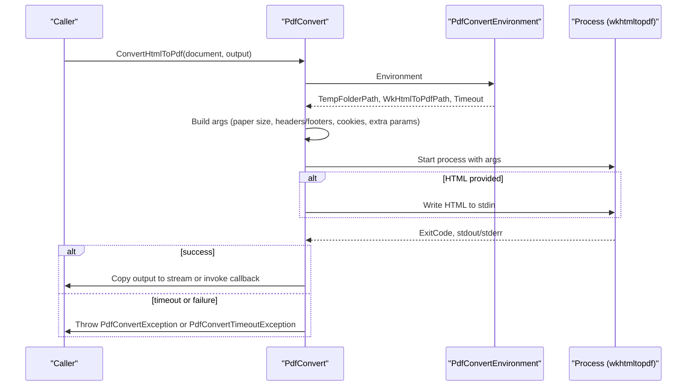

**Diagram sources**
- [WkConverterPdf.cs:147-343](file://BLL/WkConverterPdf.cs#L147-L343)

**Section sources**
- [WkConverterPdf.cs:1-386](file://BLL/WkConverterPdf.cs#L1-L386)

### Time Synchronization with Server and Database
- TempoLocal: Returns local UTC time with optional ISO or default format.
- TempoServidorMSSQL: Queries PostgreSQL server time using Npgsql and returns formatted results.

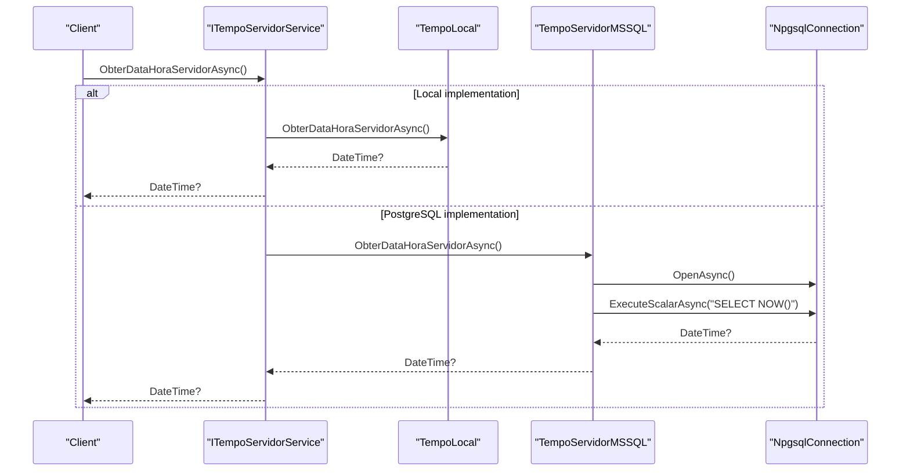

**Diagram sources**
- [ITempoServidorService.cs:1-33](file://BLL/ITempoServidorService.cs#L1-L33)
- [TempoLocal.cs:1-30](file://BLL/TempoLocal.cs#L1-L30)
- [TempoServidorMSSQL.cs:1-90](file://BLL/TempoServidorMSSQL.cs#L1-L90)

**Section sources**
- [ITempoServidorService.cs:1-33](file://BLL/ITempoServidorService.cs#L1-L33)
- [TempoLocal.cs:1-30](file://BLL/TempoLocal.cs#L1-L30)
- [TempoServidorMSSQL.cs:1-90](file://BLL/TempoServidorMSSQL.cs#L1-L90)

### Business Rule Enforcement and Validation Logic
Examples of business rules enforced by UtilBLL:
- CPF validation using weighted sums and modulo arithmetic.
- CNPJ validation with two check digits.
- PIS/PASEP validation using modulo 11.
- CNS validation for definitive and provisional formats.
- Phone number validation for Brazilian mobile and SME numbers.
- Email validation using standard attribute validation.
- CEP validation with regex pattern.
- Working day calculation excluding weekends and holidays.

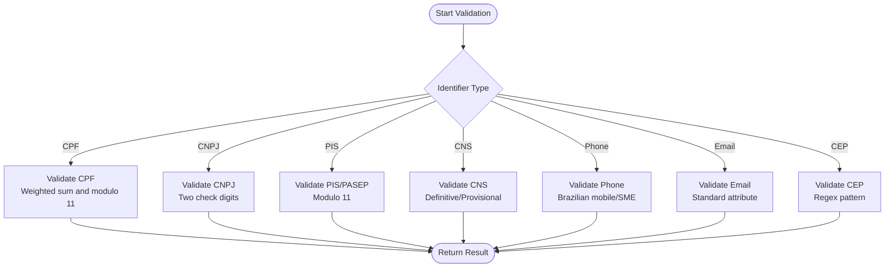

**Diagram sources**
- [UtilBLL.cs:463-671](file://BLL/UtilBLL.cs#L463-L671)

**Section sources**
- [UtilBLL.cs:463-671](file://BLL/UtilBLL.cs#L463-L671)

### Data Transformation Processes
Common transformations:
- Accent removal and normalization for strings.
- Base64 encoding/decoding for binary data.
- Stream to byte array conversion.
- Text wrapping and line breaking for reports.
- Safe async LINQ operations to prevent exceptions.

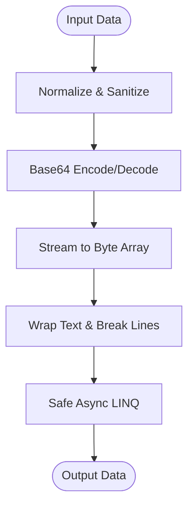

**Diagram sources**
- [UtilBLL.cs:71-121](file://BLL/UtilBLL.cs#L71-L121)
- [UtilBLL.cs:318-331](file://BLL/UtilBLL.cs#L318-L331)
- [UtilBLL.cs:1691-1719](file://BLL/UtilBLL.cs#L1691-L1719)
- [UtilBLL.cs:1679-1689](file://BLL/UtilBLL.cs#L1679-L1689)

**Section sources**
- [UtilBLL.cs:71-121](file://BLL/UtilBLL.cs#L71-L121)
- [UtilBLL.cs:318-331](file://BLL/UtilBLL.cs#L318-L331)
- [UtilBLL.cs:1691-1719](file://BLL/UtilBLL.cs#L1691-L1719)
- [UtilBLL.cs:1679-1689](file://BLL/UtilBLL.cs#L1679-L1689)

## Dependency Analysis
External dependencies and integration points:
- wkhtmltopdf executable for HTML-to-PDF conversion.
- Npgsql for PostgreSQL server time retrieval.
- SixLabors.ImageSharp for image processing.
- System.Text.Json and Newtonsoft.Json for serialization.
- System.Security.Cryptography.Xml for cryptographic operations.
- System.Drawing.Common for drawing operations.

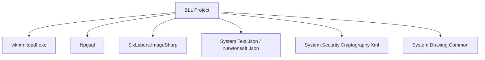

**Diagram sources**
- [BLL.csproj:8-28](file://BLL/BLL.csproj#L8-L28)

**Section sources**
- [BLL.csproj:1-33](file://BLL/BLL.csproj#L1-L33)

## Performance Considerations
- PDF generation:
  - Use streams for large documents to reduce memory usage.
  - Configure timeouts appropriately to avoid hanging processes.
  - Prefer prebuilt wkhtmltopdf binaries and cache paths to minimize discovery overhead.
- Time services:
  - Use TempoLocal for fast synchronous operations; TempoServidorMSSQL for server synchronization.
  - Cache server time periodically to reduce database load.
- Utilities:
  - Use SafeToListAsync to avoid exceptions and return fallback collections.
  - Minimize regex operations by caching compiled patterns where applicable.
- Thread safety:
  - UtilBLL is static; ensure thread-safe usage of shared resources (e.g., streams, file paths).
  - Avoid sharing mutable state across threads without synchronization.

## Troubleshooting Guide
Common issues and resolutions:
- wkhtmltopdf not found:
  - Verify wkhtmltopdf path configuration and installation.
  - Ensure the executable exists at configured locations.
- Conversion failures:
  - Check stderr output for detailed error messages.
  - Validate HTML content and URLs.
- Time retrieval errors:
  - Confirm connection string and PostgreSQL availability.
  - Handle exceptions gracefully and return null or fallback values.
- File operations:
  - Use safe deletion and path resolution helpers to avoid locked files.
  - Ensure directories exist before writing.

**Section sources**
- [WkConverterPdf.cs:175-177](file://BLL/WkConverterPdf.cs#L175-L177)
- [WkConverterPdf.cs:297-310](file://BLL/WkConverterPdf.cs#L297-L310)
- [TempoServidorMSSQL.cs:47-50](file://BLL/TempoServidorMSSQL.cs#L47-L50)
- [UtilBLL.cs:875-906](file://BLL/UtilBLL.cs#L875-L906)

## Conclusion
The Business Logic Layer provides robust, reusable services for PDF generation, time synchronization, and utility functions. It enforces business rules through comprehensive validation and formatting helpers, integrates with wkhtmltopdf for document conversion, and offers flexible time services backed by local and PostgreSQL sources. The design emphasizes error handling, performance, and thread safety, enabling reliable operation across diverse scenarios.