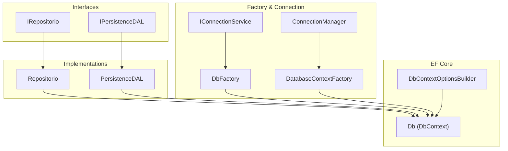
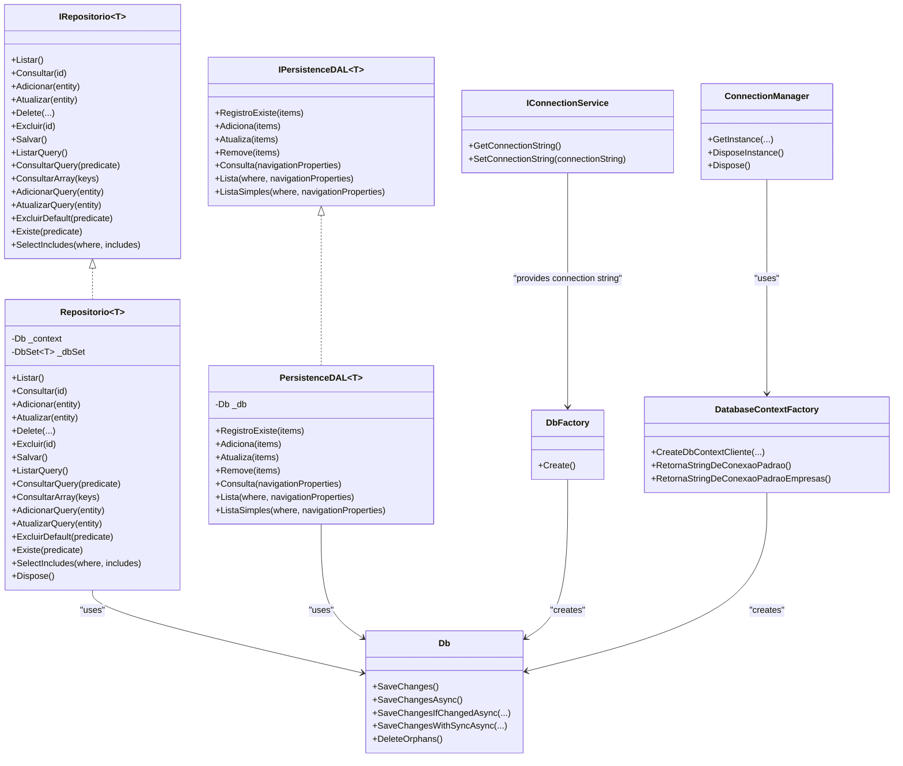
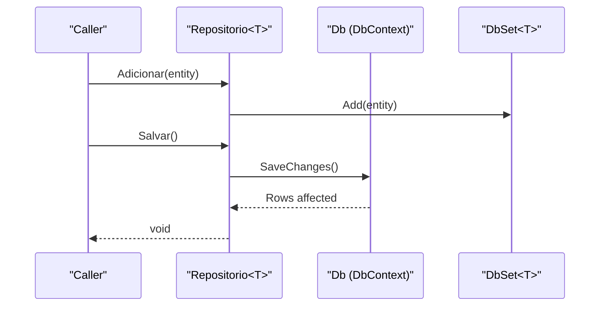
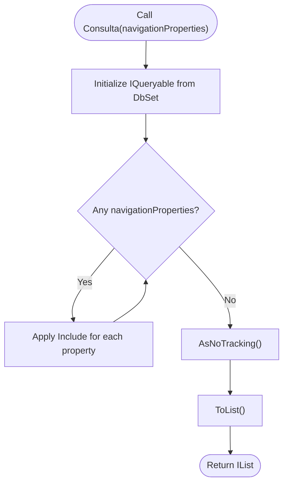
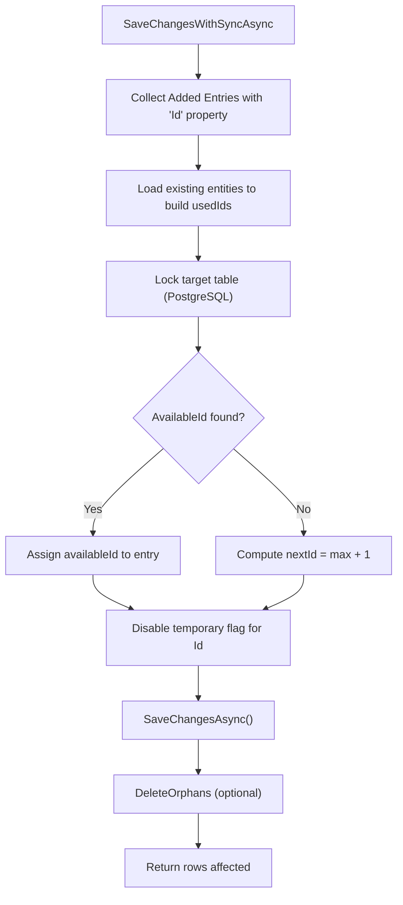
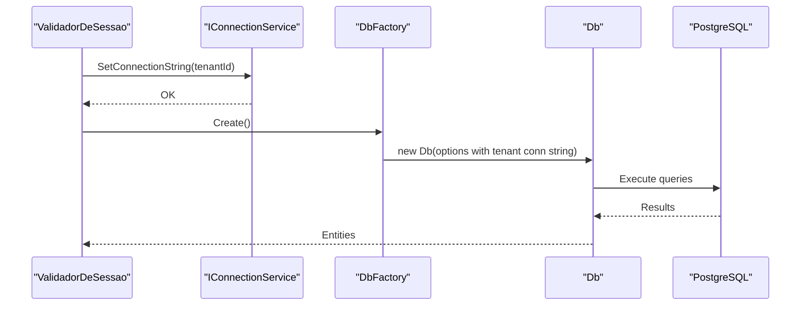
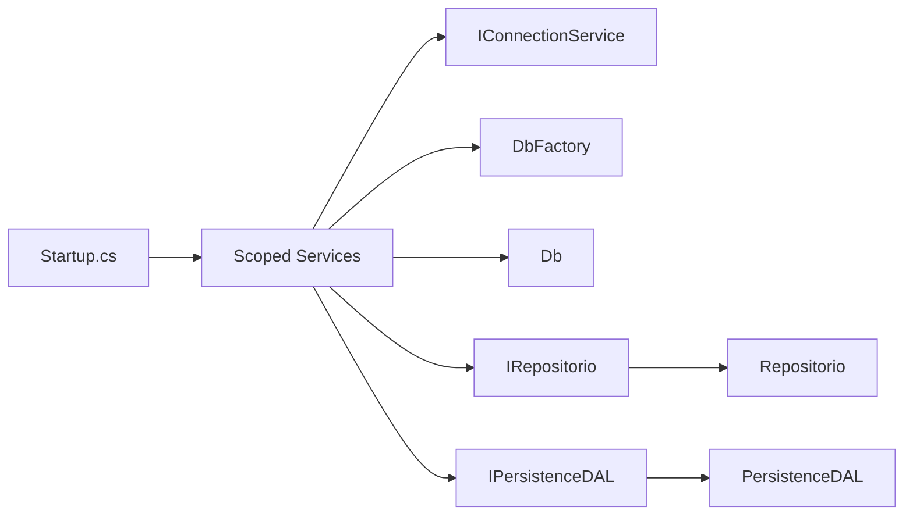

# Data Access Layer

<cite>
**Referenced Files in This Document**
- [IRepositorio.cs](file://LabWebMvc.MVC/Interfaces/IRepositorio.cs)
- [Repositorio.cs](file://LabWebMvc.MVC/Interfaces/Repositorio.cs)
- [IPersistenceDAL.cs](file://LabWebMvc.MVC/Interfaces/DAL/IPersistenceDAL.cs)
- [PersistenceDAL.cs](file://LabWebMvc.MVC/Interfaces/DAL/PersistenceDAL.cs)
- [db.cs](file://LabWebMvc.MVC/Models/db.cs)
- [DbContextOptionsBuilder.cs](file://LabWebMvc.MVC/Models/DbContextOptionsBuilder.cs)
- [DatabaseContextFactory.cs](file://LabWebMvc.MVC/Areas/ServicosDatabase/DatabaseContextFactory.cs)
- [IDbFactory.cs](file://LabWebMvc.MVC/Areas/ServicosDatabase/IDbFactory.cs)
- [ConectionManager.cs](file://LabWebMvc.MVC/Areas/ServicosDatabase/ConectionManager.cs)
- [IConnectionService.cs](file://LabWebMvc.MVC/Areas/ServicosDatabase/IConnectionService.cs)
- [Startup.cs](file://LabWebMvc.MVC/Startup.cs)
- [Program.cs](file://LabWebMvc.MVC/Program.cs)
- [appsettings.json](file://LabWebMvc.MVC/appsettings.json)
- [appsettings.Development.json](file://LabWebMvc.MVC/appsettings.Development.json)
- [HttpContextHelper.cs](file://LabWebMvc.MVC/Areas/ServicosDatabase/HttpContextHelper.cs)
</cite>

## Table of Contents
1. [Introduction](#introduction)
2. [Project Structure](#project-structure)
3. [Core Components](#core-components)
4. [Architecture Overview](#architecture-overview)
5. [Detailed Component Analysis](#detailed-component-analysis)
6. [Dependency Analysis](#dependency-analysis)
7. [Performance Considerations](#performance-considerations)
8. [Troubleshooting Guide](#troubleshooting-guide)
9. [Conclusion](#conclusion)
10. [Appendices](#appendices)

## Introduction
This document describes the Data Access Layer (DAL) implementation of the project, focusing on:
- Generic repository pattern and interfaces
- Entity Framework Core configuration and DbContext lifecycle
- Database context management, factories, and connection pooling
- Transaction management and SaveChanges strategies
- Multi-tenant database support via dynamic connection strings
- Query optimization, data mapping, caching strategies, and error handling
- Guidelines for extending the DAL and implementing custom repositories

## Project Structure
The DAL spans several areas:
- Interfaces for generic repositories and persistence abstractions
- A concrete DbContext (Db) with extensive model configuration
- Factory and connection management utilities for multi-tenancy
- DI registration in Startup for scoped DbContext lifetime



**Diagram sources**
- [IRepositorio.cs:1-51](file://LabWebMvc.MVC/Interfaces/IRepositorio.cs#L1-L51)
- [Repositorio.cs:1-129](file://LabWebMvc.MVC/Interfaces/Repositorio.cs#L1-L129)
- [IPersistenceDAL.cs:1-21](file://LabWebMvc.MVC/Interfaces/DAL/IPersistenceDAL.cs#L1-L21)
- [PersistenceDAL.cs:1-155](file://LabWebMvc.MVC/Interfaces/DAL/PersistenceDAL.cs#L1-L155)
- [db.cs:13-94](file://LabWebMvc.MVC/Models/db.cs#L13-L94)
- [DbContextOptionsBuilder.cs:1-7](file://LabWebMvc.MVC/Models/DbContextOptionsBuilder.cs#L1-L7)
- [IDbFactory.cs:1-31](file://LabWebMvc.MVC/Areas/ServicosDatabase/IDbFactory.cs#L1-L31)
- [DatabaseContextFactory.cs:1-75](file://LabWebMvc.MVC/Areas/ServicosDatabase/DatabaseContextFactory.cs#L1-L75)
- [ConectionManager.cs:1-51](file://LabWebMvc.MVC/Areas/ServicosDatabase/ConectionManager.cs#L1-L51)
- [IConnectionService.cs:1-43](file://LabWebMvc.MVC/Areas/ServicosDatabase/IConnectionService.cs#L1-L43)

**Section sources**
- [Startup.cs:33-49](file://LabWebMvc.MVC/Startup.cs#L33-L49)
- [Program.cs:25-42](file://LabWebMvc.MVC/Program.cs#L25-L42)

## Core Components
- Generic repository interface and implementation:
  - IRepositorio<T>: Defines CRUD and LINQ query operations, including includes and existence checks.
  - Repositorio<T>: Implements IRepositorio<T> using DbSet<T> and DbContext, handling attach/update/save.
- Persistence abstraction:
  - IPersistenceDAL<T>: Higher-level persistence operations (add/update/remove) and navigation property loading.
  - PersistenceDAL<T>: Uses Entry states and AsNoTracking for read-heavy scenarios.
- DbContext:
  - Db: Configures Npgsql provider, logging, and SaveChanges overrides with transaction-like synchronization and orphan cleanup.
- Factories and connection management:
  - IConnectionService: Provides default and overridden connection strings.
  - DbFactory: Creates DbContext instances using current connection string.
  - DatabaseContextFactory: Builds DbContext with a given connection string and environment-aware defaults.
  - ConnectionManager: Singleton-like manager for a client-provided connection string.

**Section sources**
- [IRepositorio.cs:1-51](file://LabWebMvc.MVC/Interfaces/IRepositorio.cs#L1-L51)
- [Repositorio.cs:1-129](file://LabWebMvc.MVC/Interfaces/Repositorio.cs#L1-L129)
- [IPersistenceDAL.cs:1-21](file://LabWebMvc.MVC/Interfaces/DAL/IPersistenceDAL.cs#L1-L21)
- [PersistenceDAL.cs:1-155](file://LabWebMvc.MVC/Interfaces/DAL/PersistenceDAL.cs#L1-L155)
- [db.cs:87-94](file://LabWebMvc.MVC/Models/db.cs#L87-L94)
- [IConnectionService.cs:1-43](file://LabWebMvc.MVC/Areas/ServicosDatabase/IConnectionService.cs#L1-L43)
- [IDbFactory.cs:1-31](file://LabWebMvc.MVC/Areas/ServicosDatabase/IDbFactory.cs#L1-L31)
- [DatabaseContextFactory.cs:1-75](file://LabWebMvc.MVC/Areas/ServicosDatabase/DatabaseContextFactory.cs#L1-L75)
- [ConectionManager.cs:1-51](file://LabWebMvc.MVC/Areas/ServicosDatabase/ConectionManager.cs#L1-L51)

## Architecture Overview
The DAL follows a layered approach:
- Interfaces define contracts for repositories and persistence operations.
- Implementations encapsulate EF Core usage and lifecycle management.
- Factories and services supply connection strings and DbContext instances.
- DI registers scoped DbContext and repository implementations.



**Diagram sources**
- [IRepositorio.cs:5-50](file://LabWebMvc.MVC/Interfaces/IRepositorio.cs#L5-L50)
- [Repositorio.cs:7-128](file://LabWebMvc.MVC/Interfaces/Repositorio.cs#L7-L128)
- [IPersistenceDAL.cs:5-20](file://LabWebMvc.MVC/Interfaces/DAL/IPersistenceDAL.cs#L5-L20)
- [PersistenceDAL.cs:7-154](file://LabWebMvc.MVC/Interfaces/DAL/PersistenceDAL.cs#L7-L154)
- [db.cs:13-94](file://LabWebMvc.MVC/Models/db.cs#L13-L94)
- [IConnectionService.cs:5-42](file://LabWebMvc.MVC/Areas/ServicosDatabase/IConnectionService.cs#L5-L42)
- [IDbFactory.cs:7-29](file://LabWebMvc.MVC/Areas/ServicosDatabase/IDbFactory.cs#L7-L29)
- [DatabaseContextFactory.cs:8-74](file://LabWebMvc.MVC/Areas/ServicosDatabase/DatabaseContextFactory.cs#L8-L74)
- [ConectionManager.cs:6-50](file://LabWebMvc.MVC/Areas/ServicosDatabase/ConectionManager.cs#L6-L50)

## Detailed Component Analysis

### Generic Repository Pattern
- Purpose: Provide a reusable, type-safe CRUD and query surface over DbSet<T>.
- Key capabilities:
  - Basic CRUD: Add, Update, Delete, Save
  - Queries: AsEnumerable/AsQueryable, Where, Find by keys, Existence checks
  - Includes: Eager load related entities via Include chaining
- Implementation notes:
  - Attach and mark Modified for updates to avoid detached entity errors.
  - SaveChanges invoked on the shared DbContext instance.



**Diagram sources**
- [Repositorio.cs:32-68](file://LabWebMvc.MVC/Interfaces/Repositorio.cs#L32-L68)

**Section sources**
- [IRepositorio.cs:11-50](file://LabWebMvc.MVC/Interfaces/IRepositorio.cs#L11-L50)
- [Repositorio.cs:22-122](file://LabWebMvc.MVC/Interfaces/Repositorio.cs#L22-L122)

### Persistence Abstractions (IPersistenceDAL)
- Purpose: Encapsulate bulk operations and navigation property loading with AsNoTracking for read-only scenarios.
- Key capabilities:
  - Existence checks per entity
  - Add/Update/Remove with Entry state manipulation
  - Navigation property eager loading via Include
  - Read-only queries using AsNoTracking
- Notes:
  - AsNoTracking avoids change tracking overhead for read-heavy workloads.



**Diagram sources**
- [PersistenceDAL.cs:94-111](file://LabWebMvc.MVC/Interfaces/DAL/PersistenceDAL.cs#L94-L111)

**Section sources**
- [IPersistenceDAL.cs:7-20](file://LabWebMvc.MVC/Interfaces/DAL/IPersistenceDAL.cs#L7-L20)
- [PersistenceDAL.cs:22-153](file://LabWebMvc.MVC/Interfaces/DAL/PersistenceDAL.cs#L22-L153)

### DbContext and EF Core Configuration
- DbContextOptions:
  - Options builder is configured in Startup for scoped lifetime.
  - Provider is Npgsql; sensitive data logging enabled; SQL and error logs forwarded to Event Viewer.
- SaveChanges strategies:
  - Overloads handle synchronous/asynchronous saves and optional orphan cleanup.
  - SaveChangesWithSyncAsync coordinates new IDs and locks target tables to prevent concurrency conflicts.
- Orphan cleanup:
  - DeleteOrphans removes records whose foreign keys reference missing parents.
  - Synchronizes PostgreSQL sequences after deletions.

```mermaid
sequenceDiagram
participant S as "Startup"
participant SP as "ServiceProvider"
participant DB as "Db"
participant OPT as "DbContextOptionsBuilder"
S->>SP : Register scoped Db
SP->>OPT : UseNpgsql(GetConnectionString())
OPT-->>SP : Options
SP->>DB : new Db(options, connectionService, eventLogHelper)
DB-->>SP : Instance ready
```

**Diagram sources**
- [Startup.cs:40-49](file://LabWebMvc.MVC/Startup.cs#L40-L49)
- [db.cs:98-129](file://LabWebMvc.MVC/Models/db.cs#L98-L129)

**Section sources**
- [db.cs:98-129](file://LabWebMvc.MVC/Models/db.cs#L98-L129)
- [db.cs:133-290](file://LabWebMvc.MVC/Models/db.cs#L133-L290)
- [db.cs:299-414](file://LabWebMvc.MVC/Models/db.cs#L299-L414)
- [DbContextOptionsBuilder.cs:3-6](file://LabWebMvc.MVC/Models/DbContextOptionsBuilder.cs#L3-L6)

### Transaction Management and Concurrency
- SaveChangesWithSyncAsync:
  - Computes available IDs for new entries, sets them, and locks the table to reduce race conditions.
  - Applies cancellation timeout and logs exceptions.
- Orphan cleanup:
  - Detects and deletes orphaned records across related entities.
- Logging:
  - SQL commands and errors are logged to Event Viewer for diagnostics.



**Diagram sources**
- [db.cs:205-290](file://LabWebMvc.MVC/Models/db.cs#L205-L290)
- [db.cs:299-414](file://LabWebMvc.MVC/Models/db.cs#L299-L414)

**Section sources**
- [db.cs:205-290](file://LabWebMvc.MVC/Models/db.cs#L205-L290)
- [db.cs:299-414](file://LabWebMvc.MVC/Models/db.cs#L299-L414)

### Connection Pooling and DbContext Lifetime
- Scoped DbContext:
  - Registered as scoped in Startup; ideal for web requests.
- Connection pooling:
  - EF Core leverages provider-specific pooling under the hood; avoid long-lived contexts to maximize pool reuse.
- Provider configuration:
  - Npgsql provider configured with connection string from IConnectionService.

**Section sources**
- [Startup.cs:40-49](file://LabWebMvc.MVC/Startup.cs#L40-L49)
- [db.cs:106-119](file://LabWebMvc.MVC/Models/db.cs#L106-L119)

### Database Factory Patterns and Multi-Tenant Support
- IConnectionService:
  - Supplies default connection string resolved from appsettings and environment variables.
  - Allows overriding connection string per request/session.
- DbFactory:
  - Creates DbContext using current connection string.
- DatabaseContextFactory:
  - Builds DbContext with a provided connection string.
  - Returns default connection strings from appsettings based on environment.
- ConnectionManager:
  - Singleton-like manager for a client-provided connection string.
- Multi-tenant flow:
  - Obtain tenant-specific connection string (e.g., from session), set via IConnectionService, then create DbContext via DbFactory.



**Diagram sources**
- [IConnectionService.cs:37-42](file://LabWebMvc.MVC/Areas/ServicosDatabase/IConnectionService.cs#L37-L42)
- [IDbFactory.cs:23-28](file://LabWebMvc.MVC/Areas/ServicosDatabase/IDbFactory.cs#L23-L28)
- [DatabaseContextFactory.cs:11-21](file://LabWebMvc.MVC/Areas/ServicosDatabase/DatabaseContextFactory.cs#L11-L21)
- [ConectionManager.cs:15-31](file://LabWebMvc.MVC/Areas/ServicosDatabase/ConectionManager.cs#L15-L31)

**Section sources**
- [IConnectionService.cs:12-42](file://LabWebMvc.MVC/Areas/ServicosDatabase/IConnectionService.cs#L12-L42)
- [IDbFactory.cs:12-29](file://LabWebMvc.MVC/Areas/ServicosDatabase/IDbFactory.cs#L12-L29)
- [DatabaseContextFactory.cs:8-74](file://LabWebMvc.MVC/Areas/ServicosDatabase/DatabaseContextFactory.cs#L8-L74)
- [ConectionManager.cs:6-50](file://LabWebMvc.MVC/Areas/ServicosDatabase/ConectionManager.cs#L6-L50)

### CRUD Examples and Query Optimization
- CRUD via Repositorio<T>:
  - Add, Update (Attach + Modified), Delete, SaveChanges.
- Query optimization:
  - Use AsNoTracking for read-only lists (PersistenceDAL).
  - Apply Include for related entities to avoid N+1.
  - Prefer Where(predicate) and Any() for existence checks.
- Data mapping:
  - Fluent model configuration in OnModelCreating covers table names, keys, indexes, and relationships.

**Section sources**
- [Repositorio.cs:32-108](file://LabWebMvc.MVC/Interfaces/Repositorio.cs#L32-L108)
- [PersistenceDAL.cs:94-153](file://LabWebMvc.MVC/Interfaces/DAL/PersistenceDAL.cs#L94-L153)
- [db.cs:565-1599](file://LabWebMvc.MVC/Models/db.cs#L565-L1599)

### Connection String Management
- Default connection strings:
  - PostgreSQL connection strings stored in appsettings.json and appsettings.Development.json.
  - Environment-aware selection via configuration builders.
- Dynamic overrides:
  - IConnectionService resolves default and supports SetConnectionString for tenant-specific values.

**Section sources**
- [appsettings.json:23-26](file://LabWebMvc.MVC/appsettings.json#L23-L26)
- [appsettings.Development.json:30-33](file://LabWebMvc.MVC/appsettings.Development.json#L30-L33)
- [DatabaseContextFactory.cs:24-73](file://LabWebMvc.MVC/Areas/ServicosDatabase/DatabaseContextFactory.cs#L24-L73)
- [IConnectionService.cs:17-38](file://LabWebMvc.MVC/Areas/ServicosDatabase/IConnectionService.cs#L17-L38)

## Dependency Analysis
- DI registrations:
  - IConnectionService and DbFactory registered as scoped.
  - Db registered as scoped with provider configuration.
  - IRepositorio<T> mapped to Repositorio<T>.
- Coupling:
  - Repositorio<T> and PersistenceDAL<T> depend on Db.
  - Factories depend on IConnectionService and configuration.
- Cohesion:
  - Each class focuses on a single responsibility: repository, persistence, context creation, or connection management.



**Diagram sources**
- [Startup.cs:37-52](file://LabWebMvc.MVC/Startup.cs#L37-L52)
- [IConnectionService.cs:5-42](file://LabWebMvc.MVC/Areas/ServicosDatabase/IConnectionService.cs#L5-L42)
- [IDbFactory.cs:7-29](file://LabWebMvc.MVC/Areas/ServicosDatabase/IDbFactory.cs#L7-L29)
- [db.cs:13-94](file://LabWebMvc.MVC/Models/db.cs#L13-L94)
- [IRepositorio.cs](file://LabWebMvc.MVC/Interfaces/IRepositorio.cs#L5)
- [Repositorio.cs](file://LabWebMvc.MVC/Interfaces/Repositorio.cs#L7)
- [IPersistenceDAL.cs](file://LabWebMvc.MVC/Interfaces/DAL/IPersistenceDAL.cs#L5)
- [PersistenceDAL.cs](file://LabWebMvc.MVC/Interfaces/DAL/PersistenceDAL.cs#L7)

**Section sources**
- [Startup.cs:33-52](file://LabWebMvc.MVC/Startup.cs#L33-L52)

## Performance Considerations
- Use AsNoTracking for read-only queries to avoid change tracking overhead.
- Minimize round-trips by batching operations and leveraging SaveChanges wisely.
- Apply Include selectively to reduce N+1 query problems.
- Keep DbContext scoped to request lifetime to improve connection pooling efficiency.
- Use SaveChangesWithSyncAsync for high-concurrency inserts to coordinate IDs and reduce contention.
- Monitor SQL logs via Event Viewer to identify slow queries and exceptions.

[No sources needed since this section provides general guidance]

## Troubleshooting Guide
- Connection string issues:
  - Verify appsettings values and environment selection.
  - Ensure IConnectionService returns a valid connection string.
- SaveChanges failures:
  - Inspect logged SQL and error messages in Event Viewer.
  - Use SaveChangesIfChangedAsync to capture inner exceptions.
- Orphan records:
  - Run DeleteOrphans to clean up invalid foreign keys.
- Multi-tenancy:
  - Confirm tenant connection string is set before creating DbContext.

**Section sources**
- [DatabaseContextFactory.cs:24-73](file://LabWebMvc.MVC/Areas/ServicosDatabase/DatabaseContextFactory.cs#L24-L73)
- [IConnectionService.cs:37-42](file://LabWebMvc.MVC/Areas/ServicosDatabase/IConnectionService.cs#L37-L42)
- [db.cs:106-127](file://LabWebMvc.MVC/Models/db.cs#L106-L127)
- [db.cs:151-200](file://LabWebMvc.MVC/Models/db.cs#L151-L200)
- [db.cs:299-414](file://LabWebMvc.MVC/Models/db.cs#L299-L414)

## Conclusion
The Data Access Layer employs a robust generic repository pattern with EF Core, integrates strongly with DI, and supports multi-tenancy via dynamic connection strings. Transaction safeguards, orphan cleanup, and logging enhance reliability. Following the guidelines below ensures maintainable and performant data access.

[No sources needed since this section summarizes without analyzing specific files]

## Appendices

### Guidelines for Extending the Data Access Layer
- Implement custom repositories:
  - Derive from IRepositorio<T> or compose PersistenceDAL<T> for specialized queries.
  - Keep repository methods focused and unit-testable.
- Add new entities:
  - Define DbSet<T> in Db and configure entity mappings in OnModelCreating.
  - Use fluent configuration for keys, indexes, and relationships.
- Introduce multi-tenant repositories:
  - Resolve tenant connection string via IConnectionService and create DbContext via DbFactory.
- Optimize queries:
  - Prefer projection and AsNoTracking for read-only lists.
  - Use Include for related entities and Where for filtering.
- Handle transactions:
  - Use SaveChangesWithSyncAsync for concurrent inserts.
  - Wrap operations in explicit transactions when needed.

[No sources needed since this section provides general guidance]