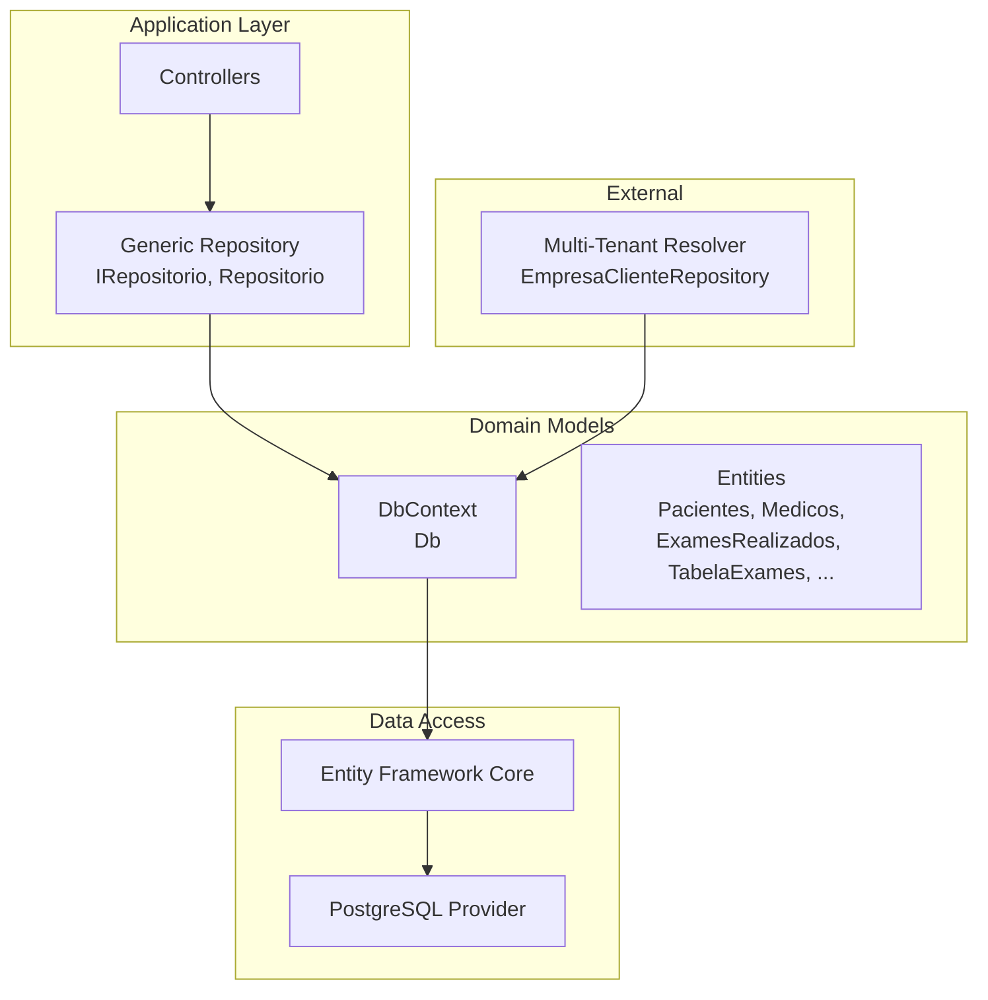
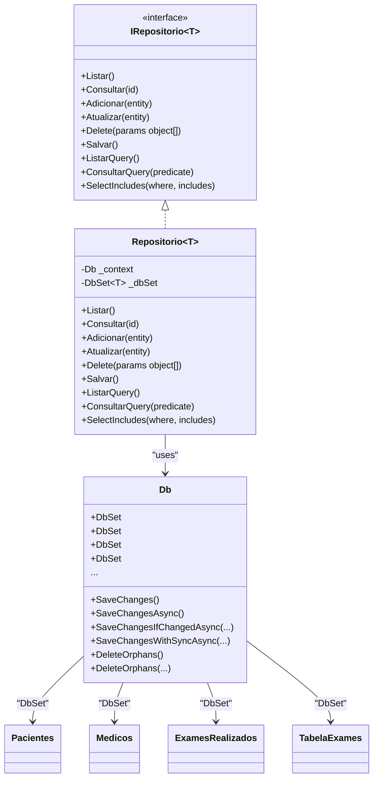
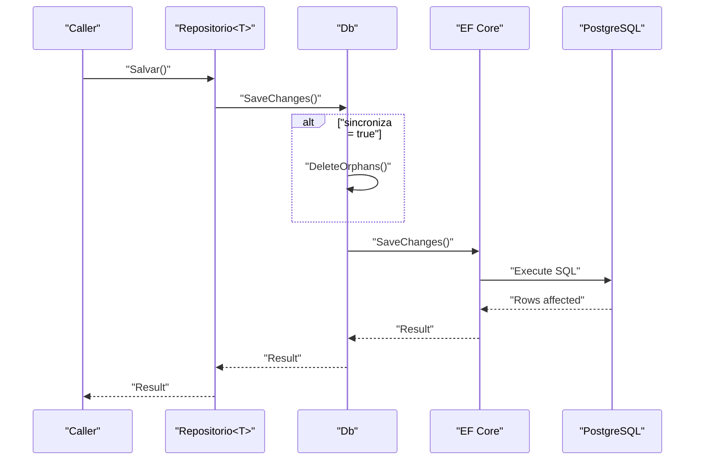
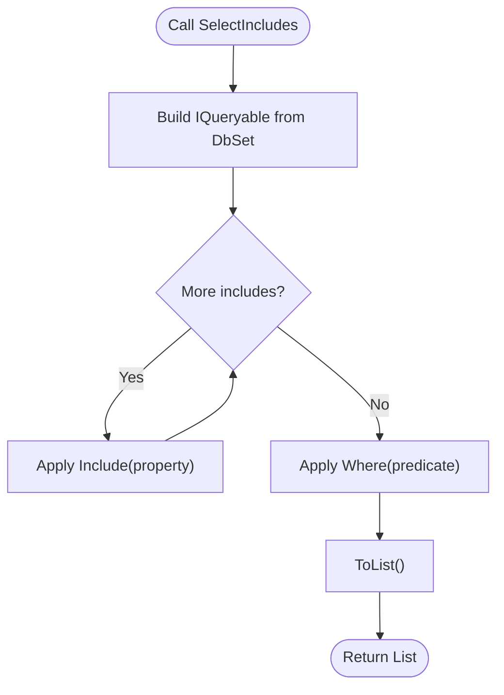
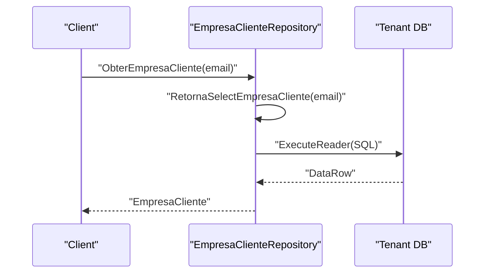
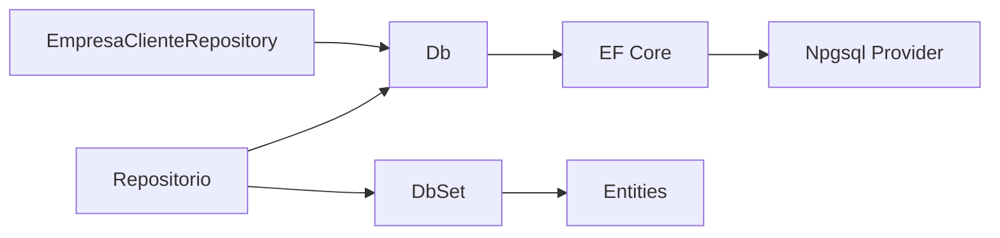

# Database Design

<cite>
**Referenced Files in This Document**
- [db.cs](file://LabWebMvc.MVC/Models/db.cs)
- [IRepositorio.cs](file://LabWebMvc.MVC/Interfaces/IRepositorio.cs)
- [Repositorio.cs](file://LabWebMvc.MVC/Interfaces/Repositorio.cs)
- [Pacientes.cs](file://LabWebMvc.MVC/Models/Pacientes.cs)
- [Medicos.cs](file://LabWebMvc.MVC/Models/Medicos.cs)
- [ExamesRealizados.cs](file://LabWebMvc.MVC/Models/ExamesRealizados.cs)
- [TabelaExames.cs](file://LabWebMvc.MVC/Models/TabelaExames.cs)
- [EmpresaClienteRepository.cs](file://LabWebMvc.MVC/Areas/ServicosDatabase/EmpresaClienteRepository.cs)
</cite>

## Table of Contents
1. [Introduction](#introduction)
2. [Project Structure](#project-structure)
3. [Core Components](#core-components)
4. [Architecture Overview](#architecture-overview)
5. [Detailed Component Analysis](#detailed-component-analysis)
6. [Dependency Analysis](#dependency-analysis)
7. [Performance Considerations](#performance-considerations)
8. [Troubleshooting Guide](#troubleshooting-guide)
9. [Conclusion](#conclusion)
10. [Appendices](#appendices)

## Introduction
This document describes the database design and data model for the medical laboratory management system. It focuses on the entity relationships, field definitions, data types, primary and foreign keys, indexes, constraints, and referential integrity enforced by the Entity Framework model. It also documents data access patterns via the generic repository, transaction and concurrency controls, logging and auditing hooks, and operational considerations such as data lifecycle, retention, and backup strategies.

## Project Structure
The database context and entity model are defined in the MVC project under the Models folder. The generic repository pattern is implemented in the Interfaces folder. A specialized repository handles customer-specific connections for multi-tenant scenarios.

**Diagram sources**
- [db.cs:13-129](file://LabWebMvc.MVC/Models/db.cs#L13-L129)
- [IRepositorio.cs:5-50](file://LabWebMvc.MVC/Interfaces/IRepositorio.cs#L5-L50)
- [Repositorio.cs:7-129](file://LabWebMvc.MVC/Interfaces/Repositorio.cs#L7-L129)
- [EmpresaClienteRepository.cs:8-119](file://LabWebMvc.MVC/Areas/ServicosDatabase/EmpresaClienteRepository.cs#L8-L119)

**Section sources**
- [db.cs:13-129](file://LabWebMvc.MVC/Models/db.cs#L13-L129)
- [IRepositorio.cs:5-50](file://LabWebMvc.MVC/Interfaces/IRepositorio.cs#L5-L50)
- [Repositorio.cs:7-129](file://LabWebMvc.MVC/Interfaces/Repositorio.cs#L7-L129)
- [EmpresaClienteRepository.cs:8-119](file://LabWebMvc.MVC/Areas/ServicosDatabase/EmpresaClienteRepository.cs#L8-L119)

## Core Components
- DbContext: Centralized data access and change tracking. Implements SaveChanges variants with logging and orphan deletion.
- Entities: Strongly typed models mapped to database tables with fluent configuration for keys, indexes, and relationships.
- Generic Repository: Provides CRUD and LINQ-based querying with includes for related entities.
- Multi-tenant Resolver: Builds per-customer connection strings and queries legacy tables for tenant configuration.

Key capabilities:
- Transaction control with SaveChanges and SaveChangesAsync variants.
- Orphan cleanup via DeleteOrphans and DeleteOrphans<TParent,TChild>.
- Logging of SQL statements and errors via Event Viewer integration.
- Multi-database support with runtime SQL generation.

**Section sources**
- [db.cs:13-129](file://LabWebMvc.MVC/Models/db.cs#L13-L129)
- [db.cs:565-2386](file://LabWebMvc.MVC/Models/db.cs#L565-L2386)
- [IRepositorio.cs:5-50](file://LabWebMvc.MVC/Interfaces/IRepositorio.cs#L5-L50)
- [Repositorio.cs:7-129](file://LabWebMvc.MVC/Interfaces/Repositorio.cs#L7-L129)
- [EmpresaClienteRepository.cs:8-119](file://LabWebMvc.MVC/Areas/ServicosDatabase/EmpresaClienteRepository.cs#L8-L119)

## Architecture Overview
The system uses a layered architecture:
- Data access layer: DbContext and DbSet-based entities.
- Business logic layer: Generic repository for domain operations.
- Application layer: Controllers orchestrate operations and call repository methods.
- Multi-tenancy: Tenant resolution builds connection strings and queries tenant metadata.

**Diagram sources**
- [db.cs:13-129](file://LabWebMvc.MVC/Models/db.cs#L13-L129)
- [IRepositorio.cs:5-50](file://LabWebMvc.MVC/Interfaces/IRepositorio.cs#L5-L50)
- [Repositorio.cs:7-129](file://LabWebMvc.MVC/Interfaces/Repositorio.cs#L7-L129)
- [Pacientes.cs:3-102](file://LabWebMvc.MVC/Models/Pacientes.cs#L3-L102)
- [Medicos.cs:3-32](file://LabWebMvc.MVC/Models/Medicos.cs#L3-L32)
- [ExamesRealizados.cs:3-70](file://LabWebMvc.MVC/Models/ExamesRealizados.cs#L3-L70)
- [TabelaExames.cs:3-34](file://LabWebMvc.MVC/Models/TabelaExames.cs#L3-L34)

## Detailed Component Analysis

### DbContext and SaveChanges Pipeline
- Connection configuration is resolved at runtime and logged to Event Viewer.
- SaveChanges variants:
  - SaveChanges(): Basic persistence with orphan cleanup toggle.
  - SaveChangesAsync(): Asynchronous persistence.
  - SaveChangesIfChangedAsync(sincroniza): Conditional orphan cleanup.
  - SaveChangesWithSyncAsync(sincroniza, quantidadeRegistrosMaximo): Optimistic concurrency-safe ID assignment and sequence synchronization for PostgreSQL identity columns.
- Orphan deletion:
  - DeleteOrphans(): Scans all DbSet entities and removes records whose foreign keys reference missing parents.
  - DeleteOrphans<TParent,TChild>: Overload for targeted orphan removal.
- Logging:
  - SQL commands and errors are emitted to Event Viewer for diagnostics.

**Diagram sources**
- [Repositorio.cs:65-68](file://LabWebMvc.MVC/Interfaces/Repositorio.cs#L65-L68)
- [db.cs:133-290](file://LabWebMvc.MVC/Models/db.cs#L133-L290)

**Section sources**
- [db.cs:96-129](file://LabWebMvc.MVC/Models/db.cs#L96-L129)
- [db.cs:133-290](file://LabWebMvc.MVC/Models/db.cs#L133-L290)
- [db.cs:299-456](file://LabWebMvc.MVC/Models/db.cs#L299-L456)

### Generic Repository Pattern
- Methods:
  - Listing and querying: Listar(), ListarQuery(), ConsultarQuery(predicate).
  - CRUD: Adicionar(entity), Atualizar(entity), Delete(...), Excluir(id).
  - Includes: SelectIncludes(where, includes) for eager loading related entities.
- Behavior:
  - Uses DbSet<T> for all operations.
  - Attach and set EntityState for updates.
  - Disposes DbContext on dispose.

**Diagram sources**
- [Repositorio.cs:114-122](file://LabWebMvc.MVC/Interfaces/Repositorio.cs#L114-L122)

**Section sources**
- [IRepositorio.cs:5-50](file://LabWebMvc.MVC/Interfaces/IRepositorio.cs#L5-L50)
- [Repositorio.cs:7-129](file://LabWebMvc.MVC/Interfaces/Repositorio.cs#L7-L129)

### Multi-Tenant Resolution
- Resolves tenant connection string and metadata from a dedicated table across supported databases.
- Generates SQL dynamically based on detected database type.
- Returns a strongly-typed model for tenant configuration.

**Diagram sources**
- [EmpresaClienteRepository.cs:73-108](file://LabWebMvc.MVC/Areas/ServicosDatabase/EmpresaClienteRepository.cs#L73-L108)

**Section sources**
- [EmpresaClienteRepository.cs:8-119](file://LabWebMvc.MVC/Areas/ServicosDatabase/EmpresaClienteRepository.cs#L8-L119)

### Core Entities and Relationships

#### Patients (Pacientes)
- Primary key: Id (int).
- Fields include personal data, identifiers, address, contact, and audit timestamps.
- Relationships:
  - One-to-many with ExamesExportados, ExamesImpressos, ExamesPendentes, ExamesRealizados, ExamesRealizadosAM, FichasInternas, FichasLotes, FichasPlanilhas, ItensExamesRealizados, ItensExamesRealizadosAM, Requisitar.

**Section sources**
- [Pacientes.cs:3-102](file://LabWebMvc.MVC/Models/Pacientes.cs#L3-L102)
- [db.cs:1861-1959](file://LabWebMvc.MVC/Models/db.cs#L1861-L1959)

#### Physicians (Medicos)
- Primary key: Id (int).
- Fields include CRM, name, specialty, phone, and email.
- Relationships:
  - One-to-many with ExamesExportados, ExamesPendentes, ExamesRealizados, ExamesRealizadosAM, FichasInternas, FichasLotes, FichasPlanilhas, Requisitar.

**Section sources**
- [Medicos.cs:3-32](file://LabWebMvc.MVC/Models/Medicos.cs#L3-L32)
- [db.cs:1806-1829](file://LabWebMvc.MVC/Models/db.cs#L1806-L1829)

#### Exams Realized (ExamesRealizados)
- Primary key: Id (int).
- Foreign keys: PacienteId, TabelaExamesId, InstituicaoId, PostoId, MedicoId.
- Timestamps and flags for exam lifecycle.
- Relationships:
  - Many-to-one with Instituicao, Medicos, Pacientes, Postos, TabelaExames.
  - One-to-many with ExamesExportados, FichasInternas, FichasLotes, FichasPlanilhas, ItensExamesRealizados.

**Section sources**
- [ExamesRealizados.cs:3-70](file://LabWebMvc.MVC/Models/ExamesRealizados.cs#L3-L70)
- [db.cs:1037-1147](file://LabWebMvc.MVC/Models/db.cs#L1037-L1147)

#### Exam Catalog (TabelaExames)
- Primary key: Id (int).
- Unique index on SiglaTabela.
- Relationships:
  - One-to-many with ExamesExportados, ExamesImpressos, ExamesPendentes, ExamesRealizados, ExamesRealizadosAM, FichasLotes, FichasPlanilhas, ItensExamesRealizados, ItensExamesRealizadosAM, Requisitar.

**Section sources**
- [TabelaExames.cs:3-34](file://LabWebMvc.MVC/Models/TabelaExames.cs#L3-L34)
- [db.cs:2282-2296](file://LabWebMvc.MVC/Models/db.cs#L2282-L2296)

### Schema and Constraints Overview
- PostgreSQL provider is configured; SQL logs are emitted to Event Viewer.
- Fluent configuration defines:
  - Primary keys and indexes.
  - Unique constraints via HasIndex(...).IsUnique().
  - Foreign keys with DeleteBehavior and constraint names.
  - Property length and Unicode constraints.
  - ValueGenerated patterns for identity columns.

Examples of constraints and indexes:
- Unique indexes:
  - ControleDeAcesso.SenhaId (unique).
  - Empresa.Sigla+Matriz+Filial (unique).
  - Instituicao.Sigla (unique).
  - Cor.Cor (unique).
  - Senhas.LoginUsuario (unique).
  - Sexo.Sigla (unique).
  - TabelaExames.SiglaTabela (unique).
  - TextosProntos.Texto (unique).
  - UF.Sigla (unique).
- Foreign keys:
  - ExamesExportados → ExamesRealizados, Instituicao, Medicos, Pacientes, TabelaExames.
  - ExamesImpressos → Instituicao, Pacientes, TabelaExames.
  - ExamesPendentes → ClasseExames, Instituicao, Medicos, Pacientes, TabelaExames.
  - ExamesRealizados → Instituicao, Medicos, Pacientes, Postos, TabelaExames.
  - ItensExamesRealizados → ClasseExames, ExamesRealizados, Instituicao, Pacientes, TabelaExames.
  - Requisitar → ClasseExames, Instituicao, Medicos, Pacientes, TabelaExames.
  - UsuariosWeb → Senhas (Cascade delete).

**Section sources**
- [db.cs:565-2386](file://LabWebMvc.MVC/Models/db.cs#L565-L2386)

## Dependency Analysis
- DbContext depends on Npgsql provider and logs via Event Viewer.
- Repositorio<T> depends on Db and DbSet<T>.
- Entities depend on each other via foreign keys and navigations.
- Multi-tenant resolver depends on Npgsql for raw SQL execution.

**Diagram sources**
- [Repositorio.cs:7-16](file://LabWebMvc.MVC/Interfaces/Repositorio.cs#L7-L16)
- [db.cs:13-129](file://LabWebMvc.MVC/Models/db.cs#L13-L129)
- [EmpresaClienteRepository.cs:8-19](file://LabWebMvc.MVC/Areas/ServicosDatabase/EmpresaClienteRepository.cs#L8-L19)

**Section sources**
- [Repositorio.cs:7-16](file://LabWebMvc.MVC/Interfaces/Repositorio.cs#L7-L16)
- [db.cs:13-129](file://LabWebMvc.MVC/Models/db.cs#L13-L129)
- [EmpresaClienteRepository.cs:8-19](file://LabWebMvc.MVC/Areas/ServicosDatabase/EmpresaClienteRepository.cs#L8-L19)

## Performance Considerations
- Use asynchronous SaveChangesAsync and repository methods to avoid blocking threads.
- Prefer SelectIncludes to reduce N+1 queries by eagerly loading related entities.
- Leverage ListarQuery/ConsultarQuery with predicates to minimize data transfer.
- Keep orphan cleanup scope narrow; use DeleteOrphans<TParent,TChild> for targeted cleanup.
- Monitor SQL logs in Event Viewer to identify slow queries and constraint violations.
- For high-concurrency scenarios, consider SaveChangesWithSyncAsync to coordinate ID allocation and sequence synchronization.

[No sources needed since this section provides general guidance]

## Troubleshooting Guide
- Connection failures:
  - Verify connection string resolution and Event Viewer logs for “Nenhuma string de conexão encontrada”.
- Constraint violations:
  - Review unique indexes and foreign keys; check DeleteOrphans behavior for missing parent references.
- Logging:
  - SQL statements and errors are written to Event Viewer; filter by LABWE7 markers.
- Multi-tenancy:
  - Confirm database type detection and generated SQL correctness; ensure tenant metadata exists.

**Section sources**
- [db.cs:96-129](file://LabWebMvc.MVC/Models/db.cs#L96-L129)
- [db.cs:108-119](file://LabWebMvc.MVC/Models/db.cs#L108-L119)
- [db.cs:299-456](file://LabWebMvc.MVC/Models/db.cs#L299-L456)
- [EmpresaClienteRepository.cs:21-71](file://LabWebMvc.MVC/Areas/ServicosDatabase/EmpresaClienteRepository.cs#L21-L71)

## Conclusion
The database design centers on a robust Entity Framework model with explicit keys, indexes, and foreign keys. The generic repository simplifies data access while the DbContext provides transaction control, logging, and orphan cleanup. Multi-tenancy is supported through a dedicated resolver. Operational practices such as logging, constrained indexes, and cascade behaviors ensure referential integrity and maintainability.

[No sources needed since this section summarizes without analyzing specific files]

## Appendices

### Data Lifecycle, Retention, and Archival
- No explicit retention or archival policies are defined in the model or repository code.
- Recommendation: Define lifecycle policies (e.g., soft delete flags, periodic purges) and implement them via repository filters or scheduled jobs.

[No sources needed since this section provides general guidance]

### Data Migration Paths and Version Management
- Fluent configuration supports evolving schemas; migrations can be added via EF Core tools.
- The context includes guidance comments for scaffolding and migrations.

**Section sources**
- [db.cs:15-78](file://LabWebMvc.MVC/Models/db.cs#L15-L78)

### Backup Strategies
- Backups should target the underlying PostgreSQL database hosting the lab schema.
- Consider point-in-time recovery and regular snapshot schedules aligned with business continuity requirements.

[No sources needed since this section provides general guidance]

### Security and Privacy Controls
- Connection strings and credentials are resolved at runtime; ensure secure storage and least-privilege access.
- Logging includes sensitive data; sanitize logs and restrict access to Event Viewer entries.
- Multi-tenant isolation relies on per-tenant connection strings; enforce strict separation.

**Section sources**
- [db.cs:96-129](file://LabWebMvc.MVC/Models/db.cs#L96-L129)
- [EmpresaClienteRepository.cs:83-108](file://LabWebMvc.MVC/Areas/ServicosDatabase/EmpresaClienteRepository.cs#L83-L108)