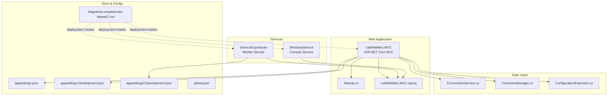
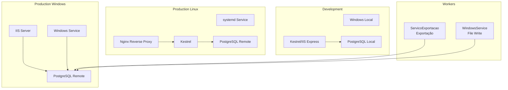
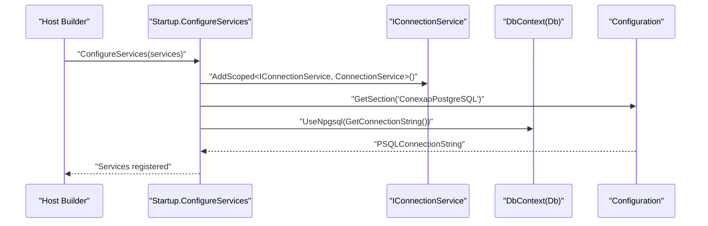
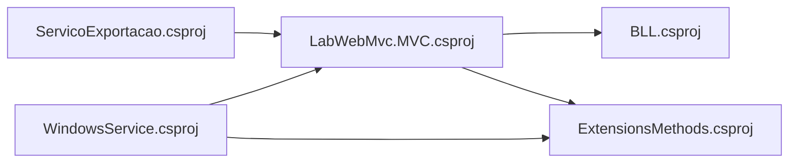

# Getting Started

<cite>
**Referenced Files in This Document**
- [global.json](file://global.json)
- [LabWebMvc.MVC.csproj](file://LabWebMvc.MVC/LabWebMvc.MVC.csproj)
- [ServicoExportacao.csproj](file://ServicoExportacao/ServicoExportacao.csproj)
- [WindowsService.csproj](file://WindowsService/WindowsService.csproj)
- [Program.cs](file://LabWebMvc.MVC/Program.cs)
- [Startup.cs](file://LabWebMvc.MVC/Startup.cs)
- [appsettings.json](file://LabWebMvc.MVC/appsettings.json)
- [appsettings.Development.json](file://LabWebMvc.MVC/appsettings.Development.json)
- [appsettings2.Development.json](file://ServicoExportacao/appsettings2.Development.json)
- [ConfigurationExtension.cs](file://LabWebMvc.MVC/Areas/Connections/ConfigurationExtension.cs)
- [IConnectionService.cs](file://LabWebMvc.MVC/Areas/ServicosDatabase/IConnectionService.cs)
- [ConectionManager.cs](file://LabWebMvc.MVC/Areas/ServicosDatabase/ConectionManager.cs)
- [Program.cs (WindowsService)](file://WindowsService/Program.cs)
- [diagramas-arquiteturais-labweb7.md](file://LabWeb7-Project Documentos/Biblioteca Microsoft/diagramas-arquiteturais-labweb7.md)
- [PUBLICAÇÃO DO SERIÇO NO WINDOWS SERVICE.txt](file://LabWeb7-Project Documentos/Biblioteca Microsoft/PUBLICAÇÃO DO SERIÇO NO WINDOWS SERVICE.txt)
- [Instalar e Desinstalar um Serviço.txt](file://LabWeb7-Project Documentos/Biblioteca Microsoft/Instalar e Desinstalar um Serviço.txt)
- [TempoServidorMSSQL.cs](file://BLL/TempoServidorMSSQL.cs)
</cite>

## Table of Contents
1. [Introduction](#introduction)
2. [Project Structure](#project-structure)
3. [Core Components](#core-components)
4. [Architecture Overview](#architecture-overview)
5. [Detailed Component Analysis](#detailed-component-analysis)
6. [Dependency Analysis](#dependency-analysis)
7. [Performance Considerations](#performance-considerations)
8. [Troubleshooting Guide](#troubleshooting-guide)
9. [Conclusion](#conclusion)
10. [Appendices](#appendices)

## Introduction
This guide helps you install, configure, and run LabWeb7-Projeto locally and in production. It covers prerequisites, environment setup, database configuration, service installation, and cross-platform considerations. You will also find quick-start steps to access the application, create test users, and verify core functionality.

## Project Structure
The solution is organized around:
- Web application (ASP.NET Core MVC) with PostgreSQL connectivity
- Worker service for exports
- Windows console service for file writing
- Business logic and shared utilities
- Documentation and deployment notes

**Diagram sources**
- [Program.cs:1-107](file://LabWebMvc.MVC/Program.cs#L1-L107)
- [Startup.cs:1-248](file://LabWebMvc.MVC/Startup.cs#L1-L248)
- [LabWebMvc.MVC.csproj:1-56](file://LabWebMvc.MVC/LabWebMvc.MVC.csproj#L1-L56)
- [ServicoExportacao.csproj:1-49](file://ServicoExportacao/ServicoExportacao.csproj#L1-L49)
- [WindowsService.csproj:1-40](file://WindowsService/WindowsService.csproj#L1-L40)
- [IConnectionService.cs:1-43](file://LabWebMvc.MVC/Areas/ServicosDatabase/IConnectionService.cs#L1-L43)
- [ConectionManager.cs:1-51](file://LabWebMvc.MVC/Areas/ServicosDatabase/ConectionManager.cs#L1-L51)
- [ConfigurationExtension.cs:1-20](file://LabWebMvc.MVC/Areas/Connections/ConfigurationExtension.cs#L1-L20)
- [appsettings.json:1-78](file://LabWebMvc.MVC/appsettings.json#L1-L78)
- [appsettings.Development.json:1-85](file://LabWebMvc.MVC/appsettings.Development.json#L1-L85)
- [appsettings2.Development.json:1-22](file://ServicoExportacao/appsettings2.Development.json#L1-L22)
- [diagramas-arquiteturais-labweb7.md:438-482](file://LabWeb7-Project Documentos/Biblioteca Microsoft/diagramas-arquiteturais-labweb7.md#L438-L482)

**Section sources**
- [Program.cs:1-107](file://LabWebMvc.MVC/Program.cs#L1-L107)
- [Startup.cs:1-248](file://LabWebMvc.MVC/Startup.cs#L1-L248)
- [LabWebMvc.MVC.csproj:1-56](file://LabWebMvc.MVC/LabWebMvc.MVC.csproj#L1-L56)
- [ServicoExportacao.csproj:1-49](file://ServicoExportacao/ServicoExportacao.csproj#L1-L49)
- [WindowsService.csproj:1-40](file://WindowsService/WindowsService.csproj#L1-L40)
- [appsettings.json:1-78](file://LabWebMvc.MVC/appsettings.json#L1-L78)
- [appsettings.Development.json:1-85](file://LabWebMvc.MVC/appsettings.Development.json#L1-L85)
- [appsettings2.Development.json:1-22](file://ServicoExportacao/appsettings2.Development.json#L1-L22)
- [diagramas-arquiteturais-labweb7.md:438-482](file://LabWeb7-Project Documentos/Biblioteca Microsoft/diagramas-arquiteturais-labweb7.md#L438-L482)

## Core Components
- ASP.NET Core MVC host configured to run as a Windows service or Linux process
- PostgreSQL connection abstraction via IConnectionService and ConnectionManager
- JSON-based configuration with environment-specific overrides
- Worker and Windows console services for background tasks

Key capabilities:
- Cross-platform hosting with OS-aware configuration loading
- Dependency injection wiring for repositories, sessions, authentication, and integrations
- Optional Windows service hosting and Linux console execution

**Section sources**
- [Program.cs:7-23](file://LabWebMvc.MVC/Program.cs#L7-L23)
- [Startup.cs:32-165](file://LabWebMvc.MVC/Startup.cs#L32-L165)
- [IConnectionService.cs:12-42](file://LabWebMvc.MVC/Areas/ServicosDatabase/IConnectionService.cs#L12-L42)
- [ConectionManager.cs:6-50](file://LabWebMvc.MVC/Areas/ServicosDatabase/ConectionManager.cs#L6-L50)
- [appsettings.json:16-26](file://LabWebMvc.MVC/appsettings.json#L16-L26)
- [appsettings.Development.json:21-33](file://LabWebMvc.MVC/appsettings.Development.json#L21-L33)

## Architecture Overview
The system supports multiple execution modes: development on Windows with local PostgreSQL, production on Windows as a service with remote PostgreSQL, and production on Linux with systemd and Nginx reverse proxy.

**Diagram sources**
- [diagramas-arquiteturais-labweb7.md:438-482](file://LabWeb7-Project Documentos/Biblioteca Microsoft/diagramas-arquiteturais-labweb7.md#L438-L482)

**Section sources**
- [diagramas-arquiteturais-labweb7.md:438-482](file://LabWeb7-Project Documentos/Biblioteca Microsoft/diagramas-arquiteturais-labweb7.md#L438-L482)

## Detailed Component Analysis

### Prerequisites
- .NET 8.0 SDK
  - The repository enforces .NET 8 via global.json and project targets net8.0.
- PostgreSQL database
  - The application connects to PostgreSQL using Npgsql EF Core provider.
- Development environment
  - Visual Studio or VS Code with .NET 8 workload
  - Optional: IIS Express or Kestrel for local development

**Section sources**
- [global.json:1-6](file://global.json#L1-L6)
- [LabWebMvc.MVC.csproj:3-3](file://LabWebMvc.MVC/LabWebMvc.MVC.csproj#L3-L3)
- [ServicoExportacao.csproj:2-3](file://ServicoExportacao/ServicoExportacao.csproj#L2-L3)
- [WindowsService.csproj:2-4](file://WindowsService/WindowsService.csproj#L2-L4)
- [appsettings.json:23-26](file://LabWebMvc.MVC/appsettings.json#L23-L26)

### Installation and Setup

#### Development Environment
- Restore packages and run the web app:
  - Use the IDE or CLI to build and run the MVC project.
- Configure connection strings:
  - Edit appsettings.Development.json to match your local PostgreSQL server and credentials.
- Launch settings:
  - The project includes launchSettings.json for IIS Express/Kestrel profiles.

Verification steps:
- Access the login page and confirm routing to /Home/Login.
- Verify session and cookie policies are applied.

**Section sources**
- [appsettings.Development.json:21-33](file://LabWebMvc.MVC/appsettings.Development.json#L21-L33)
- [Program.cs:32-42](file://LabWebMvc.MVC/Program.cs#L32-L42)
- [Startup.cs:168-246](file://LabWebMvc.MVC/Startup.cs#L168-L246)

#### Production Environment (Windows)
- Build and publish:
  - Publish the WindowsService project in Release configuration.
- Install Windows service:
  - Use the documented commands to create and manage the service.
- Configure connection strings:
  - Ensure appsettings.json points to the production PostgreSQL server.

Verification steps:
- Confirm the service appears in Windows Services.
- Check Event Viewer logs if configured.

**Section sources**
- [Program.cs (WindowsService):9-35](file://WindowsService/Program.cs#L9-L35)
- [PUBLICAÇÃO DO SERIÇO NO WINDOWS SERVICE.txt:1-32](file://LabWeb7-Project Documentos/Biblioteca Microsoft/PUBLICAÇÃO DO SERIÇO NO WINDOWS SERVICE.txt#L1-L32)
- [Instalar e Desinstalar um Serviço.txt:1-21](file://LabWeb7-Project Documentos/Biblioteca Microsoft/Instalar e Desinstalar um Serviço.txt#L1-L21)
- [appsettings.json:19-26](file://LabWebMvc.MVC/appsettings.json#L19-L26)

#### Production Environment (Linux)
- Run as a console application or systemd service:
  - The host builder detects Linux and logs a console message indicating service-like execution.
- Configure reverse proxy:
  - Use Nginx to proxy requests to Kestrel.

Verification steps:
- Confirm the process binds to the expected port.
- Validate static files and routing work under the proxy.

**Section sources**
- [Program.cs:16-20](file://LabWebMvc.MVC/Program.cs#L16-L20)
- [diagramas-arquiteturais-labweb7.md:454-459](file://LabWeb7-Project Documentos/Biblioteca Microsoft/diagramas-arquiteturais-labweb7.md#L454-L459)

### Database Initialization and Connection Strings
- Connection string configuration:
  - The application reads PostgreSQL connection strings from appsettings.json and appsettings.Development.json.
  - A dedicated IConnectionService resolves the active connection string and supports runtime overrides.
- Connection manager:
  - A singleton ConnectionManager ensures a single Db instance per process lifecycle.

**Diagram sources**
- [Startup.cs:33-49](file://LabWebMvc.MVC/Startup.cs#L33-L49)
- [IConnectionService.cs:12-42](file://LabWebMvc.MVC/Areas/ServicosDatabase/IConnectionService.cs#L12-L42)
- [appsettings.json:23-26](file://LabWebMvc.MVC/appsettings.json#L23-L26)

**Section sources**
- [appsettings.json:19-26](file://LabWebMvc.MVC/appsettings.json#L19-L26)
- [appsettings.Development.json:30-33](file://LabWebMvc.MVC/appsettings.Development.json#L30-L33)
- [IConnectionService.cs:12-42](file://LabWebMvc.MVC/Areas/ServicosDatabase/IConnectionService.cs#L12-L42)
- [ConectionManager.cs:6-50](file://LabWebMvc.MVC/Areas/ServicosDatabase/ConectionManager.cs#L6-L50)

### Service Installation Procedures
- Windows service:
  - Publish the WindowsService project.
  - Use the documented commands to create, describe, and delete the service.
- Linux service:
  - Run the executable as a console app or configure a systemd unit.

**Section sources**
- [Program.cs (WindowsService):37-81](file://WindowsService/Program.cs#L37-L81)
- [PUBLICAÇÃO DO SERIÇO NO WINDOWS SERVICE.txt:7-32](file://LabWeb7-Project Documentos/Biblioteca Microsoft/PUBLICAÇÃO DO SERIÇO NO WINDOWS SERVICE.txt#L7-L32)
- [Instalar e Desinstalar um Serviço.txt:2-21](file://LabWeb7-Project Documentos/Biblioteca Microsoft/Instalar e Desinstalar um Serviço.txt#L2-L21)

### Initial Setup Verification
- Access the application:
  - Navigate to the login route and verify routing and static resources.
- Authentication and sessions:
  - Confirm cookie policy, session configuration, and authentication middleware are active.
- Database connectivity:
  - Ensure the connection string resolves and the DbContext is created with Npgsql.

**Section sources**
- [Startup.cs:168-246](file://LabWebMvc.MVC/Startup.cs#L168-L246)
- [appsettings.Development.json:21-33](file://LabWebMvc.MVC/appsettings.Development.json#L21-L33)
- [IConnectionService.cs:37-42](file://LabWebMvc.MVC/Areas/ServicosDatabase/IConnectionService.cs#L37-L42)

### Basic Usage Examples
- Quick start:
  - Start the web app; the default route maps to the login page.
- Create test users:
  - Use the Senhas area to manage users and passwords.
- Verify core functionality:
  - Access the home pages and ensure navigation works without errors.

Note: Specific UI flows are implemented in views and controllers; refer to the Senhas and Home areas for user management and landing pages.

**Section sources**
- [Startup.cs:222-238](file://LabWebMvc.MVC/Startup.cs#L222-L238)

### Cross-Platform Considerations
- OS detection:
  - The host builder selects OS-specific configuration files and applies Windows service hosting on Windows.
- Linux execution:
  - The host builder logs a console message indicating service-like behavior on Linux.

**Section sources**
- [Program.cs:25-42](file://LabWebMvc.MVC/Program.cs#L25-L42)
- [Program.cs:16-20](file://LabWebMvc.MVC/Program.cs#L16-L20)

## Dependency Analysis
The projects and their relationships are defined below. The web application references the business logic and shared methods projects. Worker and Windows service projects reference the web application to reuse configuration and services.

**Diagram sources**
- [LabWebMvc.MVC.csproj:49-51](file://LabWebMvc.MVC/LabWebMvc.MVC.csproj#L49-L51)
- [ServicoExportacao.csproj:46-47](file://ServicoExportacao/ServicoExportacao.csproj#L46-L47)
- [WindowsService.csproj:36-39](file://WindowsService/WindowsService.csproj#L36-L39)

**Section sources**
- [LabWebMvc.MVC.csproj:49-51](file://LabWebMvc.MVC/LabWebMvc.MVC.csproj#L49-L51)
- [ServicoExportacao.csproj:46-47](file://ServicoExportacao/ServicoExportacao.csproj#L46-L47)
- [WindowsService.csproj:36-39](file://WindowsService/WindowsService.csproj#L36-L39)

## Performance Considerations
- Use Release builds for production deployments.
- Keep connection strings secure; avoid hardcoding secrets in configuration files.
- Monitor session and cookie policies to prevent unnecessary overhead.
- On Linux, ensure reverse proxy and Kestrel are tuned for production traffic.

[No sources needed since this section provides general guidance]

## Troubleshooting Guide
- Connection failures:
  - Verify the PostgreSQL connection string in appsettings.json/appsettings.Development.json matches your server configuration.
  - Confirm the IConnectionService resolves the correct connection string and that overrides are not inadvertently set.
- Windows service issues:
  - Ensure the service is installed with the correct binary path and that the working directory contains required dependencies.
  - Check Event Viewer logs if configured.
- Linux service issues:
  - Confirm the process runs with appropriate permissions and ports are open.
  - Validate Nginx reverse proxy configuration.

**Section sources**
- [appsettings.json:19-26](file://LabWebMvc.MVC/appsettings.json#L19-L26)
- [appsettings.Development.json:30-33](file://LabWebMvc.MVC/appsettings.Development.json#L30-L33)
- [IConnectionService.cs:37-42](file://LabWebMvc.MVC/Areas/ServicosDatabase/IConnectionService.cs#L37-L42)
- [Program.cs (WindowsService):37-81](file://WindowsService/Program.cs#L37-L81)
- [Instalar e Desinstalar um Serviço.txt:2-21](file://LabWeb7-Project Documentos/Biblioteca Microsoft/Instalar e Desinstalar um Serviço.txt#L2-L21)

## Conclusion
You now have the essentials to install, configure, and deploy LabWeb7-Projeto across development and production environments. Use the provided configuration files, service installation steps, and verification guidelines to get up and running quickly. For deeper customization, adjust connection strings, authentication, and platform-specific hosting options as needed.

[No sources needed since this section summarizes without analyzing specific files]

## Appendices

### Appendix A: Quick Start Checklist
- Install .NET 8 SDK
- Install and configure PostgreSQL
- Clone or open the repository
- Restore packages and run the web app
- Confirm login route and static resources
- Verify sessions and authentication middleware
- For Windows production, publish and install the Windows service
- For Linux production, run as a console app or systemd service behind Nginx

**Section sources**
- [global.json:1-6](file://global.json#L1-L6)
- [appsettings.json:19-26](file://LabWebMvc.MVC/appsettings.json#L19-L26)
- [Program.cs:7-23](file://LabWebMvc.MVC/Program.cs#L7-L23)
- [diagramas-arquiteturais-labweb7.md:438-482](file://LabWeb7-Project Documentos/Biblioteca Microsoft/diagramas-arquiteturais-labweb7.md#L438-L482)