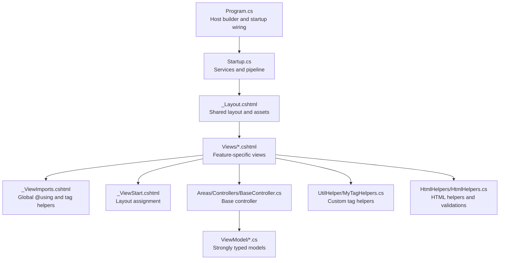
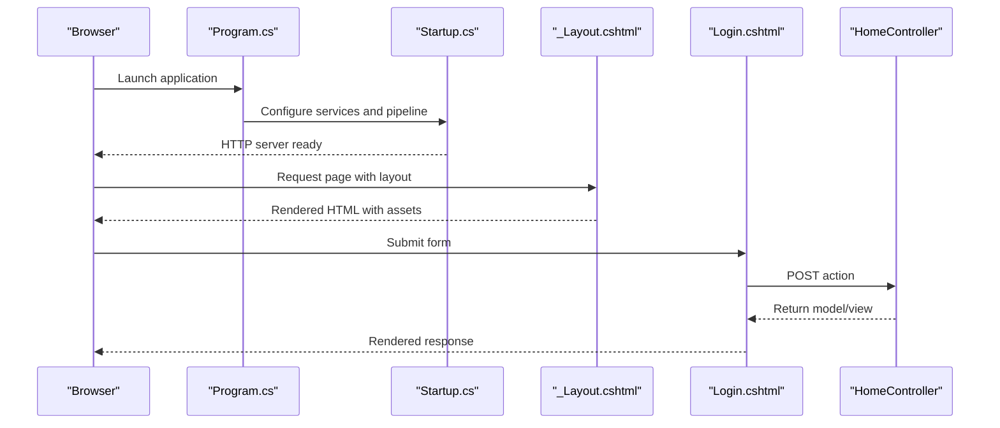
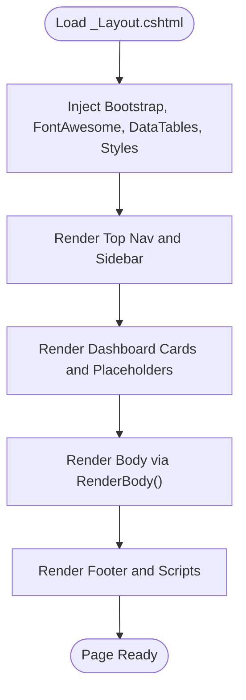
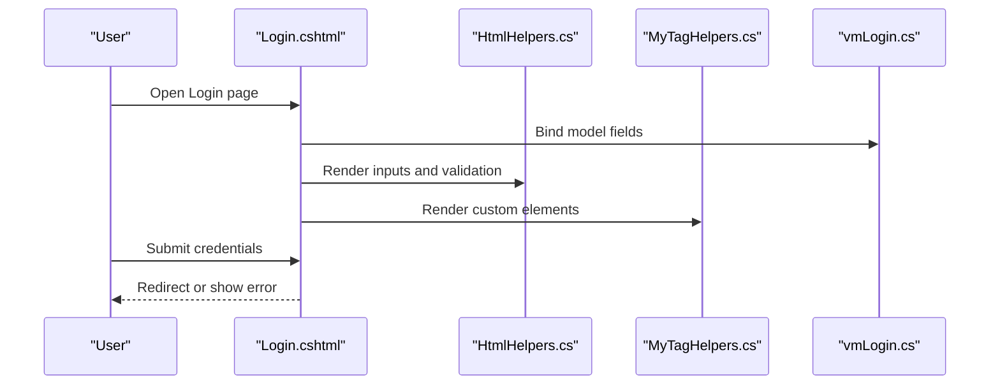
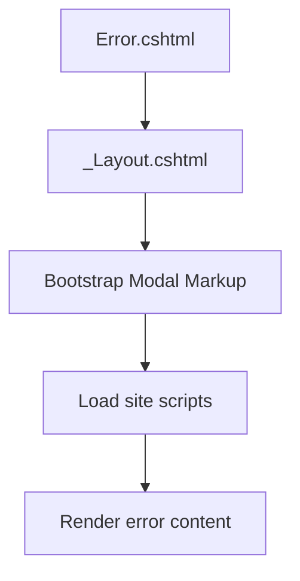
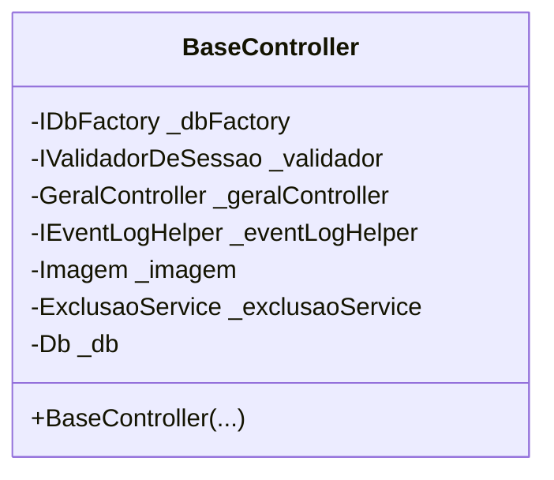
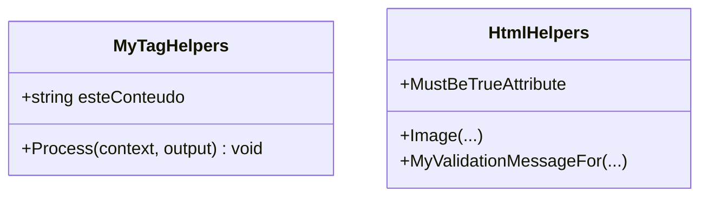
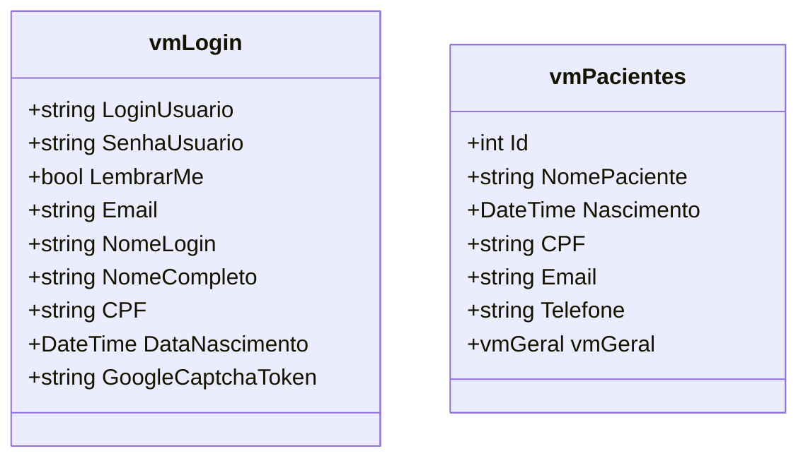
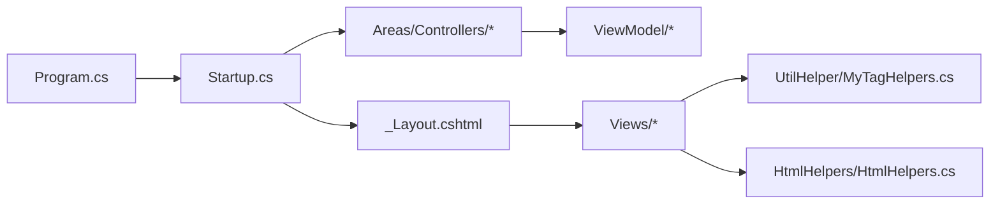

# Presentation Layer

<cite>
**Referenced Files in This Document**
- [Program.cs](file://LabWebMvc.MVC/Program.cs)
- [Startup.cs](file://LabWebMvc.MVC/Startup.cs)
- [_ViewImports.cshtml](file://LabWebMvc.MVC/Views/_ViewImports.cshtml)
- [_ViewStart.cshtml](file://LabWebMvc.MVC/Views/_ViewStart.cshtml)
- [_Layout.cshtml](file://LabWebMvc.MVC/Views/Shared/_Layout.cshtml)
- [BaseController.cs](file://LabWebMvc.MVC/Areas/Controllers/BaseController.cs)
- [MyTagHelpers.cs](file://LabWebMvc.MVC/UtilHelper/MyTagHelpers.cs)
- [HtmlHelpers.cs](file://LabWebMvc.MVC/HtmlHelpers/HtmlHelpers.cs)
- [vmLogin.cs](file://LabWebMvc.MVC/ViewModel/vmLogin.cs)
- [vmPacientes.cs](file://LabWebMvc.MVC/ViewModel/vmPacientes.cs)
- [Login.cshtml](file://LabWebMvc.MVC/Views/Home/Login.cshtml)
- [Error.cshtml](file://LabWebMvc.MVC/Views/Mensagem/Error.cshtml)
</cite>

## Table of Contents
1. [Introduction](#introduction)
2. [Project Structure](#project-structure)
3. [Core Components](#core-components)
4. [Architecture Overview](#architecture-overview)
5. [Detailed Component Analysis](#detailed-component-analysis)
6. [Dependency Analysis](#dependency-analysis)
7. [Performance Considerations](#performance-considerations)
8. [Troubleshooting Guide](#troubleshooting-guide)
9. [Conclusion](#conclusion)
10. [Appendices](#appendices)

## Introduction
This document describes the ASP.NET Core MVC presentation layer of the application. It covers the controller architecture, view components, and the ViewModel management system. It documents the shared layout structure, partial views, and reusable components. It explains the Bootstrap-based frontend implementation, JavaScript integration, and responsive design patterns. It also details the menu system, authentication views, and user interface components, including tag helpers, HTML helpers, and custom components. Finally, it addresses front-end asset management, styling approaches, cross-browser compatibility, common UI patterns, form handling, and data visualization components.

## Project Structure
The presentation layer is organized around the MVC pattern with areas for specialized concerns, a shared layout, strongly typed views, and a ViewModel namespace. Key elements:
- Entry point and hosting configuration in Program.cs and Startup.cs
- Global imports and layout inheritance via _ViewImports.cshtml and _ViewStart.cshtml
- Shared layout with navigation, sidebar, dashboard placeholders, and script/style bundles
- Base controller for common dependencies and database factory
- Tag helpers and HTML helpers for rendering and validation
- Strongly typed ViewModels for forms and data binding
- Authentication views under Views/Home and error pages under Views/Mensagem

**Diagram sources**
- [Program.cs:1-107](file://LabWebMvc.MVC/Program.cs#L1-L107)
- [Startup.cs:1-248](file://LabWebMvc.MVC/Startup.cs#L1-L248)
- [_Layout.cshtml:1-375](file://LabWebMvc.MVC/Views/Shared/_Layout.cshtml#L1-L375)
- [_ViewImports.cshtml:1-5](file://LabWebMvc.MVC/Views/_ViewImports.cshtml#L1-L5)
- [_ViewStart.cshtml:1-5](file://LabWebMvc.MVC/Views/_ViewStart.cshtml#L1-L5)
- [BaseController.cs:1-40](file://LabWebMvc.MVC/Areas/Controllers/BaseController.cs#L1-L40)
- [MyTagHelpers.cs:1-20](file://LabWebMvc.MVC/UtilHelper/MyTagHelpers.cs#L1-L20)
- [HtmlHelpers.cs:1-286](file://LabWebMvc.MVC/HtmlHelpers/HtmlHelpers.cs#L1-L286)
- [vmLogin.cs:1-42](file://LabWebMvc.MVC/ViewModel/vmLogin.cs#L1-L42)
- [vmPacientes.cs:1-137](file://LabWebMvc.MVC/ViewModel/vmPacientes.cs#L1-L137)

**Section sources**
- [Program.cs:1-107](file://LabWebMvc.MVC/Program.cs#L1-L107)
- [Startup.cs:1-248](file://LabWebMvc.MVC/Startup.cs#L1-L248)
- [_ViewImports.cshtml:1-5](file://LabWebMvc.MVC/Views/_ViewImports.cshtml#L1-L5)
- [_ViewStart.cshtml:1-5](file://LabWebMvc.MVC/Views/_ViewStart.cshtml#L1-L5)
- [_Layout.cshtml:1-375](file://LabWebMvc.MVC/Views/Shared/_Layout.cshtml#L1-L375)

## Core Components
- Controller architecture: A base controller injects database factory, session validator, general controller service, event logging helper, image service, and concurrency deletion service. This promotes reuse and consistent data access across feature controllers.
- ViewModel management: Strongly typed ViewModels define validation attributes and bindable properties for forms. Examples include vmLogin for authentication and vmPacientes for patient records.
- Tag helpers: A custom tag helper renders structured content with a specific element name and content attribute.
- HTML helpers: Helpers provide image rendering, custom validation message generation, and DOM element construction utilities.

**Section sources**
- [BaseController.cs:1-40](file://LabWebMvc.MVC/Areas/Controllers/BaseController.cs#L1-L40)
- [vmLogin.cs:1-42](file://LabWebMvc.MVC/ViewModel/vmLogin.cs#L1-L42)
- [vmPacientes.cs:1-137](file://LabWebMvc.MVC/ViewModel/vmPacientes.cs#L1-L137)
- [MyTagHelpers.cs:1-20](file://LabWebMvc.MVC/UtilHelper/MyTagHelpers.cs#L1-L20)
- [HtmlHelpers.cs:1-286](file://LabWebMvc.MVC/HtmlHelpers/HtmlHelpers.cs#L1-L286)

## Architecture Overview
The presentation layer follows a layered MVC architecture:
- Program.cs configures the host and selects the Startup class.
- Startup.cs registers services (authentication, sessions, localization, database factories, integrations) and configures the HTTP pipeline (static files, routing, authentication, authorization, endpoints).
- Views use _ViewImports.cshtml for global directives and _ViewStart.cshtml to inherit _Layout.cshtml.
- _Layout.cshtml defines the Bootstrap-based shell, navigation, sidebar, dashboard placeholders, and loads scripts and styles.

**Diagram sources**
- [Program.cs:1-107](file://LabWebMvc.MVC/Program.cs#L1-L107)
- [Startup.cs:168-246](file://LabWebMvc.MVC/Startup.cs#L168-L246)
- [_Layout.cshtml:1-375](file://LabWebMvc.MVC/Views/Shared/_Layout.cshtml#L1-L375)
- [Login.cshtml:1-137](file://LabWebMvc.MVC/Views/Home/Login.cshtml#L1-L137)

## Detailed Component Analysis

### Shared Layout and Navigation
The shared layout integrates Bootstrap, FontAwesome, DataTables, and custom styles/scripts. It provides:
- Top navigation bar with user dropdown
- Left sidebar with dynamic menu and user summary
- Dashboard area with cards and placeholder for charts
- Cookie consent partial, body content via RenderBody(), and footer
- Global scripts for keyboard navigation, F5 save behavior, and progress overlay

**Diagram sources**
- [_Layout.cshtml:1-375](file://LabWebMvc.MVC/Views/Shared/_Layout.cshtml#L1-L375)

**Section sources**
- [_Layout.cshtml:1-375](file://LabWebMvc.MVC/Views/Shared/_Layout.cshtml#L1-L375)

### Authentication Views and Forms
The Login view demonstrates:
- Strongly typed ViewModel binding
- Bootstrap-styled form controls
- ReCaptcha integration and hidden token field
- Password visibility toggle
- Conditional error message display
- Custom scripts for UX enhancements

**Diagram sources**
- [Login.cshtml:1-137](file://LabWebMvc.MVC/Views/Home/Login.cshtml#L1-L137)
- [HtmlHelpers.cs:1-286](file://LabWebMvc.MVC/HtmlHelpers/HtmlHelpers.cs#L1-L286)
- [MyTagHelpers.cs:1-20](file://LabWebMvc.MVC/UtilHelper/MyTagHelpers.cs#L1-L20)
- [vmLogin.cs:1-42](file://LabWebMvc.MVC/ViewModel/vmLogin.cs#L1-L42)

**Section sources**
- [Login.cshtml:1-137](file://LabWebMvc.MVC/Views/Home/Login.cshtml#L1-L137)
- [vmLogin.cs:1-42](file://LabWebMvc.MVC/ViewModel/vmLogin.cs#L1-L42)

### Error Handling and Messaging
Error.cshtml renders a modal dialog with error content and loads site scripts. It inherits the shared layout and uses Bootstrap modal classes for presentation.

**Diagram sources**
- [Error.cshtml:1-19](file://LabWebMvc.MVC/Views/Mensagem/Error.cshtml#L1-L19)
- [_Layout.cshtml:1-375](file://LabWebMvc.MVC/Views/Shared/_Layout.cshtml#L1-L375)

**Section sources**
- [Error.cshtml:1-19](file://LabWebMvc.MVC/Views/Mensagem/Error.cshtml#L1-L19)

### Controller Architecture and Base Controller
BaseController initializes dependencies for derived controllers:
- Database factory for dynamic DbContext creation
- Session validator for access control
- General controller service for shared operations
- Event logging helper for audit trails
- Image service for media handling
- Concurrency exclusion service for safe deletions

**Diagram sources**
- [BaseController.cs:1-40](file://LabWebMvc.MVC/Areas/Controllers/BaseController.cs#L1-L40)

**Section sources**
- [BaseController.cs:1-40](file://LabWebMvc.MVC/Areas/Controllers/BaseController.cs#L1-L40)

### Tag Helpers and HTML Helpers
- Custom tag helper: MyTagHelpers renders a custom element with content attribute support.
- HTML helpers: Provide image rendering, custom validation messages, and DOM element builders. They augment standard MVC helpers for richer UI composition.

**Diagram sources**
- [MyTagHelpers.cs:1-20](file://LabWebMvc.MVC/UtilHelper/MyTagHelpers.cs#L1-L20)
- [HtmlHelpers.cs:1-286](file://LabWebMvc.MVC/HtmlHelpers/HtmlHelpers.cs#L1-L286)

**Section sources**
- [MyTagHelpers.cs:1-20](file://LabWebMvc.MVC/UtilHelper/MyTagHelpers.cs#L1-L20)
- [HtmlHelpers.cs:1-286](file://LabWebMvc.MVC/HtmlHelpers/HtmlHelpers.cs#L1-L286)

### ViewModel Management
- vmLogin: Defines fields for email, password, remember me, and ReCaptcha token with validation attributes.
- vmPacientes: Comprehensive model for patient data with extensive validation attributes and bindable properties.

**Diagram sources**
- [vmLogin.cs:1-42](file://LabWebMvc.MVC/ViewModel/vmLogin.cs#L1-L42)
- [vmPacientes.cs:1-137](file://LabWebMvc.MVC/ViewModel/vmPacientes.cs#L1-L137)

**Section sources**
- [vmLogin.cs:1-42](file://LabWebMvc.MVC/ViewModel/vmLogin.cs#L1-L42)
- [vmPacientes.cs:1-137](file://LabWebMvc.MVC/ViewModel/vmPacientes.cs#L1-L137)

### Asset Management and Responsive Design
- Static files: Bootstrap CSS/JS, FontAwesome, DataTables, and custom styles/scripts are loaded in the layout.
- Responsive viewport meta tag ensures mobile-friendly scaling.
- DataTables integration supports responsive tables and client-side interactions.
- Custom CSS and JS files are included to enhance UI and behavior.

**Section sources**
- [_Layout.cshtml:1-375](file://LabWebMvc.MVC/Views/Shared/_Layout.cshtml#L1-L375)

### Cross-Browser Compatibility
- Meta tags for IE compatibility and viewport configuration improve rendering consistency.
- Bootstrap grid and components are designed for broad browser support.
- Feature detection and graceful degradation are applied in scripts (e.g., localStorage usage).

**Section sources**
- [_Layout.cshtml:6-8](file://LabWebMvc.MVC/Views/Shared/_Layout.cshtml#L6-L8)

### Common UI Patterns and Form Handling
- Keyboard navigation: Tabbing between inputs and preventing Enter from submitting forms prematurely.
- F5 save behavior: Intercepting F5 to trigger the primary save button.
- Masking and input formatting: jQuery plugins for masks and money formatting.
- SweetAlert2 integration for modal confirmations and alerts.
- Partial views and components for reusable UI segments (e.g., dashboard cards, cookie consent).

**Section sources**
- [_Layout.cshtml:316-370](file://LabWebMvc.MVC/Views/Shared/_Layout.cshtml#L316-L370)

### Data Visualization Components
- Dashboard placeholders for cards and charts are present in the layout.
- DataTables integration enables interactive data grids with sorting, filtering, and pagination.
- Charts library is referenced but not actively rendered in the provided layout; charts can be added via JavaScript initialization.

**Section sources**
- [_Layout.cshtml:163-191](file://LabWebMvc.MVC/Views/Shared/_Layout.cshtml#L163-L191)
- [_Layout.cshtml:47-48](file://LabWebMvc.MVC/Views/Shared/_Layout.cshtml#L47-L48)

## Dependency Analysis
The presentation layer depends on:
- Startup.cs for service registration and middleware pipeline configuration
- Program.cs for host and environment-specific configuration
- _Layout.cshtml for shared UI and asset loading
- Controllers for business logic orchestration
- ViewModels for data binding and validation
- Tag and HTML helpers for rendering and validation

**Diagram sources**
- [Program.cs:1-107](file://LabWebMvc.MVC/Program.cs#L1-L107)
- [Startup.cs:1-248](file://LabWebMvc.MVC/Startup.cs#L1-L248)
- [_Layout.cshtml:1-375](file://LabWebMvc.MVC/Views/Shared/_Layout.cshtml#L1-L375)
- [BaseController.cs:1-40](file://LabWebMvc.MVC/Areas/Controllers/BaseController.cs#L1-L40)
- [MyTagHelpers.cs:1-20](file://LabWebMvc.MVC/UtilHelper/MyTagHelpers.cs#L1-L20)
- [HtmlHelpers.cs:1-286](file://LabWebMvc.MVC/HtmlHelpers/HtmlHelpers.cs#L1-L286)
- [vmLogin.cs:1-42](file://LabWebMvc.MVC/ViewModel/vmLogin.cs#L1-L42)
- [vmPacientes.cs:1-137](file://LabWebMvc.MVC/ViewModel/vmPacientes.cs#L1-L137)

**Section sources**
- [Startup.cs:118-165](file://LabWebMvc.MVC/Startup.cs#L118-L165)
- [Startup.cs:168-246](file://LabWebMvc.MVC/Startup.cs#L168-L246)

## Performance Considerations
- Minimize unnecessary reflows by batching DOM updates in scripts.
- Defer non-critical scripts and leverage Bootstrap’s compiled assets.
- Use DataTables’ built-in features (pagination, search) to reduce DOM size.
- Cache frequently accessed UI components (e.g., dashboard cards) in memory or localStorage where appropriate.

## Troubleshooting Guide
- Authentication failures: Verify cookie policy, sliding expiration, and login/logout paths configured in Startup.cs.
- Session issues: Confirm session middleware placement after routing and before authentication.
- Localization errors: Ensure pt-BR culture is set and supported in the pipeline.
- Asset loading: Confirm static files middleware is enabled and paths match wwwroot structure.
- Validation errors: Use custom HTML helpers and tag helpers to ensure consistent error rendering.

**Section sources**
- [Startup.cs:127-153](file://LabWebMvc.MVC/Startup.cs#L127-L153)
- [Startup.cs:187-214](file://LabWebMvc.MVC/Startup.cs#L187-L214)
- [Startup.cs:194-200](file://LabWebMvc.MVC/Startup.cs#L194-L200)
- [_Layout.cshtml:14-51](file://LabWebMvc.MVC/Views/Shared/_Layout.cshtml#L14-L51)

## Conclusion
The presentation layer leverages ASP.NET Core MVC best practices with a shared layout, strong typing via ViewModels, reusable tag and HTML helpers, and a Bootstrap-based responsive design. The controller base class centralizes common services, while Startup.cs orchestrates authentication, sessions, localization, and routing. The result is a maintainable, extensible UI foundation suitable for enterprise-grade applications.

## Appendices
- Global directives and tag helpers are centralized in _ViewImports.cshtml.
- Layout inheritance is standardized via _ViewStart.cshtml.
- Authentication and error views demonstrate practical patterns for user feedback and security.

**Section sources**
- [_ViewImports.cshtml:1-5](file://LabWebMvc.MVC/Views/_ViewImports.cshtml#L1-L5)
- [_ViewStart.cshtml:1-5](file://LabWebMvc.MVC/Views/_ViewStart.cshtml#L1-L5)