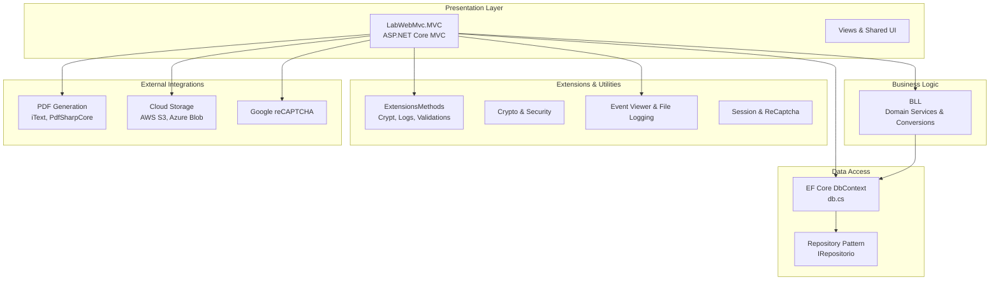
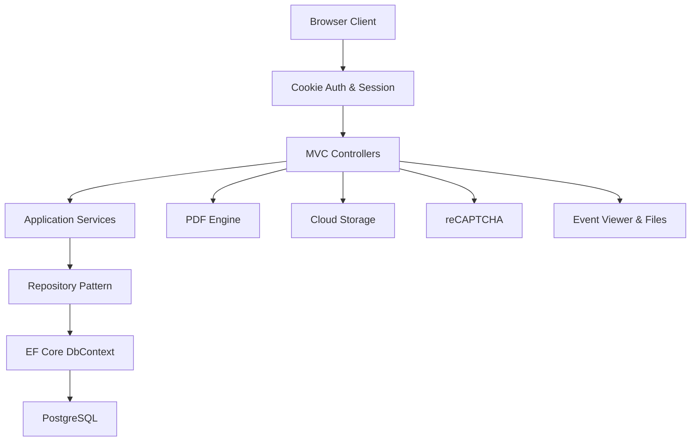
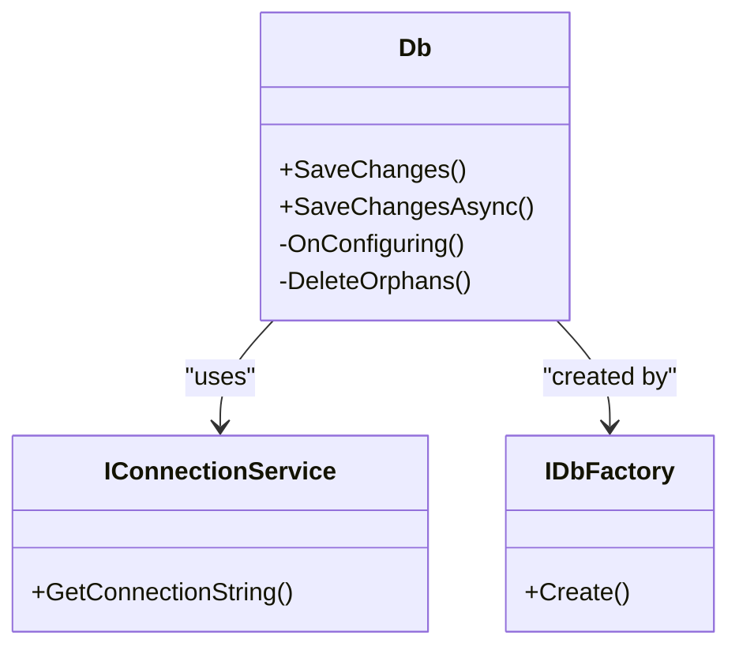
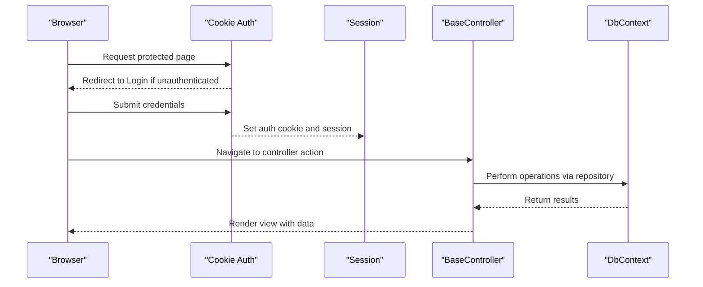
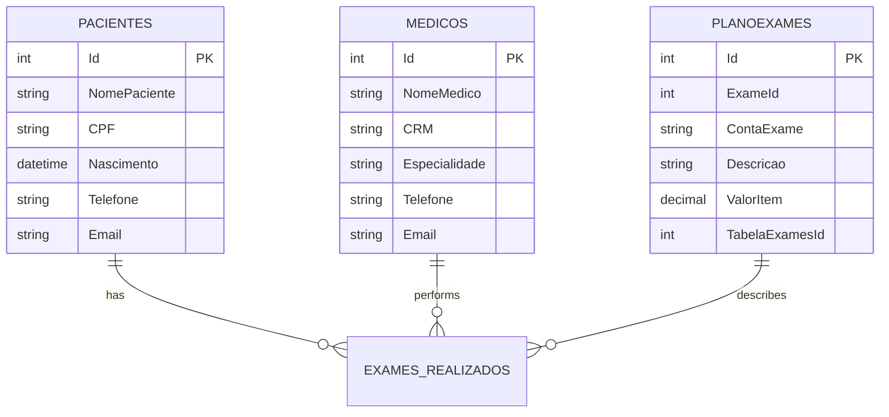
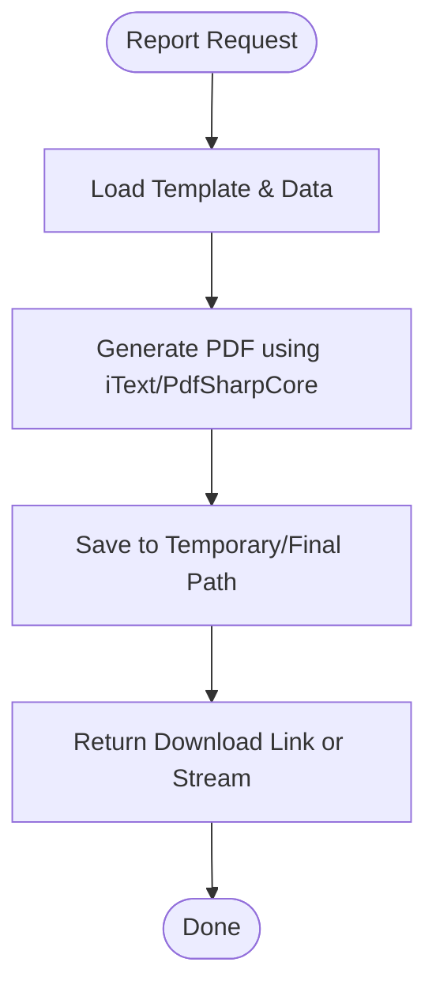
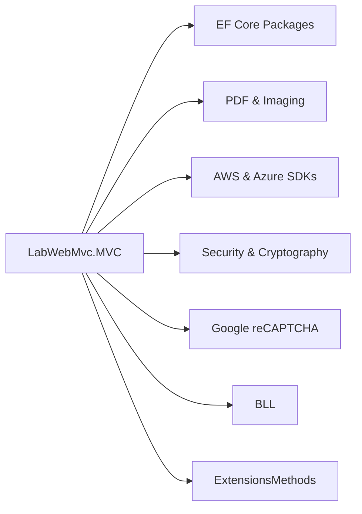

# Project Overview

<cite>
**Referenced Files in This Document**
- [LabWebMvc.MVC.csproj](file://LabWebMvc.MVC/LabWebMvc.MVC.csproj)
- [Program.cs](file://LabWebMvc.MVC/Program.cs)
- [Startup.cs](file://LabWebMvc.MVC/Startup.cs)
- [appsettings.json](file://LabWebMvc.MVC/appsettings.json)
- [appsettings.Development.json](file://LabWebMvc.MVC/appsettings.Development.json)
- [global.json](file://global.json)
- [db.cs](file://LabWebMvc.MVC/Models/db.cs)
- [BaseController.cs](file://LabWebMvc.MVC/Areas/Controllers/BaseController.cs)
- [Pacientes.cs](file://LabWebMvc.MVC/Models/Pacientes.cs)
- [Medicos.cs](file://LabWebMvc.MVC/Models/Medicos.cs)
- [Planoexames.cs](file://LabWebMvc.MVC/Models/Planoexames.cs)
- [README.md](file://Documentos do Qoder/README.md)
- [BLL.csproj](file://BLL/BLL.csproj)
- [ExtensionsMethods.csproj](file://ExtensionsMethods/ExtensionsMethods.csproj)
</cite>

## Table of Contents
1. [Introduction](#introduction)
2. [Project Structure](#project-structure)
3. [Core Components](#core-components)
4. [Architecture Overview](#architecture-overview)
5. [Detailed Component Analysis](#detailed-component-analysis)
6. [Dependency Analysis](#dependency-analysis)
7. [Performance Considerations](#performance-considerations)
8. [Troubleshooting Guide](#troubleshooting-guide)
9. [Conclusion](#conclusion)
10. [Appendices](#appendices)

## Introduction
LabWeb7-Projeto is a healthcare management platform designed for medical laboratory operations. It supports end-to-end workflows including patient registration, physician and institution management, examination planning and scheduling, result capture, report generation, and administrative controls. Built as a full-stack .NET 8.0 application using ASP.NET Core MVC, the system integrates PostgreSQL for persistence and modern web technologies for client-side experiences. The platform emphasizes multi-tenant connectivity, robust identity and session management, and extensible integrations for cloud storage and PDF generation.

## Project Structure
The solution is organized into modular projects that separate concerns across presentation, business logic, data access, and supporting utilities. Key elements include:
- Presentation layer (ASP.NET Core MVC) with area-based controllers and views
- Business logic layer (BLL) encapsulating domain services and conversions
- Data access layer (EF Core) with a custom DbContext and repository pattern
- Extensions and shared utilities for cryptography, logging, validations, and storage
- Supporting services for exportation and Windows service hosting

**Diagram sources**
- [LabWebMvc.MVC.csproj:1-56](file://LabWebMvc.MVC/LabWebMvc.MVC.csproj#L1-L56)
- [BLL.csproj:1-33](file://BLL/BLL.csproj#L1-L33)
- [ExtensionsMethods.csproj:1-40](file://ExtensionsMethods/ExtensionsMethods.csproj#L1-L40)
- [db.cs:13-200](file://LabWebMvc.MVC/Models/db.cs#L13-L200)

**Section sources**
- [README.md:123-136](file://Documentos do Qoder/README.md#L123-L136)
- [LabWebMvc.MVC.csproj:1-56](file://LabWebMvc.MVC/LabWebMvc.MVC.csproj#L1-L56)
- [BLL.csproj:1-33](file://BLL/BLL.csproj#L1-L33)
- [ExtensionsMethods.csproj:1-40](file://ExtensionsMethods/ExtensionsMethods.csproj#L1-L40)

## Core Components
- Authentication and Authorization: Cookie-based authentication with sliding expiration and explicit login/logout paths.
- Session Management: Distributed in-memory sessions with configurable timeouts and secure cookie policies.
- Localization: pt-BR culture applied globally for consistent date/time formatting.
- Data Access: EF Core with PostgreSQL provider, custom DbContext, generic repository pattern, and factory-based connection switching for multi-tenancy.
- PDF Generation: iText and PdfSharpCore integrated for report creation and conversion.
- Cloud Storage: AWS S3 and Azure Blob SDKs for externalized document storage.
- Security: BCrypt hashing, cryptographic utilities, and Google reCAPTCHA Enterprise integration.
- Logging: Event Viewer and file-based logging helpers for diagnostics and audit trails.

**Section sources**
- [Startup.cs:127-164](file://LabWebMvc.MVC/Startup.cs#L127-L164)
- [Startup.cs:168-246](file://LabWebMvc.MVC/Startup.cs#L168-L246)
- [db.cs:96-129](file://LabWebMvc.MVC/Models/db.cs#L96-L129)
- [appsettings.json:1-78](file://LabWebMvc.MVC/appsettings.json#L1-L78)

## Architecture Overview
The system follows a layered architecture with clear separation of concerns:
- Presentation: MVC controllers and Razor pages handle user interactions and rendering.
- Application: Controllers orchestrate workflows, coordinate repositories, and manage sessions.
- Domain: Models represent entities and relationships; business rules are enforced in services.
- Infrastructure: Data access via EF Core, external integrations via SDKs, and cross-cutting concerns via extensions.

**Diagram sources**
- [Startup.cs:168-246](file://LabWebMvc.MVC/Startup.cs#L168-L246)
- [db.cs:13-200](file://LabWebMvc.MVC/Models/db.cs#L13-L200)
- [LabWebMvc.MVC.csproj:24-46](file://LabWebMvc.MVC/LabWebMvc.MVC.csproj#L24-L46)

## Detailed Component Analysis

### Technology Stack Overview
- Backend: .NET 8.0, ASP.NET Core MVC, EF Core 8.0.19, Npgsql.EntityFrameworkCore.PostgreSQL 8.0.4
- Frontend: Bootstrap, DataTables, jQuery, and custom scripts for UI interactions
- Security: BCrypt.Net-Next, Google reCAPTCHA Enterprise, cryptographic utilities
- PDF & Images: iText, PdfSharpCore, SixLabors.ImageSharp
- Cloud: AWSSDK.S3, Azure.Storage.Blobs
- Hosting: Windows/Linux service support via WindowsService hosting package

**Section sources**
- [LabWebMvc.MVC.csproj:24-46](file://LabWebMvc.MVC/LabWebMvc.MVC.csproj#L24-L46)
- [BLL.csproj:9-28](file://BLL/BLL.csproj#L9-L28)
- [ExtensionsMethods.csproj:14-35](file://ExtensionsMethods/ExtensionsMethods.csproj#L14-L35)

### System Requirements
- .NET SDK: 8.0.413 (as specified in global.json)
- Operating Systems: Windows, Linux, macOS (service mode configured per OS)
- Database: PostgreSQL (connection strings configured in appsettings)
- Optional: wkhtmltopdf path for PDF conversion (configured in appsettings)

**Section sources**
- [global.json:1-6](file://global.json#L1-L6)
- [appsettings.json:23-26](file://LabWebMvc.MVC/appsettings.json#L23-L26)
- [appsettings.json:53-55](file://LabWebMvc.MVC/appsettings.json#L53-L55)

### Deployment Considerations
- Windows Service: Use WindowsService hosting package; publish Release configuration and register via SCM commands.
- Environment-specific configuration: appsettings.{OS}.json selection handled in Program.cs.
- Authentication: Ensure HTTPS redirection and cookie policies are enabled in production.
- Logging: Configure Event Viewer source and log levels appropriately for production environments.
- Multi-tenancy: Connection strings for enterprise databases are provided; ensure correct selection per tenant.

**Section sources**
- [Program.cs:11-22](file://LabWebMvc.MVC/Program.cs#L11-L22)
- [Program.cs:25-42](file://LabWebMvc.MVC/Program.cs#L25-L42)
- [Startup.cs:168-181](file://LabWebMvc.MVC/Startup.cs#L168-L181)
- [appsettings.json:8-18](file://LabWebMvc.MVC/appsettings.json#L8-L18)

### Data Access and Multi-Tenancy
The data access layer uses a custom DbContext with a factory pattern to dynamically switch connections based on the current tenant. SaveChanges is overridden to include orphan cleanup and centralized logging.

**Diagram sources**
- [db.cs:13-200](file://LabWebMvc.MVC/Models/db.cs#L13-L200)
- [Startup.cs:35-49](file://LabWebMvc.MVC/Startup.cs#L35-L49)

**Section sources**
- [db.cs:132-200](file://LabWebMvc.MVC/Models/db.cs#L132-L200)
- [Startup.cs:35-49](file://LabWebMvc.MVC/Startup.cs#L35-L49)

### Authentication and Session Flow
The authentication pipeline sets up cookie-based authentication, session management, and localization middleware. Controllers inherit from a base controller that injects shared services for database access, validations, logging, image handling, and concurrency-safe deletions.

**Diagram sources**
- [Startup.cs:127-164](file://LabWebMvc.MVC/Startup.cs#L127-L164)
- [Startup.cs:168-246](file://LabWebMvc.MVC/Startup.cs#L168-L246)
- [BaseController.cs:12-39](file://LabWebMvc.MVC/Areas/Controllers/BaseController.cs#L12-L39)

**Section sources**
- [Startup.cs:127-164](file://LabWebMvc.MVC/Startup.cs#L127-L164)
- [Startup.cs:168-246](file://LabWebMvc.MVC/Startup.cs#L168-L246)
- [BaseController.cs:12-39](file://LabWebMvc.MVC/Areas/Controllers/BaseController.cs#L12-L39)

### Healthcare Workflows: Patient, Physician, and Examination Planning
- Patient Registration: Entities include personal and demographic details with relationships to examination records.
- Physician Management: Entities capture physician identities, specialties, and links to performed examinations.
- Examination Planning: Entities model plans, items, and descriptions, enabling structured reporting and result capture.

**Diagram sources**
- [Pacientes.cs:3-102](file://LabWebMvc.MVC/Models/Pacientes.cs#L3-L102)
- [Medicos.cs:3-32](file://LabWebMvc.MVC/Models/Medicos.cs#L3-L32)
- [Planoexames.cs:3-35](file://LabWebMvc.MVC/Models/Planoexames.cs#L3-L35)

**Section sources**
- [Pacientes.cs:3-102](file://LabWebMvc.MVC/Models/Pacientes.cs#L3-L102)
- [Medicos.cs:3-32](file://LabWebMvc.MVC/Models/Medicos.cs#L3-L32)
- [Planoexames.cs:3-35](file://LabWebMvc.MVC/Models/Planoexames.cs#L3-L35)

### PDF Generation and Report Creation
The system integrates PDF generation libraries to produce reports from templates and dynamic content. Configuration includes paths for temporary and final PDF storage.

**Diagram sources**
- [appsettings.json:53-55](file://LabWebMvc.MVC/appsettings.json#L53-L55)
- [LabWebMvc.MVC.csproj:37-42](file://LabWebMvc.MVC/LabWebMvc.MVC.csproj#L37-L42)

**Section sources**
- [appsettings.json:53-55](file://LabWebMvc.MVC/appsettings.json#L53-L55)
- [LabWebMvc.MVC.csproj:37-42](file://LabWebMvc.MVC/LabWebMvc.MVC.csproj#L37-L42)

## Dependency Analysis
The solution leverages a cohesive set of NuGet packages to implement core capabilities:
- Entity Framework Core and PostgreSQL provider for ORM and database connectivity
- PDF and imaging libraries for report generation and image processing
- Cloud SDKs for scalable storage
- Security and cryptography packages for authentication and data protection
- Google reCAPTCHA Enterprise for bot mitigation

**Diagram sources**
- [LabWebMvc.MVC.csproj:24-46](file://LabWebMvc.MVC/LabWebMvc.MVC.csproj#L24-L46)
- [BLL.csproj:9-28](file://BLL/BLL.csproj#L9-L28)
- [ExtensionsMethods.csproj:14-35](file://ExtensionsMethods/ExtensionsMethods.csproj#L14-L35)

**Section sources**
- [LabWebMvc.MVC.csproj:24-46](file://LabWebMvc.MVC/LabWebMvc.MVC.csproj#L24-L46)
- [BLL.csproj:9-28](file://BLL/BLL.csproj#L9-L28)
- [ExtensionsMethods.csproj:14-35](file://ExtensionsMethods/ExtensionsMethods.csproj#L14-L35)

## Performance Considerations
- Use asynchronous repository methods and SaveChangesAsync to avoid blocking threads.
- Apply pagination and filtering in queries to reduce payload sizes.
- Minimize large object graphs; project only required fields in views.
- Cache frequently accessed reference data (e.g., institutions, exams) in memory with invalidation strategies.
- Monitor database queries via EF Core logging and optimize slow queries.

## Troubleshooting Guide
- Connection Issues: Verify PostgreSQL connection strings in appsettings and ensure the database is reachable.
- Authentication Failures: Confirm cookie policy, login paths, and session timeout configurations.
- PDF Generation Errors: Check wkhtmltopdf path and permissions; validate template rendering logic.
- Logging: Use Event Viewer and file-based logs to diagnose runtime errors and sensitive operations.
- Multi-tenancy: Ensure the correct connection string is selected for the active tenant.

**Section sources**
- [appsettings.json:23-26](file://LabWebMvc.MVC/appsettings.json#L23-L26)
- [Startup.cs:168-181](file://LabWebMvc.MVC/Startup.cs#L168-L181)
- [db.cs:96-129](file://LabWebMvc.MVC/Models/db.cs#L96-L129)
- [README.md:201-209](file://Documentos do Qoder/README.md#L201-L209)

## Conclusion
LabWeb7-Projeto provides a robust, multi-tenant healthcare laboratory management platform built on .NET 8.0. Its layered architecture, strong security posture, and extensible integrations enable efficient patient and physician management, structured examination planning, and reliable report generation. The system’s modular design and comprehensive configuration support facilitate maintainability, scalability, and seamless deployment across diverse environments.

## Appendices
- Additional documentation and diagrams are available in the Qoder-generated documents for deeper insights into architecture, data models, and operational flows.