# System Architecture

<cite>
**Referenced Files in This Document**
- [Program.cs](file://LabWebMvc.MVC/Program.cs)
- [Startup.cs](file://LabWebMvc.MVC/Startup.cs)
- [IRepositorio.cs](file://LabWebMvc.MVC/Interfaces/IRepositorio.cs)
- [Repositorio.cs](file://LabWebMvc.MVC/Interfaces/Repositorio.cs)
- [BaseController.cs](file://LabWebMvc.MVC/Areas/Controllers/BaseController.cs)
- [DatabaseContextFactory.cs](file://LabWebMvc.MVC/Areas/ServicosDatabase/DatabaseContextFactory.cs)
- [db.cs](file://ModeloDeDados/Models/db.cs)
- [BLL.csproj](file://BLL/BLL.csproj)
- [ModeloDeDados.csproj](file://ModeloDeDados/ModeloDeDados.csproj)
- [ExtensionsMethods.csproj](file://ExtensionsMethods/ExtensionsMethods.csproj)
- [TempoServidorMSSQL.cs](file://BLL/TempoServidorMSSQL.cs)
- [IEventLogHelper.cs](file://ExtensionsMethods/EventViewerHelper/IEventLogHelper.cs)
</cite>

## Table of Contents
1. [Introduction](#introduction)
2. [Project Structure](#project-structure)
3. [Core Components](#core-components)
4. [Architecture Overview](#architecture-overview)
5. [Detailed Component Analysis](#detailed-component-analysis)
6. [Dependency Analysis](#dependency-analysis)
7. [Performance Considerations](#performance-considerations)
8. [Security Architecture](#security-architecture)
9. [Deployment Topology](#deployment-topology)
10. [Scalability Considerations](#scalability-considerations)
11. [Troubleshooting Guide](#troubleshooting-guide)
12. [Conclusion](#conclusion)

## Introduction
This document describes the layered architecture of LabWeb7-Projeto, focusing on how the presentation layer (LabWebMvc.MVC), business logic (BLL), data access (ModeloDeDados), and cross-cutting concerns (ExtensionsMethods) collaborate. It documents the high-level design patterns in use, including MVC, Repository, Dependency Injection, and Factory, and explains service-oriented architecture with background services, Windows service implementation, and cloud integration patterns. It also covers system boundaries, data flow, integration points, scalability, security, and deployment topology.

## Project Structure
The solution is organized into distinct projects representing layers and cross-cutting concerns:
- Presentation: LabWebMvc.MVC (ASP.NET Core MVC, controllers, views, areas, integrations)
- Business Logic: BLL (.NET library with utilities, services, and domain helpers)
- Data Access: ModeloDeDados (Entity Framework DbContext and model classes)
- Cross-Cutting: ExtensionsMethods (logging, cryptography, storage, validations)
- Background Services: ServicoExportacao (background service project)
- Windows Service: WindowsService (Windows service wrapper)
- Supporting libraries: Extensions, ExtensionsMethods, and shared models

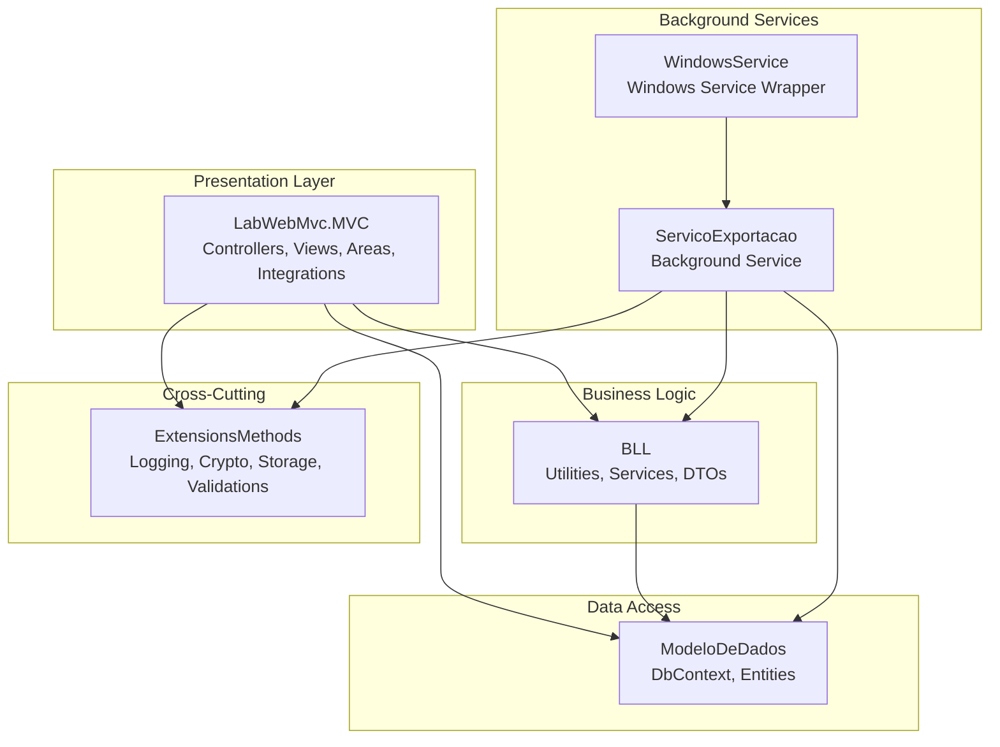

**Diagram sources**
- [Program.cs:1-107](file://LabWebMvc.MVC/Program.cs#L1-L107)
- [Startup.cs:1-248](file://LabWebMvc.MVC/Startup.cs#L1-L248)
- [BLL.csproj:1-33](file://BLL/BLL.csproj#L1-L33)
- [ModeloDeDados.csproj:1-20](file://ModeloDeDados/ModeloDeDados.csproj#L1-L20)
- [ExtensionsMethods.csproj:1-40](file://ExtensionsMethods/ExtensionsMethods.csproj#L1-L40)

**Section sources**
- [Program.cs:1-107](file://LabWebMvc.MVC/Program.cs#L1-L107)
- [Startup.cs:1-248](file://LabWebMvc.MVC/Startup.cs#L1-L248)

## Core Components
- Presentation Layer (LabWebMvc.MVC)
  - Controllers inherit from a base controller that injects repositories, logging, image handling, concurrency control, and database factory.
  - Dependency injection registers services for sessions, authentication, repositories, export/import integrations, and platform-specific printers.
- Business Logic (BLL)
  - Provides utilities, services (e.g., server time retrieval), and reusable helpers used across layers.
- Data Access (ModeloDeDados)
  - Entity Framework DbContext configured with PostgreSQL provider and dynamic connection factory for multi-tenant connections.
- Cross-Cutting (ExtensionsMethods)
  - Logging, cryptography, storage abstractions, and validations; integrates with cloud SDKs and event viewer logging.

**Section sources**
- [BaseController.cs:1-40](file://LabWebMvc.MVC/Areas/Controllers/BaseController.cs#L1-L40)
- [Startup.cs:33-165](file://LabWebMvc.MVC/Startup.cs#L33-L165)
- [db.cs:7-108](file://ModeloDeDados/Models/db.cs#L7-L108)
- [DatabaseContextFactory.cs:8-75](file://LabWebMvc.MVC/Areas/ServicosDatabase/DatabaseContextFactory.cs#L8-L75)

## Architecture Overview
The system follows a layered architecture with explicit separation of concerns:
- Presentation layer handles HTTP requests, authentication, sessions, and orchestrates business actions.
- Business logic encapsulates domain rules and services.
- Data access abstracts persistence via Entity Framework and a factory for dynamic connections.
- Cross-cutting concerns are injected via DI and applied consistently across layers.

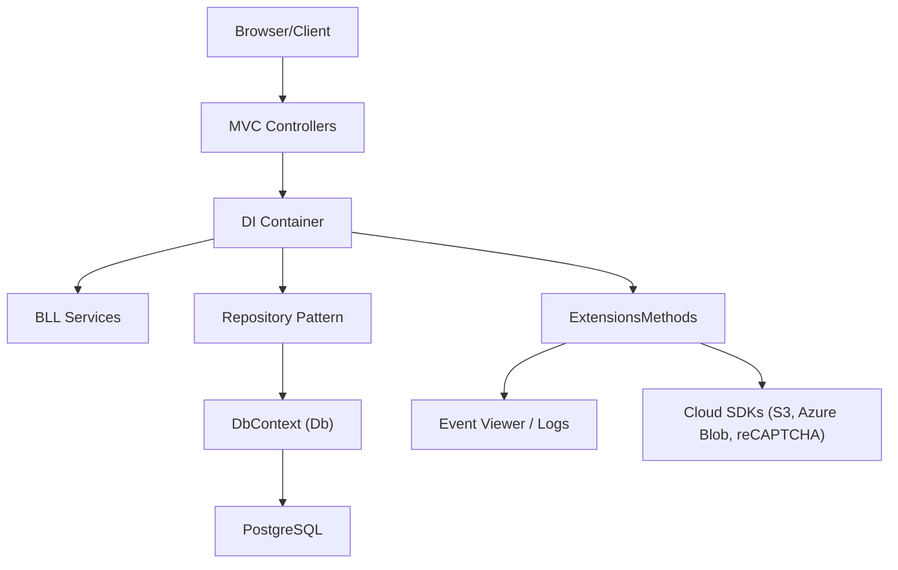

**Diagram sources**
- [Startup.cs:33-165](file://LabWebMvc.MVC/Startup.cs#L33-L165)
- [db.cs:7-108](file://ModeloDeDados/Models/db.cs#L7-L108)
- [ExtensionsMethods.csproj:1-40](file://ExtensionsMethods/ExtensionsMethods.csproj#L1-L40)

## Detailed Component Analysis

### MVC Pattern
- Controllers orchestrate user interactions and delegate to business services and repositories.
- Authentication and sessions are configured centrally in Startup.
- Base controller initializes database context via factory and exposes shared services.

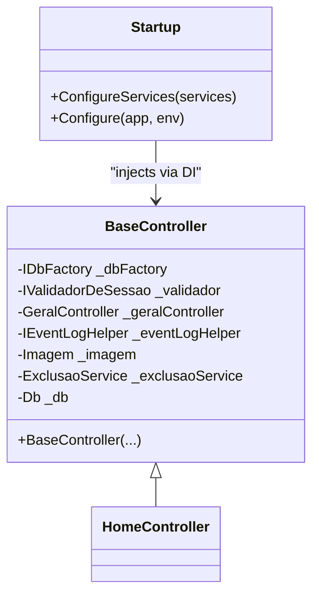

**Diagram sources**
- [BaseController.cs:12-39](file://LabWebMvc.MVC/Areas/Controllers/BaseController.cs#L12-L39)
- [Startup.cs:33-165](file://LabWebMvc.MVC/Startup.cs#L33-L165)

**Section sources**
- [BaseController.cs:1-40](file://LabWebMvc.MVC/Areas/Controllers/BaseController.cs#L1-L40)
- [Startup.cs:168-246](file://LabWebMvc.MVC/Startup.cs#L168-L246)

### Repository Pattern
- Generic repository interface defines CRUD and query operations.
- Repository implementation delegates to DbContext and DbSet.
- Used by controllers and services to abstract persistence logic.

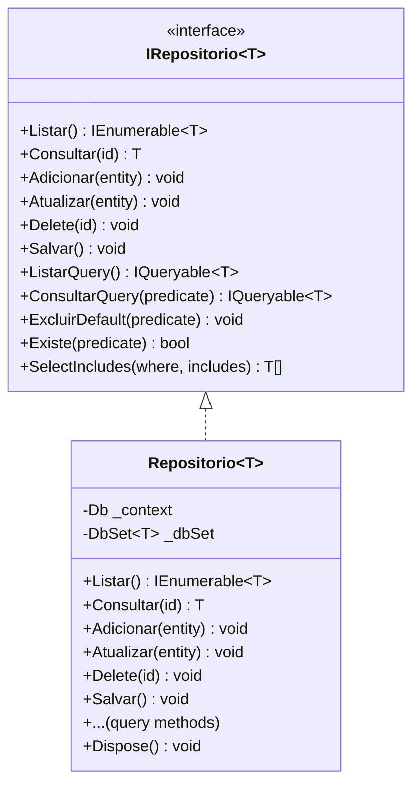

**Diagram sources**
- [IRepositorio.cs:5-51](file://LabWebMvc.MVC/Interfaces/IRepositorio.cs#L5-L51)
- [Repositorio.cs:7-129](file://LabWebMvc.MVC/Interfaces/Repositorio.cs#L7-L129)

**Section sources**
- [IRepositorio.cs:1-51](file://LabWebMvc.MVC/Interfaces/IRepositorio.cs#L1-L51)
- [Repositorio.cs:1-129](file://LabWebMvc.MVC/Interfaces/Repositorio.cs#L1-L129)

### Dependency Injection
- Services registered in Startup include:
  - Connection and factory for DbContext
  - Repository generic registration
  - Platform-specific printer selection
  - Session and authentication configuration
  - Import/export services and validators
- Controllers receive dependencies via constructor injection.

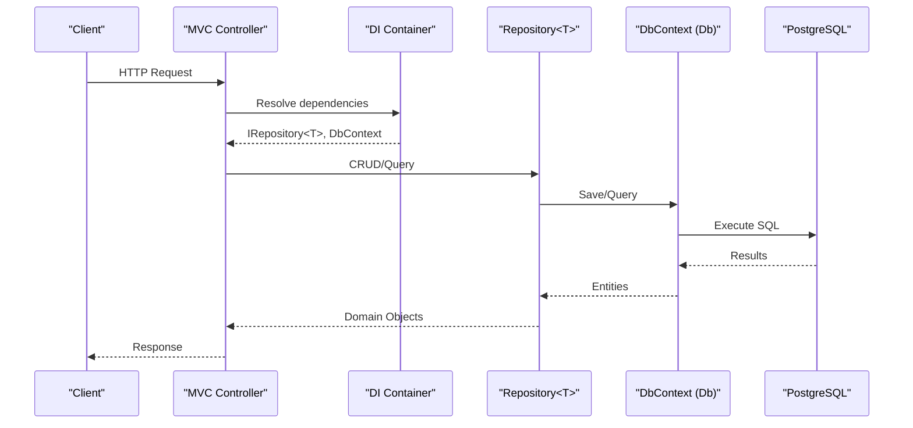

**Diagram sources**
- [Startup.cs:33-165](file://LabWebMvc.MVC/Startup.cs#L33-L165)
- [Repositorio.cs:12-68](file://LabWebMvc.MVC/Interfaces/Repositorio.cs#L12-L68)
- [db.cs:111-168](file://ModeloDeDados/Models/db.cs#L111-L168)

**Section sources**
- [Startup.cs:33-165](file://LabWebMvc.MVC/Startup.cs#L33-L165)

### Factory Pattern
- DatabaseContextFactory creates DbContext instances with custom connection strings and logging helper.
- Supports dynamic connection selection for multi-tenant environments.

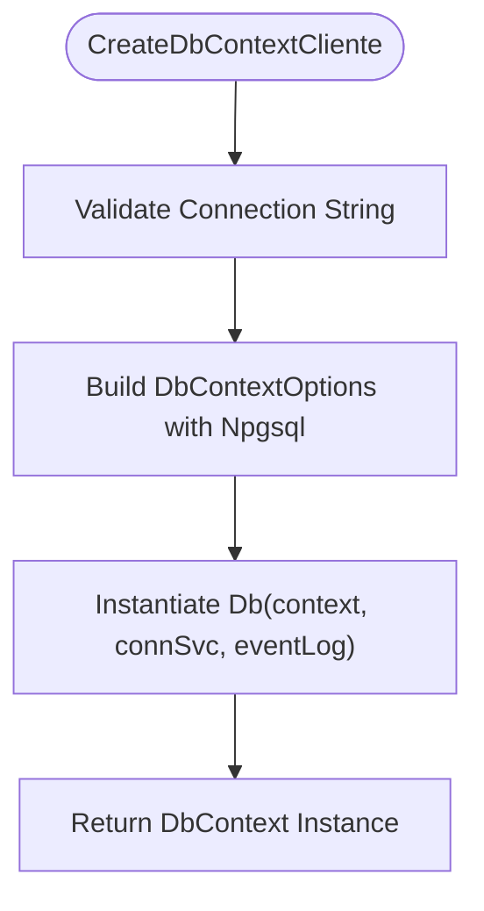

**Diagram sources**
- [DatabaseContextFactory.cs:11-21](file://LabWebMvc.MVC/Areas/ServicosDatabase/DatabaseContextFactory.cs#L11-L21)

**Section sources**
- [DatabaseContextFactory.cs:1-75](file://LabWebMvc.MVC/Areas/ServicosDatabase/DatabaseContextFactory.cs#L1-L75)

### Service-Oriented Architecture and Background Services
- Background service project (ServicoExportacao) encapsulates periodic tasks and integrates with BLL, data access, and cross-cutting concerns.
- Windows service wrapper enables running the background service as a Windows service.

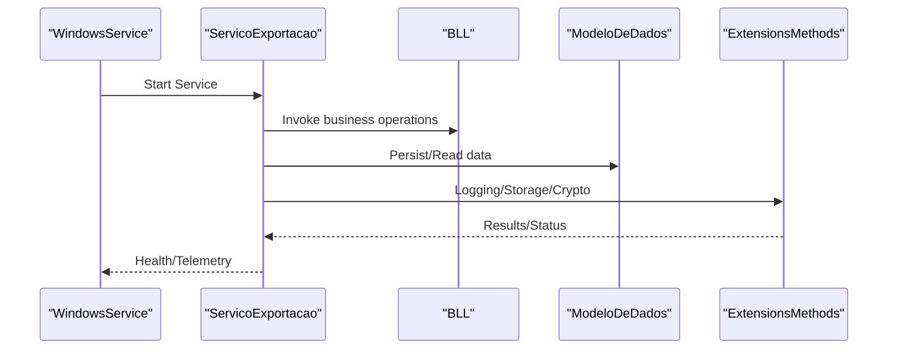

**Diagram sources**
- [Program.cs:7-23](file://LabWebMvc.MVC/Program.cs#L7-L23)
- [ExtensionsMethods.csproj:21-26](file://ExtensionsMethods/ExtensionsMethods.csproj#L21-L26)

**Section sources**
- [Program.cs:1-107](file://LabWebMvc.MVC/Program.cs#L1-L107)
- [ExtensionsMethods.csproj:1-40](file://ExtensionsMethods/ExtensionsMethods.csproj#L1-L40)

### Cloud Integration Patterns
- ExtensionsMethods integrates with AWS S3, Azure Blob Storage, and Google reCAPTCHA Enterprise.
- These integrations are available as cross-cutting services and can be consumed by controllers and services.

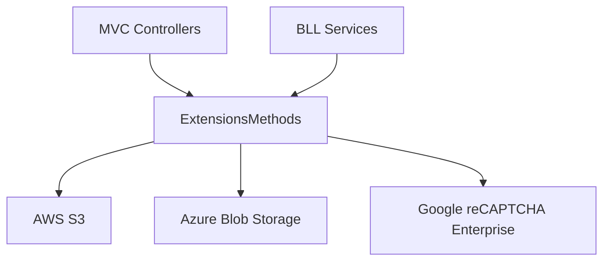

**Diagram sources**
- [ExtensionsMethods.csproj:21-26](file://ExtensionsMethods/ExtensionsMethods.csproj#L21-L26)

**Section sources**
- [ExtensionsMethods.csproj:1-40](file://ExtensionsMethods/ExtensionsMethods.csproj#L1-L40)

## Dependency Analysis
- Project references:
  - LabWebMvc.MVC depends on BLL, ModeloDeDados, and ExtensionsMethods.
  - BLL references external packages for PDF, cryptography, and cloud services.
  - ModeloDeDados references EF Core and ExtensionsMethods.
  - ExtensionsMethods references cloud SDKs and EF Core.
- Runtime dependencies:
  - ASP.NET Core hosting, Entity Framework with Npgsql, and platform-specific services.

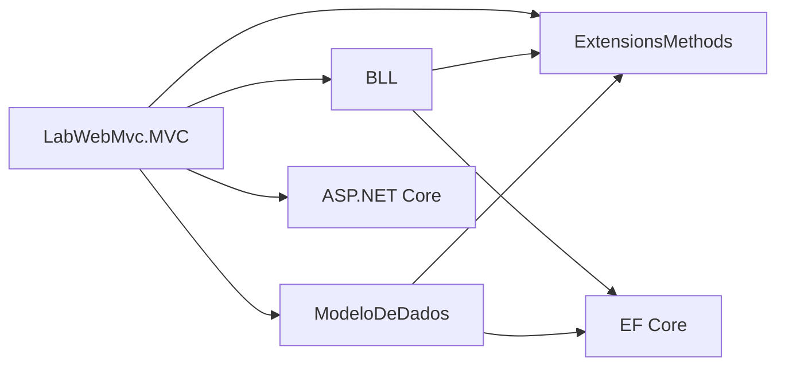

**Diagram sources**
- [BLL.csproj:9-28](file://BLL/BLL.csproj#L9-L28)
- [ModeloDeDados.csproj:9-13](file://ModeloDeDados/ModeloDeDados.csproj#L9-L13)
- [ExtensionsMethods.csproj:8-35](file://ExtensionsMethods/ExtensionsMethods.csproj#L8-L35)

**Section sources**
- [BLL.csproj:1-33](file://BLL/BLL.csproj#L1-L33)
- [ModeloDeDados.csproj:1-20](file://ModeloDeDados/ModeloDeDados.csproj#L1-L20)
- [ExtensionsMethods.csproj:1-40](file://ExtensionsMethods/ExtensionsMethods.csproj#L1-L40)

## Performance Considerations
- Use asynchronous patterns for I/O-bound operations (e.g., database and cloud calls).
- Minimize large object graphs in views; prefer projection queries via repository query methods.
- Apply pagination and filtering early in the query chain to reduce payload sizes.
- Cache infrequent reads using distributed cache where appropriate.
- Monitor DbContext lifetime and dispose contexts promptly after use.

## Security Architecture
- Authentication and sessions are configured in Startup with cookie policies and sliding expiration.
- HttpOnly and SameSite cookies are set for secure handling.
- Cross-cutting logging integrates with Event Viewer for audit trails.
- Cryptographic utilities and storage abstractions are provided in ExtensionsMethods.

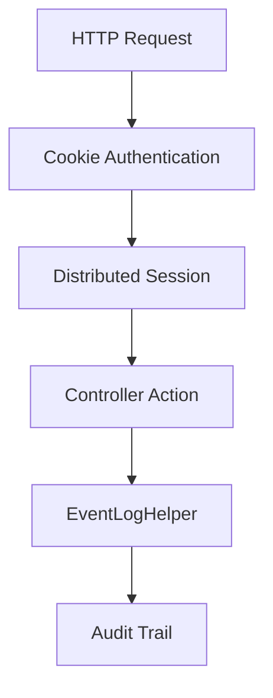

**Diagram sources**
- [Startup.cs:127-153](file://LabWebMvc.MVC/Startup.cs#L127-L153)
- [IEventLogHelper.cs](file://ExtensionsMethods/EventViewerHelper/IEventLogHelper.cs)

**Section sources**
- [Startup.cs:127-153](file://LabWebMvc.MVC/Startup.cs#L127-L153)

## Deployment Topology
- Web application runs as an ASP.NET Core host with optional Windows service wrapper.
- Background service runs as a separate Windows service consuming the same BLL and data access layers.
- Multi-tenant database connections are resolved dynamically via factory.

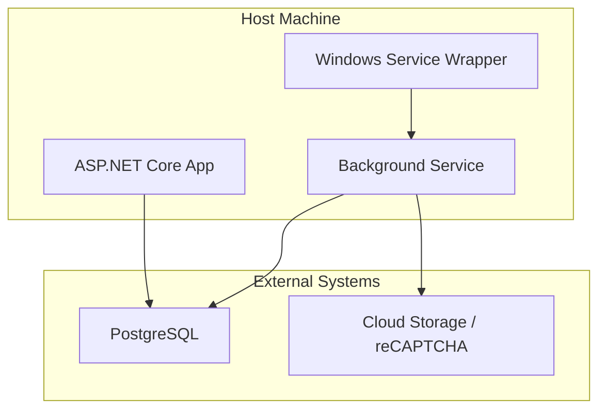

**Diagram sources**
- [Program.cs:7-23](file://LabWebMvc.MVC/Program.cs#L7-L23)
- [DatabaseContextFactory.cs:11-21](file://LabWebMvc.MVC/Areas/ServicosDatabase/DatabaseContextFactory.cs#L11-L21)

**Section sources**
- [Program.cs:1-107](file://LabWebMvc.MVC/Program.cs#L1-L107)

## Scalability Considerations
- Horizontal scaling: Stateless controllers and shared services enable load balancing behind a reverse proxy.
- Data partitioning: Multi-tenant connections support per-client databases.
- Asynchronous processing: Background services handle long-running tasks independently.
- Caching: Introduce distributed caching for frequently accessed data.

## Troubleshooting Guide
- Connection errors: Verify connection string resolution in DatabaseContextFactory and environment-specific appsettings.
- Logging: Use EventLogHelper to capture exceptions and diagnostics; confirm Event Viewer source registration.
- Time synchronization: Confirm server time service availability and connection string correctness.

**Section sources**
- [DatabaseContextFactory.cs:24-73](file://LabWebMvc.MVC/Areas/ServicosDatabase/DatabaseContextFactory.cs#L24-L73)
- [db.cs:91-107](file://ModeloDeDados/Models/db.cs#L91-L107)
- [TempoServidorMSSQL.cs:26-87](file://BLL/TempoServidorMSSQL.cs#L26-L87)

## Conclusion
LabWeb7-Projeto employs a clean layered architecture with explicit DI, a generic repository, and factory-driven data access. The system integrates cross-cutting concerns for logging, cryptography, and cloud services, and supports background and Windows service deployments. The design emphasizes maintainability, testability, and extensibility, with clear boundaries between presentation, business logic, data access, and cross-cutting concerns.