# Diagramas Arquiteturais - LabWeb7

**Data:** 21/04/2026

---

## 1. DIAGRAMA DE DEPENDÊNCIAS DA SOLUTION

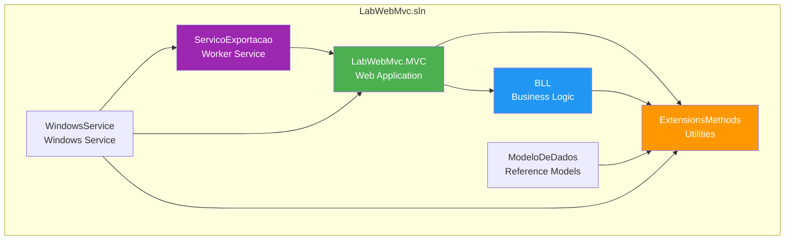

---

## 2. ARQUITETURA EM CAMADAS

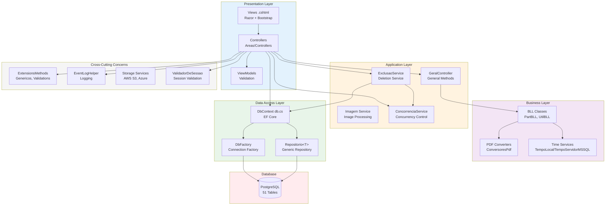

---

## 3. BANCO DE DADOS - RELACIONAMENTOS PRINCIPAIS

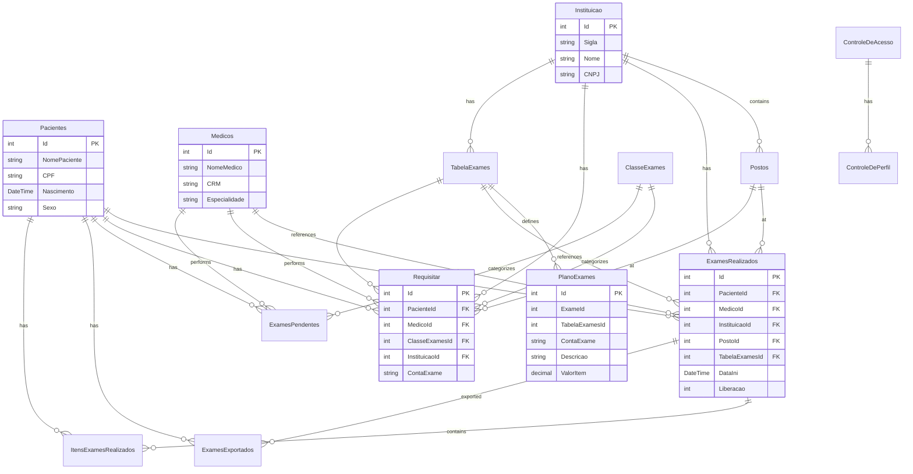

---

## 4. FLUXO: REQUISIÇÃO DE EXAMES

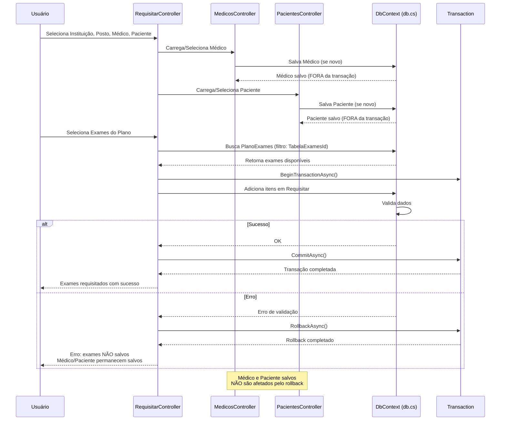

---

## 5. FLUXO: ALTERAÇÃO DE PLANO DE EXAMES (SUS MODEL)

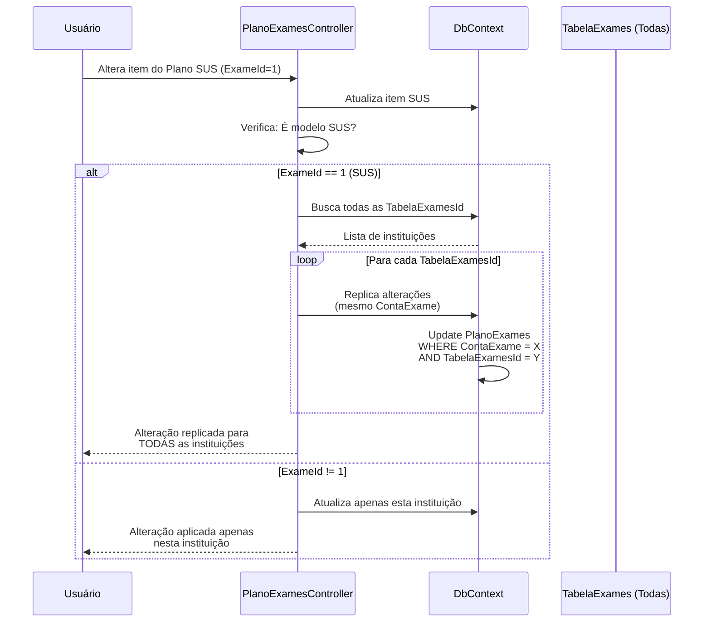

---

## 6. FLUXO: EXCLUSÃO COM VALIDAÇÃO DE FK

```mermaid
flowchart TD
    START[Iniciar Exclusão] --> CHECK{Existem registros<br/>em tabelas filhas?}
    
    CHECK -->|Sim| BLOCK[❌ Bloquear Exclusão]
    CHECK -->|Não| DELETE[✅ Executar DELETE]
    
    BLOCK --> MSG[Retornar mensagem assertiva:<br/>"Registro possui vínculos e<br/>não pode ser excluído"]
    MSG --> END1[Fim - NÃO excluído]
    
    DELETE --> TX[Iniciar Transação]
    TX --> ORPHAN{Executar<br/>DeleteOrphans?}
    
    ORPHAN -->|Sim| DEL_ORPH[Remove registros órfãos]
    ORPHAN -->|Não| SAVE[SaveChanges]
    
    DEL_ORPH --> SAVE
    SAVE --> COMMIT{Sucesso?}
    
    COMMIT -->|Sim| COMMIT_TX[Commit Transaction]
    COMMIT -->|Não| ROLLBACK[Rollback Transaction]
    
    COMMIT_TX --> END2[Fim - Excluído com sucesso]
    ROLLBACK --> END3[Fim - Erro, nada excluído]
    
    style BLOCK fill:#F44336,color:#fff
    style DELETE fill:#4CAF50,color:#fff
    style MSG fill:#FF9800,color:#fff
```

---

## 7. MULTI-TENANT - TROCA DE CONEXÃO

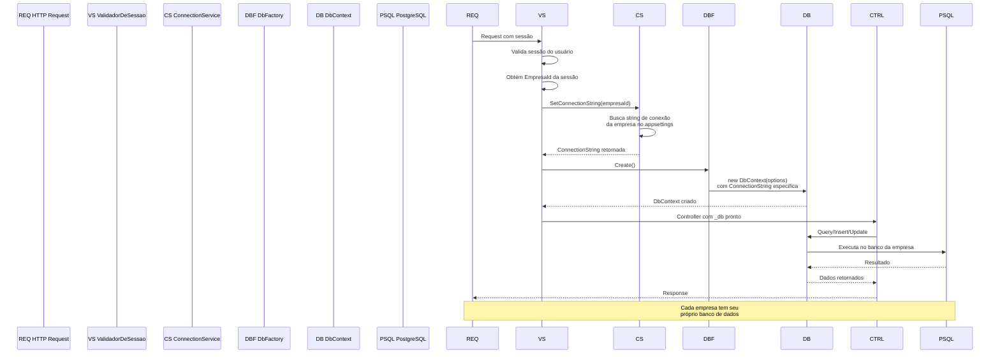

---

## 8. SAVECHANGES - REUTILIZAÇÃO DE IDs

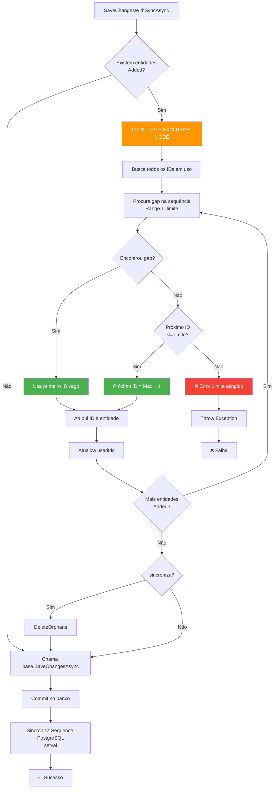

---

## 9. CONTAEXAME - HIERARQUIA DE VALIDAÇÃO

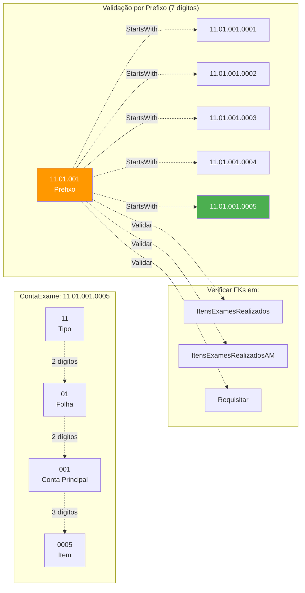

---

## 10. DEPLOY - MODOS DE EXECUÇÃO

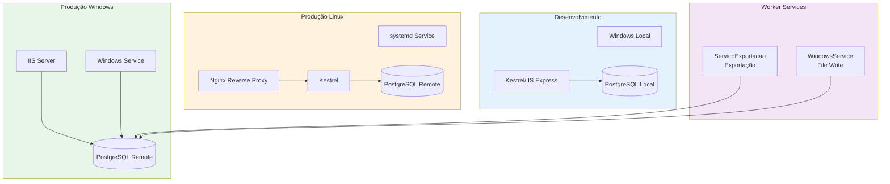

---

## 11. AUTENTICAÇÃO E AUTORIZAÇÃO

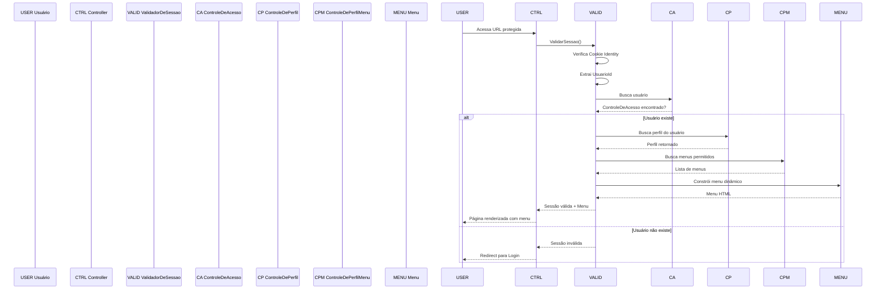

---

## 12. INTEGRAÇÕES - EXPORTAÇÃO (STRATEGY PATTERN)

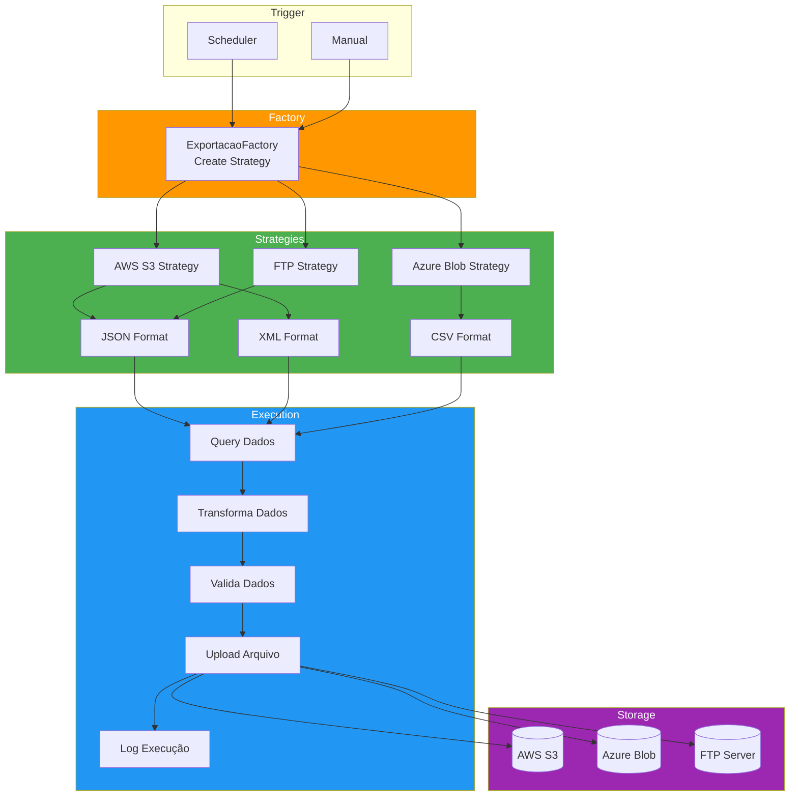

---

**Diagramas gerados por Qoder AI - 21/04/2026**
